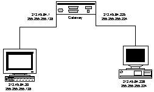
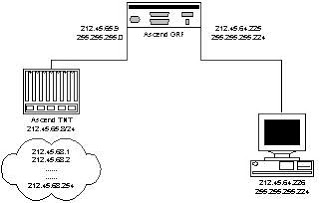
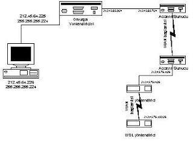
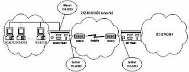

# IP Yönlendirme

Önceki dokümanda TCP/IP’nin ne oldugunu ve adreslemenin nasil
yapildigi anlatilmisti, paketlerin internet üzerinde yollarini nasil
bulduklarini ise bu dokümanda anlatacagiz.

Öncelikle bir TCP/IP networküne baglanmak isteyen bir bilgisayarda
yapilmasi gereken ayarlari ele alalim. TCP/IP protokolü tanitilirken
bir takim bilgilere ihtiyaç duyulmaktadir, bunlar

*	IP numarasi *

*	Subnet maskesi *

*	Ag geçidi (Gateway)

*	DNS Sunucularidir

Yanlarinda * bulunan bilgiler mutlaka girilmesi gerken bilgilerdir,
digerleri duruma göre bos birakilabilir.

Buradaki IP numarasi ve subnet maskesi hakkinda detayli bilgi önceki
dokümanlarda verilmistir, DNS sunuculari ise daha sonra
açiklanacaktir. Bu kisimda özellikle üzerinde durulacak olan “ag
geçidi” kavrami ve internet üzerinde yönlendirmedir. Buradan hareketle
yukaridaki bilgilere sahip bir bilgisayarin yapacaklarini özetleyelim,
ilk olarak daha önce anlatildigi sekilde IP adresini ve subnet
maskesini kullanarak ait oldugu networkü bulacaktir. Daha sonra
kendisi için bir IP yönlendirme tablosu olusturacaktir.

Yönlendirme tablosu olustururken izleyecegi yol sudur. Kendi IP
numarasina giden tüm paketleri kendisine yönlendirecektir. Ayni
sekilde kendisi ile ayni networkte olan adreslere bu IP numarasinin
ait oldugu arayüz üzerinden ulasmaya çalisacaktir. Bu network disinda
kalan adreslere yönelen tüm paketleri ise ag geçidi olarak tanimlanan
cihaza yönlendirecektir (Buradan da anlasilacagi gibi, ag geçidi
olarak tanimlanan IP numarasi mutlaka kendi IP numarasi ile ayni
subnet içinde olmalidir, aksi taktirde bilgisayar ag geçidine
ulasamayacaktir).

IP yönlendirme tablosunun olusturulabilmesi için gerekenlere bir
bakalim. Öncelikle ulasilmak istenen network ve bu networkün maskesi
bilinmelidir ve bu networke ulasmak için kullanilacak arayüz de
gerekmektedir. Bir örnekle konuyu daha açik hale getiremek için,
212.45.64.226 IP numarasina ve 255.255.255.224 subnet maskina sahip
bir bilgisayar için ag geçidinin 212.45.64.225 olarak tanimlandigini
düsünelim.

Bu durumda bilgisayar ait oldugu networkü 212.45.64.224 olarak
hesaplayacaktir, olusturdugu yönlendirme tablosu ise su sekilde ifade
edilebilir. Öncelikle kendi IP numarasina giden paketleri kendi
kendine gönder. 212.45.64.224 networkünde olan tüm paketleri
212.45.64.226 IP numarasini kullanarak gönder, bu networkün disindaki
adreslere gidecek paketleri ise 212.45.64.225 IP numarasi üzerinden
yönlendir. Tablo olarak ifade edecek olursak,

```
Hedef Network  Maske  Ag geçidi  Arayüz
212.45.64.226 255.255.255.255 127.0.0.1* Loopback
212.45.64.224 255.255.255.224 212.45.64.226 Ethernet0
0.0.0.0 0.0.0.0 212.45.64.225 Ethernet0
```

Not: 127.0.0.1 (Loopback) bilgisayarin kendisini ifade eder,
255.255.255.255 ise tek bilgisayari tanimlayan subnet maskesidir.

sonucunu elde edebiriz. Burada belirtilen arayüz bilgisayarin bu IP
numarasina ulasmak için kullandigi arayüzdür, bu arayüzün tanimi ve
gösterimi çesitli isletim sistemleri arasinda farkli olabilmektedir,
unix türevi sistemlerde ethernet için eth0, le0, hme0 gibi isimler
kullanilirken (burada 0 kaçinci arayüz oldugunu gösterir, örnegin bir
bilgisayarda iki ethernet karti varsa bunlar eth0 ve eth1 ya da hme0
ve hme1 olarak tanimlanirlar), windows tabanli sistemlerde ise bundan
farkli olarak arayüzler sahip olduklari birincil IP ile tanimlanirlar,
örnegin örnegimizdeki arayüz, arayüzün birincil IP numarasi olan
212.45.64.226 ile tanimlanacaktir. Bu tanimlamalarin yapilmis oldugu
bir bilgisayarin IP yönlendirme tablosu incelenecek olursa (IP
numarasinin tanimlandigi bilgisayar WinNT Server 4.0’dir)

```
C:\>route print
Active Routes:
Network Address Netmask Gateway Address Interface  Metric
0.0.0.0 0.0.0.0 212.45.64.225 212.45.64.226 1
127.0.0.0 255.0.0.0 127.0.0.1 127.0.0.1 1
212.45.64.224 255.255.255.224 212.45.64.226 212.45.64.226 1
212.45.64.226 255.255.255.255 127.0.0.1 127.0.0.1 1
212.45.64.255 255.255.255.255 212.45.64.226 212.45.64.226 1
224.0.0.0 224.0.0.0 212.45.64.226 212.45.64.226 1
255.255.255.255 255.255.255.255 212.45.64.226 212.45.64.226 1
```

NOT: 0.0.0.0/0.0.0.0 tanimlanabilecek en genel networktür. Bütün IP
numaralarini kapsar.

Yukaridaki tabloda birinci, üçüncü ve dördüncü satirlarin bizim
olusturdugumuz tabloda yer aldigi digerlerinin ise yer almadigi hemen
dikkati çekecektir. Burada ikinci satir 127 ile baslayan tüm
adreslerin loopback arayüzüne yönlendirilmesi gerektigini
belirtmektedir. Bu da 127 ile baslayan tüm adreslerin aslinda kendi
kullandigimiz bilgisayari tanimladigi anlamina gelir. Besinci, altinci
ve yedinci satirlar ise broadcast ve multicast tanimlamalaridir,
broadcast yönlendirmeler belli bir IP numarasina degil tüm networke
ulasilmaya çalisildiginda kullanilirlar. Ancak yönlendirme tablosunun
bu tanimlari sistem tarafindan otomatik olarak yapilmaktadir,
kullanicinin bunlari ileride deginilecegi sekilde degistirmesine,
silmesine ya da eklemesine gerek duyulmamaktadir.

Bizim olusturdugumuz tabloda bulunmayan “metric” hanesi ise esdeger
yönlendirmeler arasinda hangisinin önce kullanilacagini belirtir.

Bir IP yönlendirme tablosu incelenirken ya da olusturulurken dikkat
edilmesi gereken en önemli noktalardan biri yönlendirme tablosunun en
özelden en genele dogru taranacagidir, örnegin 212.45.64.226 numarali
IP’ye ulasmaya çalisirken bu IP numarasinin hem
212.45.64.226/255.255.255.255 hem 212.45.64.224/255.255.255.224 hem de
0.0.0.0/0.0.0.0 networklerinin içinde kaldigi görülür ama bunlarin
arasinda en özel olan kullanilacaktir, bu da
212.45.64.226/255.255.255.255’tir.

Örneklerle devam ederek konumuzu genisletelim. 212.45.64.226/27 IP
numarali bilgisayarimizin 212.45.64.231 IP numarali bilgisayara
ulasmak istedigini düsünelim. Öncelikle kendi yönlendirme tablosunda
bulunan network adresleri ile subnet maskelerini kullanarak bu IP’nin
yönlendirme tablosundaki networklerden herhangi birinin dahilinde olup
olmadigini hesaplayacaktir. Hem birinci (0.0.0.0/0) hem de üçüncü
satirlarin (212.45.64.224/27) bu IP’yi kapsadigi bu hesaplama sonucu
ortaya çikacaktir, 212.45.64.224/27 digerinden daha özel bir tanimlama
oldugu için bunu kullanacak ve paketi kendi IP numarasi üzerinden
LAN’e gönderecektir. Bunu komut satirinda inceleyecek olursak.

```
C:\>tracert 212.45.64.231
Tracing route to aboneservisi.marketweb.net.tr [212.45.64.231]
over a maximum of 30 hops:
1   <10>
```

Buradan da görüldügü gibi 212.45.64.226 ve 212.45.64.226
bilgisayarlari ayni networkte bulunduklari için hiçbir ag geçididen
geçmeksizin haberlesebilmektedirler.

Bu kez ayni bilgisayari kullanarak 212.45.64.20 IP numarasina sahip
bilgisayara ulasmaya çalistigimizi düsünelim. Bilgisayarimiz yine
yönlendirme tablosunu kullanarak bu IP’nin hangi networkler tarafindan
kapsandigini bulmaya çalisacaktir. Bulacagi networkün ise yalnizca
0.0.0.0/0 oldugu görülecektir. (Daha önce de söylendigi gibi 0.0.0.0/0
tüm networkleri kapsamaktadir, bu yüzden default route adi
verilmistir). Bu durumda paketler, ag geçidi olarak tanimlanan
212.45.64.225 IP numarali cihaza yönlendirilecektir yani bir anlamda
“top 212.45.64.225’e atilmistir”. Kritik soru da burada gelmektedir,
212.45.64.225 IP numarali cihaz 212.45.64.20 IP numarasina nasil
ulasacaktir. Ag geçidinin özelligini de tam burada tanimlamak faydali
olacaktir. Bir cihazin ag geçidi görevini görebilmesi için en az iki
farkli network’te arayüzünün bulunmasi gerekmektedir. Örnegin bir ag
geçidi x.y.z.0/24 networkündeki bilgisayarlarin a.b.c.0/24
networkündeki bilgisayarlara ulasmasi için kurulmussa, bir arayüzünün
(örnegin ethernet) x.y.z.0/24 networküne bagli, baska bir arayüzünün
(ethernet, seri/dialup arabirim vs) a.b.c.0/24 networküne bagli olmasi
gerekmektedir.

Örnegimizden kopmadan devam edersek, 212.45.64.20 IP numarali
bilgisayar ag yönlendiricisine 1 numarali ethernet arayüzünden,
212.45.64.226 IP numarali bilgisayar ise ag yönlendiricisine 2
numarali ethernet arayüzünden bagli oldugunu düsünebiliriz. Traceroute
sonucunu incelersek

```
C:\>tracert 212.45.64.20
Tracing route to kheops.marketweb.net.tr [212.45.64.20]
over a maximum of 30 hops:
1    10 ms   <10>
```

Görüldügü gibi 212.45.64.20 IP numarali bilgisayara 212.45.64.225
numarali cihaz üzerinden ulasilmistir. Buradan çikan sonuç
212.45.64.225 IP numarali cihazin en az iki arayüzü/IP adresinin
oldugu ve bu arayüzlerden biri 212.45.64.224 networkünde iken
digerinin 212.45.64.0 networkünde oldugudur. 212.45.64.225 IP numarali
cihazin yönlendirme tablosu hakkinda basit bir yorum yaparsak söyle
bir sonuç elde edebiliriz.

```
Network Address Netmask Gateway Address Interface
212.45.64.0 255.255.255.128* 212.45.64.1** Ethernet0
212.45.64.224 255.255.255.224 212.45.64.225 Ethernet1
```

Not: * Buradaki traceroute sonucu ile netmaski ögrenmek mümkün
degildir, burada verileni bir önbilgi kabul edebilirsiniz.

Not: ** Burada belirtilen 212.45.64.0/25 segmentinde herhangi bir IP
olabilir. Bu yönlendiricinin 212.45.64.0/25 segmentindeki IP
numarasidir. Ayni sekilde arayüzler de (ethernet 0, ethernet 1)
önbilgi olarak yazilmistir, arayüzlerin ne oldugu eldeki verilerle
tesbit edilemez.

Görüldügü gibi 212.45.64.225 adresine yönlendirilen paketler bu cihazin yönlendirme tablosunda taranarak ilgili arayüzlerden hedeflerine ulastirilmislardir. Ayni sekilde 212.45.64.20/25 IP numarali bilgisayardan 212.45.64.226 adresine çekilen traceroute sonucu da

```
kheops/export/staff/ilker>traceroute 212.45.64.226
traceroute to 212.45.64.226 (212.45.64.226), 30 hops max, 40 byte packets
1  212.45.64.1 (212.45.64.1)  3 ms 3 ms 1 ms
2  taurus.marketweb.net.tr (212.45.64.226) 5 ms 5 ms 6 ms
```

seklindedir. Bu da ag geçidimizin hem 212.45.64.1 hem de 212.45.64.225
IP numaralarina sahip oldugunu göstermektedir. Sematik olarak
gösterirsek



Görüldügü gibi ag geçidinin iki ayri networke de baglantisi
bulunmaktadir. Kafalarda kalmis olabilecek sorulari gidermek için son
bir örnek vererek konumuzun tanim kismini bitirelim. Networkleri
caddelere, istemcileri de caddelere çikislari olan evlere benzetirsek,
ag geçitleri, ön kapisi bir caddeye, arka kapisi ise baska bir caddeye
açilan, böylece caddeler arasinda belli kurallar dahilinde- geçis
saglayan is merkezleridir.

Yukaridaki açiklamalardan da anlasilabilecegi gibi internete bagli tüm
bilgisayarlar bir anlamda yönlendirme yapmakta ve yönlendirme
tablolari kullanmaktadirlar. Ancak asil isi yürütenler, yönlendirici
(router) dedigimiz bu isi yapmak için özel olarak tasarlanmis
sistemlerdir ('siradan' bilgisayarlar da uygun sekilde konfigüre
edilerek router haline getirilebilirler ancak bu dokümanda buna
deginilmeyecektir). O halde genel anlamda bir routeri tanimlarsak, çok
sayida farkli arayüze (ethernet, atm, fddi, serial, e1, e3, t1, t3...)
sahip olup, çesitli protokolleri yönlendirmesi (IP,IPX ) için özel
olarak tasarlanmis cihazlardir. Bir çogunda desteklenen arayüzler
modüler olup ihtiyaca göre eklenip çikarilabilmektedir. Ayni sekilde
yönlendirme protokolleri de cihazlarin yazilimlari ile
belirlenebilmektedir. Bu cihazlara örnek olarak çesitli Cisco ve
Ascend cihazlari gösterilebilir (Piyasada onlarda farkli üretici
tarafindan üretilmis yüzlerce hatta binlerce router bulunmaktadir,
burada belirtilenler yalnizca örnek olarak verilmistir). Dokümanin
bundan sonraki kisminda isletim sistemi detaylarina mümkün oldugu
kadar az girilerek router’lardan bahsedilecektir.

Az önce teorik olarak çikarilan sonuçlari omurga router’I üzerinde
inceleyecek olursak (Burada incelenen router bir Ascend GRF 400’dür)

```
Routing tables
Internet:
Destination Gateway Flags Refs Use Interface
212.45.64/25 212.45.64.1 UHI 2 6 ge031
212.45.64.224/27 212.45.64.225 U 1 403 ge032
```
NOT:

* Buradaki iki satir router yönlendirme tablosundan seçilerek
         gösterilmistir. Aksi taktirde yüzlerce network tanimi
         arasinda görülmeleri mümkün degildir.

* Arayüzler ise burada görüldügü gibi belirtilenlerden farkli
         tanimlanmislardir, ge031 cihazin birinci sase, üçüncü
         slotunun, birinci portunu belirtmektedir, ayni sekilde ge032
         de birinci sase, üçüncü slotunun, ikinci portunu belirtir
         (buradaki e ise arayüzün ethernet oldugunu göstermektedir).

Simdi örnegi biraz daha karmasiklastiralim ve sisteme yeni bir cihaz
daha ilave edelim. Ethernet portunun IP’si 212.45.65.8/24 olan bu
cihaz GRF’e 3. ethernet portu araciligiyla baglantili olsun (GRF’in
ayni segmentteki IP numarasinin ise 212.45.65.9/24 oldugunu kabul
edelim). Ayni zamanda bu cihaz üzerinde bulunan 240 modemin IP
numaralarinin 212.45.68.1, 212.45.68.2 .. 212.45.68.254 havuzunda
bulunsun. Sematik olarak bunu gösterirsek



Bu durumda 212.45.68.0/24 segmentine ulasmak için mutlaka 212.45.65.8
IP numarali cihaza (TNT) ulasmak gerekmektedir, buradan çikan sonuç
ise TNT’nin de yönlendirme yaptigi ve bir anlamda router
oldugudur. Ancak tüm trafigin geçtigi omurga yönlendiricisinin
212.45.68.0/24 segmentine 212.45.65.8 IP numarasi ile ulasacagini
bilmesi gerekir aksi taktirde 212.45.68.0/24 segmentine ulasmak için
kendisine gelen paketleri hangi adrese yönlendirecegini bilemez. Bu
durumda omurga yönlendiricisi üzerinde 212.45.68.0/24’ün 212.45.65.8’e
yönlendirilmesi gerekir (bu islem dinamik routing (rip, ospf), arp
proxy ve benzeri yöntemlerle yapilabilir, ancak burada konuyu
karistirmamak için statik yönlendirme anlatilacaktir). Bunun için
router üzerinde "route add net 212.45.68.0 212.45.65.8" seklinde bir
komut çalistirmak yeterli olacaktir (yazilan komut isletim sistemine
bagli olup burada belirtilen SysV türü unix sistemlerinde kullanilan
notasyondur, ayni islem bir cisco yönlendirici üzerinde konfigürasyon
moduna geçtikten sonra "ip route 212.45.68.0 255.255.255.0
212.45.65.8" seklindeki bir komutla yapilabilir). Bunu da yaptiktan
sonra omurga routerinin yönlendirici tablosuna tekrar bakarsak :

```
Routing tables
Internet:
Destination Gateway Flags Refs Use Interface
212.45.65 212.45.65.9 U 1 12316 ge030
212.45.68 212.45.65.8 UGS 0 399 ge030
212.45.64/25 212.45.64.1 UHI 2 6 ge031
212.45.64.224/27 212.45.64.225 U 1 403 ge032
```

Simdi bilgisayarimizdan 212.45.68.2 IP numarasina ulasmak için
traceroute sonucu alirsak :

```
C:\>tracert 212.45.68.2
```

```
Tracing route to tnt-port002.marketweb.net.tr [212.45.68.2]
over a maximum of 30 hops:

1   <10>  
```

Görüldügü gibi bilgisayarimizin nasil ulasacagini bilmedigi paketi ag
geçidine göndermis, ag geçidi de 212.45.68 blogunun 212.45.65.8
adresinden erisildigini bildigi için paketi bu adrese
göndermistir. Akla söyle bir soru gelebilir : Omurga yönlendiricisi
hangi adrese gidecegini bilmedigi bir paket alirsa ne olur ? Su anda
tanimli olmayan bir bloga çekilen traceroute sonucunu inceleyelim.

```
C:\>tracert 212.45.80.1
Tracing route to 212.45.80.1 over a maximum of 30 hops

1   <10>
```

Görüldügü gibi, paket omurga router’ina kadar ulasmis ancak router
bunu nereye yönlendirecegini bilmedigi için "destination host
unreachable" (belirtilen adres ulasilamaz) mesaji vermistir (Konu
hakkinda bilgi düzeyi daha yüksek kullanicilar için not: Lokal olarak
kullanilan blok 212.45.64/19’dir, bu yüzden bu blok içinde kalan
adresler internet’e yönlendirilmeyecek sekilde düzenlenmistir.)

Burada dikkat edilmesi gereken nokta iletisimin çift yönlü oldugudur,
yani omurga routeri sizin gönderdiginiz paketleri hedefine
ulastirirken karsidan gelen paketleri de size ulastirmalidir, aksi
taktirde baglanti kurulamaz. Buradan hareketle kabaca bir tahmin
yapilirsa 212.45.65.8 IP’li cihazin da ag geçidinin omurga routeri
oldugu düsünülebilir. LAN düzeyinde IP yönlendirmesini son bir örnekle
noktalayalim.

```
C:\>tracert  212.45.76.193

Tracing route to anadolunet-idsl.anadolunet.com.tr [212.45.76.193]
over a maximum of 30 hops:

1   <10>  
```

Bu tabloya bakarak, aradaki tüm yönlendiricilerin yönlendirme
tablolarini inceleyelim. Öncelikle grf.marketweb.net.tr’da 212.45.76
ile ilgili bir yönlendirme bulunmasi gerekir, ilgili yönlendirme
asagida gösterilmistir.

```
Routing tables
Internet:
Destination Gateway Flags Refs Use Interface
212.45.66/22 212.45.65.7 UGS 0 0 ge030
```

Traceroute sonucuna paralel olarak 212.45.76/22 blogu 212.45.65.7 IP
numarasina yönlendirilimistir. Ayni yönlendirmeyi 212.45.65.7’de
ararsak:

% sh ip route 212.45.76.193 Destination Gateway IF Flg Pref Met Use Age
212.45.76.0/22 212.45.76.1 wan36 rGT 60 1 54107 18169

Yine traceroute sonucuna paralel olrak 212.45.76/22 blogu 212.45.76.1
IP numarasina yönlendirilmistir (arayüzden de anlasilacagi gibi bu
baglanti bir WAN baglantisidir). Sonuç olarak 212.45.76.1 IPsine kadar
ulasmis durumdayiz. Bu IP’ye sahip cihazda bir sorgulama yaparsak:

```
#sh ip route 212.45.76.193
Routing entry for 212.45.76.192/26
Known via "static", distance 1, metric 0
Routing Descriptor Blocks:
* 212.45.76.4
  Route metric is 0, traffic share count is 1
```

Görüldügü gibi yeni ag geçidimiz 212.45.76.4’tür. Burada dikkat
edilmesi gereken sey, blogumuzun küçülmüs oldugudur, az önce /22
olarak yönlendirilen blok su an /26 olarak yönlendirilmektedir. Bu da
kanin atar damarlardan kilcal damarlara dagilmasi gibi düsünülebilir,
en genelden en özele dogru yönlendirme devam
etmektedir. 212.45.76.4’teki yönlendirme tablosu asagidadir.

```
IDSL> ip route stat Dest FF Len Interface Gateway Metric stat Timer Use
212.45.76.193 00 32 wan0ppp 212.45.76.193 2 002f 0 1676
212.45.76.192 00 26 wan0ppp 212.45.76.193 1 002f 0 1832303
```

Görüldügü gibi 212.45.76.193 IP’sine wan baglantisindan ulasilmaktadir
ve trace bir sonraki noktada tamamlanmaktadir. Daha önce belirttigim
gibi burada gösterilen paketin "gidis yoludur", ayni paketlerin ayni
sekilde geri de gelebilmesi gerekir, ancak bunu da ayrica göstermeyi
gereksiz görüyorum. Ancak geri dönüs için söyle bir yol düsünülebilir
"paketi yönlendirecegin adresi biliyorsan yönlendir yoksa varsayilan
(default) yönlendiriciye gönder". Bu sistemle 212.45.64.226’ye ulasmak
isteyen bir paket 212.45.76.193’ten çikar ve varsayilan
yönlendirmeleri izleyerek omurga yönlendiricisine kadar ulasir, omurga
yönlendiricisi ise zaten 212.45.64.226’ya nasil ulasacagini
bilmektedir. Bu sekilde gelis/gidis yönlendirmeleri tamamlanmis
olur. Burada belirtilen yapinin semasi ise su sekildedir.




Sanirim bu semayla traceroute sonucu beraber incelendiginde, IP
yönlendirme konusunda net bir fikir elde edilebilir. NOT: Yukarida
verilen tüm sekil ve yönlendirme tablolarinda yalnizca ilgili kisimlar
gösterilmis diger kisimlar karisikliga yol açmamasi için
çikartilmistir.

TEK NOLTADAN INTERNETE BAGLANTI ÜZERINDE YÖNLENDIRME ÖRNEGI

Yönlendirmenin temel prensipleri dokümanin ilk kisminda anlatilmistir,
ancak internet üzerinde yönlendirme agin büyüklügü ve araya giren daha
gelismis yönlendirme protokolleri nedeniyle çok daha karmasik bir hal
alir. Bu yüzden burada internet yönlendirmesi anlatilirken, yalnizca
tek noktadan servis alan bir kurumun yönlendirmesi anlatilacaktir. Bir
önceki anlatimdan farkli olarak olayin sistematigi de anlatilmaya
çalisilacak ve teknik yapinin yaninda bir takim prosedürel olaylardan
da bahsedilecektir.

30 bilgisayarar ve 1 routerdan olusan LAN’ini internete baglamak
isteyen bir kurum düsünelim. Öncelikle servis alinacak kuruma
(ISS-Internet Servis Saglayici) baglantiyi saglayacak bir ortam
gerekmektedir, hemen hiç bir durumda bu yalnizca kisa mesafelerde
çalisan ethernet ile mümkün olmamaktadir. Degisik alternatifler mümkün
olmasina ragmen burada Telekom sirketinden kiralanan data iletisim
hattinin kullanildigini ve bu hattin her iki ucuna konulan birer özel
modem ile ISS ile kurum arasinda iletisimin hazir oldugunu
düsünelim. Modemin baglantisi seri arayüz vasitasiyla routera
yapilacaktir. Bu durumda router ethernet üzerinden bilgisayarlarla,
modem üzerinden de ISS tarafinda bulunan router ile haberlesebilecek
ve bilgisayarlar için internete bir geçit görevi görecektir (ag
geçidi-gateway). Fiziksel baglanti hazir oldugunda internet üzerinde
kullanilmasi gereken IP numaralarina ihtiyaç duyulur. IP’ler kuruma
yine ISS tarafindan saglanacaktir, ve ISS’in kullandigi IP blogunun
bir bölümünü olusturacaktir. Bu durumda ISS’in bu kuruma 64 IP’lik bir
blok verdigini düsünelim. Bu blok 212.45.72.0/26, routerin ethernet
arayüzüne verilen IP ise 212.45.72.1 olsun. Ayni zamanda routerin
modeme bagli seri aryüzüne 212.45.95.2/30, ISS tarafinda bulunan
routerin modeme bagli seri arayüzüne ise 212.45.95.1/30 IP’lerinin
atandigini düsünelim (Burada verilen IP’lerin belirlenmesi ISS’in
sistem yöneticisi tarafindan yapilacaktir).

Bu anlatilanlari sematik olarak gösterirsek :




Görüldügü gibi sistemde routerlar en az iki farkli networkte
bulunmaktadirlar, kurum routeri hem kurum için networküne hem de
routerlar arasi geçis networküne, ISS routeri ise hem routerlar arasi
geçis networküne hem de ISS networküne baglidir ve her iki networkte
arayüzleri bulunmaktadir. Ayni zamanda kurum aginda bulunan tüm
bilgisayarlar ISS tarafindan atanan bloktan özgün birer IP numarasina
sahiptirler ve ag geçidi olarak routeri kullanmaktadirlar. Burada
görülen sistemlerin yönlendirme tablolarini teorik olarak çikaralim.

```
212.45.72.2 (diger bilgisayarlar ile benzer sekilde): Ag Maske Geçit Tür
0.0.0.0 0.0.0.0 212.45.72.1 Statik
212.45.72.0 255.255.255.192 212.45.72.2 Dogrudan Bagli


212.45.72.1/212.45.95.2: Ag Maske Geçit Tür
0.0.0.0 0.0.0.0 212.45.95.1 Statik
212.45.72.0 255.255.255.192 212.45.72.1 Dogrudan Bagli
212.45.95.0 255.255.255.252 212.45.95.2 Dogrudan Bagli


212.45.95.1 : Ag Maske Geçit Tür
0.0.0.0 0.0.0.0 212.45.65.9* Statik
212.45.72.0 255.255.255.192 212.45.95.2 Statik
212.45.95.0 255.255.255.252 212.45.95.1 Dogrudan Bagli
212.45.65.0 255.255.255.0 212.45.65.7* Dogrudan Bagli
```

* Daha önceki örneklerden yola çikilarak belirtilmistir.

Görüldügü gibi kurumda kullanilan sistemin yapisi son derece yalindir,
iç network disinda kalan tüm IP’ler routera yönlendirilerek internete
"birakilirlar", bundan sonrasini ISS routerlari halletmektedir.

Internet trafiginin ISS disindaki akisini detayli olarak anlatmak ise
bu dokümanin kapsamina sigmayacak kadar genis bir konudur, ancak
kabaca su sekilde ifade edilebilir. Her IP, ISS disinda ayni bloktan
diger IP’ler ile ayni sekilde hareket eder. Örnegin son örnekte kuruma
verilen IP blogu (212.45.72.0/26) aslinda ISS'in kendi blogu olan
212.45.64.0/19’un bir alt blogudur (subnet), ve internet üzerinde
212.45.64.0/19 blogu olarak yönlendirilir. Ancak paketler ISS
routerlarina ulastiktan sonra 212.45.72.0/26 yönlendirmesi yapilir.

Son olarak belirtilmesi gereken birkaç sey var. Bu dokümanda ana amaç
TCP/IP yönlendirmesine yabanci kullanicilar için bir temel olusturmak
idi, network mühendisi haline getirmek degil. Bu yüzden örnek olarak
verilen yönlendirmelerin tamami mümkün oldugunca basit seçilen statik
yönlendirmelerdir, gerçek durumlarda ise -orta-büyük ölçekli
sistemlerde- durum genellikle böyle olmayip daha karmasik olan dinamik
yönlendirme protokolleri kullanilanir (rip, ospf, (e)igrp, bgp gibi).

Yukaridaki yazi yazarin izni ile http://www.ilkertemir.com sitesinden
alinmistir


