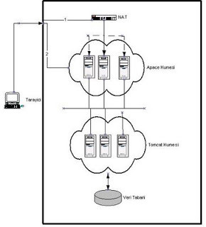

# Tomcat ile Dağıtık (Distributed) Sistem İnşâsı

İnternet uygulamamız, yazılım mühendisliği açısından mükemmel,
teknolojisi kullanımı açısından en yeni ve sağlam teknolojiler ile
donatılmış olsa bile, müşterimizin şu en son isteğine yeterli bir
şekilde cevap vermek zorundayız.  "Sitemizi günde 1,000,000 ziyaret
alacak şekilde nasıl ölçekleyebiliriz?".  Bu sorunun, yazılım
mühendisliği, proje idaresi konularından tamamen ayrı bir şekilde ele
alınması mümkündür.  Kodlama ve Ölçekleme (Scaling) Prensip olarak,
Servlet, JSP ve Java işlem mantığı kodlamasının ölçekleme
yöntemlerinden habersiz olması gerekir. Yani, programcı bir Servlet'i
kodlarken, tek bir site kullanıcısının, bir tek sunucu makinası
üzerinden bu Servlet'e eriştiğini varsayarsa, kodlama açısından
kendisine kolaylık sağlamış olacaktır. Nitekim, revaçtaki çoğu
ölçekleme metodu, kodun bu şekilde ölçeklemeden habersiz olduğunu
varsaymaktadır.  Katmanlar Bir siteyi dağıtık modelde işletmek, iki
seviyede olabilir.  * Site yükünü, işbölümüne göre dağıtmak * Aynı işi
gören sunuculardaki yazılımın "kopyasını" birçok makinaya çıkartarak,
kullanıcı yükünü (aynı katman içinde) bu aynı işi gören makinalara
dağıtmak Bunlardan, birinci kavrama örnek olarak Apaçe, Tomcat, veri
tabanı katmanlarının ayrı makinalarda, ya da ayrı makina guruplarında
olmasını gösterebiliriz. Bu türden bir ayırım, 'işbölümüne göre'
yapılmıştır. Her görev, belli bir makina tarafından yapılır, ve eğer
veri taban erişim hızını eniyileştirmek istesek, veri tabanını
çalıştıran makinayı donanım olarak eniyileştirmekten bahsederiz.
Kopyalayarak ölçeklemek, bu yazının temel konusudur. İleride
göreceğimiz gibi, Tomcat sunucularını, ve bu sunucularda işleyen site
Java kodlarını birden fazla makina üzerine kopyalayarak, ölçekleme
hedefimize, siteye gelen ziyaretçiyi bazen Tomcat 1'e, bazen Tomcat
2'ye, vs.. aktararak sitemize erişebilecek kullanıcı sayısını
arttırmak ile erişmeye uğraşırız.  Tabii ki ileri mimariler bu iki
yöntemin ikisini de kullanırlar. Günümüz mimarilerinde, donanım olarak
üç katman (internet sunucusu, uygulama sunucusu, veri taban sunucusu),
ve her katman içinde de çoğaltılmış kopyalar sayesinde yükün ve riskin
dağıtılması sözkonusudur.  Ölçekleme Sorusu E-ticaret ve benzeri
türden internet sitelerinin karşısında çıkan klasik ölçekleme sorunu
şunlardır.  Her Tomcat makinası sadece belli sayıda ziyaretçiye
Servlet/JSP servisi yapabilir. Bir makinanın sınırı aşıldığında yeni
bir Tomcat makinası ekleyerek sitemizin kapasitesini
arttırabilmeliyiz. Fakat bunu nasıl yapacağız? Bu birçok Tomcat
sunucusunun işlemci gücünü dış dünyaya tek bir kuvvet olarak
sunabilecek bir yöntem lazım, yani kümeleme (clustering) kavramının
Tomcat dünyasında olan karşılığı.  Tabii bu Tomcat kümesi, tek bir
sanal makina ismi olmayacak. (İşletim sistemi seviyesinde bu türden
işleyen kümeleme teknikleri de var). Bizim bahsettiğimiz, perde
arkasında her İnternet ziyaretini bir trafik polisi gibi bir şu, bir
bu Tomcat sunucuna aktarabilecek türden, Apaçe seviyesinde bir
eklemedir. Çünkü, internet ziyaretlerini ilk karşılayan birim,
İnternet sunucusudur.

Ek olarak, Apaçe sunucularının kendilerini de kümelemek mümkündür.
Birden fazla Apaçe sunucusu koyduğumuz zaman da, şimdi bu yeni kümeye
ayrı bir trafik polisi lazım olduğunu göreceğiz. Bu polislik görevini
ya DNS teknolojisi, ya da (daha iyisi) NAT İstek Dağıtımı (NAT Request
Distribution) teknolojisi ile halledebiliriz.  Katmanlar Arası
Bağlantılar: Tarayıcı ve İnternet Sunucusu Arasında Bir site
kullanıcısı, tarayıcısına bir internet adresi yazıp "enter" tuşuna
bastığında arka planda şunlar olur.  Yazılan internet sitesinin
ismini, internet adresine (IP) çevirebilecek bir İsim Servisi (Naming
Server) lazımdır. Bu servisler önce internet genelinde birkaç ana
sunucu, ve onlardan aktarıla aktarıla şirket/üniversite/ISP
seviyesineki tek bir DNS sunucusuna kadar iner. Ve en sonunda
şirket/ISP sınırları içindeki bu son DNS sunucu artık tarayıcıya bir
IP adresi geri göndermek zorundadır.  Ölçeklemenin ilk seviyesi burada
başlar.  En basit ölçekleme yöntemi olarak bilinen BIND ile, dönüşümlü
sıra (round robin) yaparak değişik IP adresleri vermek en eski
yöntemlerden biridir. Bu tekniğe göre, ziyaretçinin tarayıcısı sitenin
IP adresini istediğinde, bir değil, birden fazla IP adresi geri
gönderilir. Zamanımızdaki tarayıcılar birden fazla IP adresini görünce
bu adreslerden birini seçerler, ve genelde bu seçim listedeki ilk
adres olmaktadır. Bu yüzden BIND'i ayarlayıp, listedeki ilk çıkan IP
adresini sürekli değiştirmek suretiyle, ziyaretçiyi misafir(!) edecek
sunucuyu sürekli değiştirerek, yükü dağıtmış oluruz.  Bu yöntemin tek
eksik tarafı şudur. Eğer elimizde havuz halinde tuttuğumuz A1, A2, A3
ve A4 şeklinde dört Apaçe sunucu olsa, ve tam BIND, A3'ün adresini
geri gönderdiğinde A3 çökmüş olsa ne yapacağız? BIND yöntemi,
sunucuları kontrol edip hangisinin ayakta olduğuna bağlı olarak IP
adres listesini değiştirmez. Demek ki bu yöntem tam yeterli değildir,
güvenilirlik açısından eksiktir.  Daha iyi bir yöntem TCP NAT İstek
Dağıtımı (TCP NAT Request Distribution) olarak bilinir.

İstek dağıtımı tekniğini, * Linux Sanal Sunucu Projesi (The Linux
Virtual Server Project) * Cisco Localdirector üzerinden
kullanabilirsiniz. Linux Sanal Sunucusu serbest kullanıma açık olup
yazılım bazlı, Cisco Localdirector ise ticari bir ürün olup donanım
bazlı bir çözümdür. Bu iki yöntemde, arka planda havuzladıkları
sunucuların ayakta olup olmadığını, kalp atış kontrolü (heartbeat) ile
sürekli kontrol ederler. Bizim amaçlarımız için bu arka plan sunucular
Apaçe İnternet Sunucularıdır tabii ki.  Katmanlar Arası Bağlantılar:
İnternet Sunucusu ve Tomcat Arasında NAT ile ziyaretçinin bir Apaçe
makinasına aktarıldığını varsayalım. Şimdi, buradan herhangi bir
Tomcat sunucusuna aktarım yapmak zorundayız. Burada, çok önemli bir
kavrama dikkat çekmek istiyorum, bu kavramın ismi "oturum eğilimi"
(session affinity) olarak bilinir.  Belki de "eğilim" kelimesi
yeterince güçlü bir resim yaratmamıştır. Oturum "yapışkanlığı" terimi
de doğru bir terim olabilir. Anlamı şudur: HTTP protokolü durum
bilgisinden birhaber bir protokol olduğu için, kullanıcıya göre aynı
oturuma dahil olan her sayfa isteği, aslında internet sunucusuna
değişik bir istek gibi gözükmektedir.

Çerez (cookie) ve URL bildirgeçleri teknikleri ile bu sorunu çözen
Servlet/JSP teknolojileri bahsettiğimiz ölçekleme mimarisinde en altta
yer almaktadırlar. İsteklere cevap işleminin ilk seviyesi Apaçe
sunucuları olduğuna göre, Apaçe'nin, sitemizin doğru işlemesi için
şunu yapması gerekir: XYZ oturumu hangi Tomcat sunucusuna ilk kez
verildi ise, bu oturuma dahil olan "bütün" diğer istekleri tekrar aynı
Tomcat sunucusuna vermek, yani oturumu tek bir Tomcat sunucusuna
yapıştırmak. Apaçe'yi Tomcat'a ekleyen kodun, oturum yapışkanlığı
konusunu göz önüne alması gerekir.  Not: Belirtmek gerekir ki, fi
tarihinde "durumsuz mimari" şeklini savunanlar da olmuştur. Bu
mimariye göre, hiçbir sunucu hiçbir bilgiyi hatırlamayacak, yani
istekler arasında kullanıcı bilgisini hafızada tutmayacaktı. Fakat ilk
ATG 'nin Java'ya getirdiği ölçekleme mimarisinin aynı makinaya
yapışkan oturum/ziyaretçi kavramını başarıyla kullanması sayesinde, bu
yöntem tercih edilmeye başlamıştır. Programcılık ve arayüz tasarımı
bakımından da oturumdan haberli mimariler daha temiz kod
yaratmaktadırlar. Evet, oturumsuz mimariler kod yapımızı değiştirmeye
zorlayacaktı!  Mod_Jk2 Apaçe ile bir Tomcat havuzunu birbirine
bağlayan teknoloji, mod_jk2 olarak biliniyor. Mod_Jk2, oturum
yapışkanlığı tekniğini de gerçekleştiriyor. Mod_Jk2'yi ayarlamamız
için şunları yapmamız gerekiyor.

Örnek olarak, 2 Tomcat sunucusunu havuzlamak için, Apaçe makinasında
mod_jk'nin kurulmuş olduğunu farzedelim, ayartanım için
apache2/conf/workers2.properties dosyasına şunları yazmamız gerekecek.
# Birinci Tomcat sunucusu için TCP soket iletişimini
tanimla

[channel.socket:tomcat_makinasi_1:8009]
info=Ajp13 forwarding over to TCP socket
tomcatId=tomcat1
debug=0lb_factor=1# İkinci Tomcat sunucusu için TCP soket iletişimini tanimla

[channel.socket:tomcat_makinasi_2:8009]
info=Ajp13 forwarding over to TCP sockettomcatId=tomcat2
debug=0lb_factor=1
[status:]info=Islem bilgisini gösterir
[uri:/jkstatus/*]

info=Durum bilgisini gosterir, ve ayartanim degisiklikleri kontrol
edergroup=status:# examples/ olarak bilinen paketten cikan Tomcat
orneklerini# uri uzayinda tanimla[uri:/examples/*]info=Butun examples
orneklerini tanimladebug=0# Paylasilan bellek dosya degerini (shared
memory file) tanimlafile=/usr/local/apache2/logs/shm.filedebug=0
Lb_factor değeri hangi sunucu için daha büyükse, o sunucu, dönüşümlü
sıra verilme esnasında daha çok tercih edilir. Kapasite açısından daha
güçsüz bilgisayarların lb_factor'unu idareciler daha aşağı
çekebilirler.  Her Tomcat sunucu için, $CATALINA_HOME/conf/server.xml
dosyasındaki jvmRoute değerinin, Apaçe makinasındaki
workers2.properties dosyasındaki Tomcat değeri ile aynı olması
gerekiyor. İkinci Tomcat makinası için örnek: ..

```
<Engine name="Standalone" defaultHost="localhost" debug="0" jvmRoute="tomcat2">
```

gibi. Ayrıca her tomcat kimliğinden sadece bir tane olmalı. Devam
edelim, şimdi Tomcat sunucusu ayarını tamamlamak için, Tomcat makinası
server.xml üzerinde

```
<Connector classname="org.apache.coyote.tomcat4.CoyoteConnector"
port="8009" minProcessors="5" maxProcessors="75" enableLookups="true"
redirectPort="8443" acceptCount-"10" debug="0" connectionTimeout="0"
useURIValicationHack="false"
protocolHandlerClassname="org.apache.jk.server.server.JkCoyoteHandler"/>
```

tanımını yapmamız yeterli olacak.  En Son - Güvenilirlik Bir gerekli
kavram daha kaldı. Tomcat katmanı içinde Oturumun Kopyalayarak
Çoğaltılması (Session Replication).  Genel olarak ne zaman ki, bir iş
türünü yüklenmiş olan "tek bir makina" görüyor isek, bu makina,
sistemimizin geneli için bir risk noktası ihtiva eder. Bütün kritik
trafiğin geçtiği tek nokta, eğer çökerse ne yapacağız? Demek ki bu
türden bir riski, değişik makinalara (aynı katman içinde değişik
kopyalara) dağıtmamız gerekmektedir. Birden fazla Tomcat, ve Apaçe
sunucusu koymamızın hem ölçekleme, hem de güvenilirlik (reliability)
açısıdan yararları vardır.  Fakat, şimdiye kadar bahsettiğimiz
kümeleme tekniği, Tomcat 4 üzerinde sadece yükü dağıtmak için
yazılmıştır, riski dağıtmak için değil. Bu yüzden, oturum
kopyalamasını gerçekleştirecek ayrı bir pakete ihtiyacımız var.
Oturum kopyalamak derken, JSP/Servlet standartına göre programcı için
her sayfada ve Servlet içinde hazır tutulan HttpSession nesnesinin
üzerindeki bilgilerin kopyalanmasından bahsediyoruz. Aşağıda oturum
nesnesinin kullanım örneğini görebiliriz (istek.getSession()
kullanarak oturuma erişiliyor).  ...

```
// herhangi bir Servlet...
public void doGet(HttpServletRequest istek, HttpServletResponse cevap) {
// bir ornek kullanim
istek.getSession().setAttribute("degisken1", new FilancaNesne()); ...  ...
// bir ornek kullanim daha
Nesne123 n = (Nesne123)istek.getSession().getAttribute("degisken2");
}
```

HttpSession (Oturum) nesnesinin kullanıcı bir siteyi terketmedikçe
hazır halde tutulduğunu daha önce işlemiştik. HttpSession hafızada
tutulur (diske yazılmaz) o yüzden çökmeye karşı yedeklenmesi gerekir.
Tomcat 5'te (pakete dahil) bulunan, kopyalayarak çoğaltma yapan bu
türden bir mimariyi, Tomcat 4 üzerine geri uyumlayan Filip Hanik
sayesinde, kaybedilmeyen oturumlara sahip olmamız Tomcat 4 ve 5'te
mümkün oldu. Paketin kuruluş bilgileri için, Filip Hanik'in yazısını
okuyabilirsiniz.  Bu teknoloji, oturum bilgisini ağ içindeki bulunan
öteki Tomcat makinalarına yayınsal IP paketleri ile kopyalayarak
(multicast), oturum bilgisini ve bilahere çökme riskini
dağıtmaktadır. Bir makina çöktüğünde, yeni Tomcat sunucusuna
yönlendirilen ziyaretçinin bilgileri, yedekteki oturum bilgileri
üzerinden servis edilir, böylece, kullanıcı arka planda bir makinanın
çökmüş olduğunu farketmez bile.  Not: Yedekleme kelimesi sabit diske
yapılan türden yedekleme işlemini çağrıştırmasın, bu mimaride
bahsedilen oturum yedeklemesi, ağ içinde olan öteki Tomcat
makinalarının "hafızasına" yapılmaktadır.  Evet, kopyalayarak çoğaltan
bu mimariyi denemek için, çok Tomcat'li bir ortamda, ziyaret ettiğiniz
ve yapıştığınız Tomcat sunucusunu bilerek durdurun, ve bakmakta
olduğunuz sayfaya yenileyin. Oturum değerlerinin kaybolmadığını
göreceksiniz.  Serbest yazılım ile bol ölçekli günler sizin olsun.




