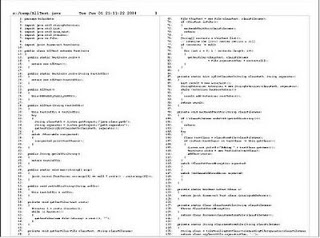

# Yazıcıdan Güzel Java Basmak (Pretty Print)

Eğer takımınız Extreme Programcılıkta tavsiye edildiği gibi ikili
programcılık yapmıyor ise, o zaman, ikili programcılığın doğal olarak
(kodcuların birbiri üzerinde) gerçekleştirdiği sürekli kontrolü,
düzenli aralıklarla yapılan bir kod kontrolu (code review) sistemi ile
taklit/telâfi edilmesi gerekir. Gözden geçirme olayı, bir toplantı
olarak düzenlenir. XP öncesi yazılım takımlarında "kodu gözden
geçirme", çok bilinen, resmi bir vakâ olarak gerçekleşir. Bu resmi
kodu gözden geçirme zamanlarında, takım lideri kimin, hangi kodunun
gözden geçireleceğini saptar, ve toplantıdan önce lider (ve diğer
programcılar) bu koda bakarlar ve hazır gelirler.  Bu uzun girişten
sonra (!) yazının esas konusunda gelelim. Kod gözden geçirmek için en
rahat yol, kodu yazıcıdan basmak, ve üzerine yorumlar yazarak
toplantıya öyle gelmektir. Kodu gözden geçirilen programcı da toplantı
sırasında kendisine verilen yorumları, düzeltmeleri kendi yazıcı
çıktısı üzerine yazarsa, kendi için yararlı olacaktır.  Yazıcıdan
alınacak çıktıdaki kodların "2 kod sayfası bir yazıcı sayfasına"
gelecek, ve her satırın numaralı olacak şekilde alınması en iyisidir.
Bu sayede, kod gözden geçirme toplantısı sırasında "..şu, ve şu hata,
şu no'lu satırda" gibi sözler söylenebilecektir.  Bu türden bir
çıktının alınması için kullanılan program, enscript programıdır.
Enscript Enscript'i Windows'da kurmak için önce kurucu programı
indirin.

Bu zip dosyasını istediğiniz yere (ENSCRIPT dizini diyelim) açtıktan
sonra, ayrı bir enscript.st dosyasını da indirip, ENSCRIPT dizinine
bırakın. Önceki enscript.st dosyasının üzerine yazabilirsiniz, önemli
değil.  Şimdi sıra Ghostview ve Ghostscript kurmaya geldi. Postscript
dosyaları Unix'çilerin uzun süredir bildiği bir formattır. Enscript
programı formatladığı kaynak kodları görsel olarak biçimlendirip,
çıktıyı postscript olarak yazdığı için, Ghostview adında bir gösterici
programa ihtiyacımız var.  Şu bâğlantıdan Ghostview'ü ve Ghostscript'i
indirebilirsiniz.  Bu kadar!  Artık istediğiniz kodu güzel basmak için
aşağıdaki şekilde bir komut verebilirsiniz. Enscript'in birçok
seçeneği vardır, bunlari enscript --help ile öğrenebilirsiniz. En
standart kullanım, 2 kod sayfası bir yazıcı sayfası, satırlarda
numaralar, en başta kod isminin ismi başlık olarak ve Java (ya da
başka dil) sözdiziminde önemli olan anahtar kelimelerin (keyword) koyu
olarak basıldığı formattır.

```
$ enscript -pcikti.ps -r -c -C -2 -j --pretty-print=java -r -v --lines-per-page=90 CLASS.java
```

Emacs İçin Güzel kod çıktısını Emacs içinden, iki tuş kombinasyonu ile
almak için aşağıdaki kodu _emacs içine koymanız yeterli. Sonuç, ana
dizinde cikti.ps adlı bir dosya olacak. Bu dosyayı Ghostview içinden
hemen yazıcıya gönderebilirsiniz.

```
(require 'ps-print)
(setq ps-paper-type 'a4)
(setq ps-lpr-command "enscript ")
(setq ps-lpr-switches'("-r -c -C -2 -j --pretty-print=java -r -v --lines-per-page=90"))
(setq ps-lpr-buffer "-pc:/cikti.ps ")
(defun enscript-print ()(interactive)
(global-font-lock-mode nil)
(shell-command(apply 'concat (append (list ps-lpr-command " ")
ps-lpr-switches (list " " ps-lpr-buffer (buffer-file-name (current-buffer))) ) ))
(global-font-lock-mode t))
(define-key global-map "\C-cp" 'enscript-print)
```

Kaynaklar * Enscript (Doug Clancy)




