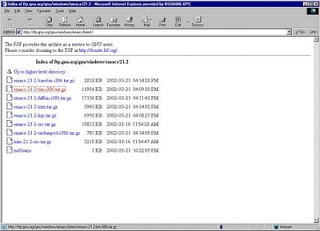
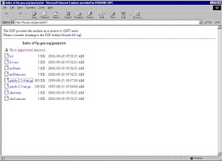
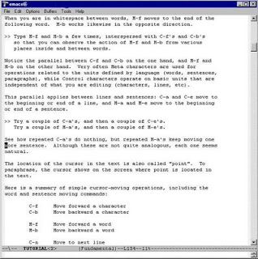

# Emacs Kurmak

Emacs Kurmak

 Emacs programini ilk defa kurmak icin asagidaki tarifi takip edebilirsiniz.                             Bu adresten ekranda görülen kırmızı işaretli olan-dosyayı indirdim. İndirdiğim zip li haldeki dosyayı açmadan once, patch (yama kod) indirdim. Buna neden gerek var bilmiyorum, ama ben yamayı indirip açmadan önce bana  emacs dosyalarını unzip ederken hata verdi. Daha sonra ben yamayı indirip, emacs dosyalarını unzip yaptım.                             Bu siteden patch indirdim. Önce onu açtım. Daha sonra Emacs dizinindeki zip'li dosyayi açtım. Bu sefer sorunsuz açıldı. Faydalandığım adres:  http://www.gnu.org/software/emacs/windows/faq3.html#install               Emacs'i kurduğum dizine gidip runemacs.exe yi çalıştırdı. Daha sonra addpm.exe yi çalıştırdım.                              İlk sayfadan sonra, Ctrl-h' ye basınca Help'i geldi.                 İşte böyle, bu kadar yapabildim. Kısacası en kolay kısmı oldu galiba. Java da yazılabiliniyormuş, HTML falan..Ben Java yazmak için kullanmak istiyorum.               Ben önceden bu Emacs ile takılmıştım bir ara, redhat in dll leri falan gerekiyordu. Sanırım bu yeni kolay sürümü.           Anonim

