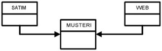

# Müşteri Çizelgeleri

Müşteri Çizelgeleri

 Musteri kayıtları CRM için cok mühimdir. Sonuçta, bütün kayıtlar dönüp  dolaşıp müşteriye bağlanır. CRM için böyle olması gerekir, çünkü raporlar hep müşteri etrafında dönüp dolaşır.                          Mesela müşteri 123 örnek alınsın... Satış, ve Web site uğrak kayıdı olsun. Eğer bu iki değişik kayıdı, müşteri 123 üzerinden bağlanmazsanız, aşağıdaki rapordan doğru sonuç alamazsınız.              "Bana saat 12:00 den sonra web siteme uğramış, ve benim dükkanlarımdan 3 kere alışveriş yapmış müşterilerimin listesini ver".              O yüzden, çizelgeler (table) aşağıdaki gibi gösterilmiştir.                WEB (SAAT DATE,MUSTERI_NO,WEB_SAYFA_NO)               SATIM (MAL_NO,MUSTERI_NO)              Gördüğünüz gibi MUSTERI_NO iki çizelge üzerinde bulunuyor.                  Diyeceksiniz ki: "Ben veri tasarım'ı biliyorum. Bundan kolay ne var? Bir çizelgenin anahtarını, ötekinin içine koyarsınız, olur biter".              İşin mekaniği gelince haklı olursunuz, evet. Fakat hatirlatmak istedigimiz çözüm yolu değil, çözüm sebepleri. Veri tasarım sırasında, sadece arasında bir bağlantı olan kayıtlar birbirine bağlanır. Bir CRM sisteminde kaydedilmiş her 'olay' müşteriye bağlıdır. O yüzden, bu olaylar müşteri kayıdına bağlanmalıdır. Eğer CRM sisteminiz, web sitesi analizi yapıyorsa, 'sepete atma' 'ödeme' gibi kayıtlar, müşteri no'sunu içermelidir. Eğer veri transferi sırasında bu bilgi elinizde yoksa, bir şekilde bunu bulmalısınız.              Müşteri anahtarı yaratma metodu burada işinize yarar. Müşterileri birbirine bağlamak için bâzen elinizde ortak anahtar olmayabilir. Bir şirketin değişik paket programları (satış, depolama) birbirinden ayrı kisiler ve zamanlarda yazılmış olabilirler. Böyle ortamlarda müşteri kayıtlarında bir bağlantı yoktur. Eğer şirket özellikle uğraşmamış ise, ikisi tamamen değişik kayıt ortamlarında, veri tabanlarında olacaklardır.               CRM raporları için bu kayıtları birleştirmek esastır. Anahtar yoksa, "yaratacaksınız". Yâni, müşteri ilk ismin ilk 3 hârfi, adresin ilk 2 hârfi ve posta kodun tamâmı ile bir anahtar yapabilirsiniz. Bu sayede birbirine uyan anahtarlar size aynı müşterileri verecektir.              Genelde veri ambarınıza müşteri veri transferini en son yapın. Sebep: Mesela satış kayıtlarını ambara aldınız. Satış kayıtları üzerinde müşteri anahtarı olacaktır. Bu sayede sadece gerekli olan müşterileri ambara alabilirsiniz. Eğer müşteri için bir satış yoksa, o müşteri kaydını transfer etmek gerekmeyebilir.

