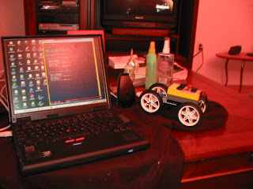

# Lego Oyuncaklarınızı Java ile Kodlayın

Java proglama dilinin esnekliği kendini her yerde gösteriyor. Bu
yazımızda ufak ortamlarda calışan bir örnek sunmaya calışacağım.
Büyük çoğunlugumuz küçükken Lego ile oynadık, ya da ne olduğunu
biliyoruz. Bizim zamanımızda olan Lego parçaları, mekanik ve yerinden
oynamayan parçalardı. Oynayan parçalar olsa bile, çocuklar eliyle
tutup evirip çevirirdi. Buna rağmen, Lego parçaları zeka geliştirmesi
ve çocukları üretmeye teşvik ettiği için muazzam bir ortam
olmuştur. Hayal dünyası ile yakın bağlantı halinde olan çocukların,
yaptıkları şeylere hayat vermesi ve oynamaları gayet rahattı.  Simdi
filimi ileri sararak 21. yüzyıla gelelim. Lego tekrar büyük bir devrim
yaratarak, oyuncak parçalarının içine programlanabilen bir beyin
ekledi.

RCX adı verilen bu beyin, öteki parçalar gibi, ötekilere yapışabilen
türden tabii ki. Fakat en önemli özelliği, üzerinde 5 tane olan çıkış
bağlantısı, ve bu bağlantıların tekerlek, ışık kontrol, dokunma
kontrolü gibi öteki parçalara bağlanması. Bu bağlantı çok
basit. Aç/Kapa şeklinde komutlar, beyinden uzuv parçalara basit
komutlar ile gönderilebiliyor.  Programlama diline gelelim. Lego
Mindstorm kutusunu alırsanız, içinden çıkan CD-ROM üzerinde, görsel
bir program ortamı bulacaksınız. Fakat bu program, görsel çoğu ortamın
olduğu gibi zaman alan bir ortam. Ayrıca gelişmiş bir programlama
dilinin gücü yok.  İşte burada, Java sahneye giriyor. RCX kodunu
anlayıp tersine çeviren programcılar, ufak bir Java VM programını Lego
beynine koymayı başardılar. Tiny VM denen bu ortam üzerinde, Lego
Mindstorm motor ve arayıcı/tarayıcı kontroller icin arayüzü yazdılar,
ve sonuç olarak Java kullanarak Lego oyuncağımızi kontrol etmeniz
mümkün oldu. Bu yeni Lego işletim sistemine LeJos deniyor. (Lego Java
Operating System/Lego Java İşletim Sistemi) Bu yazımızda, LeJos
ortamını nasıl kuracağımızı anlatacağız.  Lego Mindstorm icin yazılan
programlar, önce dizüstü yada masaüstü bilgisayarında
geliştirilir. Geliştirme ortamı bilgisayarınızda USB çıkış noktası
olmasına dikkat edin. Mindstorm kutusundan çıkan bir İnfrared verici
USB ile bağlandıktan sonra, derlenen programları infrared üzerinden
Lego beynine aktarılır. Java ya da basit RCX programları için bu işlem
aynıdır.

Lego Mindstorm paketinizi alınca, CD-ROM'u takip sistemi
kurun. Menüden çıkan seçenekleri takip edip bunu yapabilirsiniz. Bu
işlem tamamlanınca, Lego işletim sisteminin kurulması lazım. (Bu
sistem LeJos'dan farklı, ama kurulması gerekir).  Bu işlemler
bittikten sonra, LeJos sitesinden gerekli programı yükleyin. Windows
ve Linux ortamları için geliştirme kodları bulacaksınız. Bu kodlar,
sıkıştrılmış şekilde tar yada zip ortamında gelecek. Bu dosyaları
açıp, sabit disk üzerine kurun. Nereye kurduğunuz önemli değil.
Kurulduktan sonra, bazı 'ortam değişkenlerini' tanımlamanız
gerekiyor. Windows ortamında iseniz, `Settings | Control Panel`
üzerinden `Environment Variables` seçeneğine gelin. Buradan, `PATH`
değişkeni için `c:\lejos\bin;` ekleyin, ve RCXTTY değişkeni için USB
yazın.  Ayrıca Java geliştirme ortamınız olması lâzım. Bunun için
ekteki baglantidan alabilirsiniz.  Bu işlemler bittikten sonra, komut
satırına gelin ve şu komutu işletin.  lejosfirmdl İşlem sonunda Lego
beyni, iki kere 'bip' sesi çıkartacak.

Kutlarım, artık Lego'nuz Java için hazır.

```java
import josx.platform.rcx.*;

public class Test{

    public static void main (String[] arg)throws Exception {
	for (int rot = 0; rot < 2; rot++) {
	    Motor.A.forward();
	    Motor.C.forward();
	    for (int k = 0; k < 10000; k++){}
	    Motor.A.stop();
	    Motor.C.stop();
	    for (int k = 0; k < 10000; k++) {}
	}

	for (int rot = 0; rot < 2; rot++) {
	    Motor.A.backward();
	    Motor.C.backward();
	    for (int k = 0; k < 10000; k++) { }
	    Motor.A.stop();
	    Motor.C.stop();
	    for (int k = 0; k < 10000; k++) { }

	}

    }

}
```

Programı yazıp kaydedin. Tekrar komut satırına dönün ve şunu işletin:
`lejos Testlejos -o Test.bin Test` ve `lejosrun Test.bin`. Tekrar
kutlarım, yeni yazdığınız program, Lego beynine yüklendi. Geriye kalan
tek yapmanız gereken, Legoyu açıp (On-Off düğmesi), Run (çalıştır)
düğmesine basmak. Programınız işleme girecek.  Örnek olarak gördüğünüz
program için, Lego beyni üzerindeki A ve C motor bağlantılarını iki
tekerleğe baglayın. Program çalışınca, oyuncak arabanız iki kere
ileri, iki gere geri gidecek.



