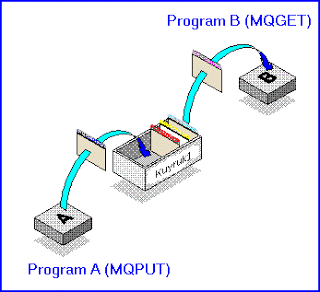

# MQ Series

Bilgisayarlarda mikroişlemci temeline kadar inerseniz, aslında
herşeyin basit bir temel üzerine oturtulduğunu
göreceksiniz. Programlar ana bellek içinde durur, ve program kodlarını
işleten merkez işlemci, kodları teker teker bellekten alıp işleme
koyar. Ve bu kodlar işlerken onların sonucunu BEKLER.  Bilgisayarları
tasarlayan mühendisler için, bu işlet/bekle döngüsü rahat anlaşılır
bir kavramdır. İşleri kolaylaştırır, bu yüzden genelde kullanılan
kavram budur. Ve en temelden desteklendiği icin, bu bütün program
dillerine yansımış, mesela bir Java işlemi de aynen makina dilinin
yaptığı gibi (assembler) işlem sonuçlarını bekler olmuştur.  Fakat
bazen, alternatif bir yaklaşımı kullanmak yararlı olabilir. Bu değişik
yaklaşım şudur: "İşlemi çağır ama sonucu beklemeden yoluna devam et,
sonucu bir şekilde geri alirsın".  Bu tip kavramlar, programlama dili
seviyesinde kullanılabilir, fakat genelde bu iş, dış paket programlar
yardımı ile yapılıyor günümüzde. MQ Series bu programlardan biridir.
İleti (Mesaj) kuyruğu denen programlar, isimleri üzere, cağırılan
işlemleri depolarlar. Mesajları yüksek bir hızda, sistemler arasında
değiş/tokuş yapmak için yazılmışlardır, ve iyi taraflarindan biri,
mesajı KAYBETMEME garantisi verirler (sabit diske yazarak).  Örneğe
gelelim.  Birbirinden alakasız iki sistem düşünelim: A ve B sistemi
tamamen ayrı makinalar üzerinde çalışıyor olsunlar. Hatta 'işletim
sistemleri' bile farklı olsun.

Bu iki sistem arasındaki bağlantı TCP/IP bağlantısı, yani Internet
usûlü bir bağlantı olabilir fakat bildiğimiz gibi TCP/IP, mesaj
iletiminde 'garanti' vermez. Paket düşmesi denen olay sık olmasa bile,
olması mümkün vakâlardandır.  Olayı renklendirmek için, B sistemine
bir servis programı koyalım. Bu 'sunucu' program, çarpma servisi
yapsın bizim için. 3 ve 5 sayısını verince geri cevap 15 verecek
yani. Mucize program!  Arayüz şöyle olabilir.  public class
Islem{public int carp(int sayi1, int sayi2){ return sayi1 * sayi2;}}
Oldu. Fakat, A sisteminden B sistemine nasıl bağlantı yapacağız? Java
dünyasında RMI kullanabiliriz. RMI ile, B sistemindeki arayüzü, A
sistemine uzaktan göstermek mümkün oluyor. yani nesne->carp(3, 5)
islemini RMI A'dan alip B'ye, cevabı ağ sistemi ile geriye
getirebiliriz.  Peki, ya, tam bu işlemi yaparken, B sistemi çökerse?
"Amma da zorlastırdın işi kardeşim, arada sırada çökerse çöksün!"  Bu
cevabın geçerli olduğu iş şartları olabilir. Fakat bazı şartlarda B
sistemi çökünce, geriye yanlış cevap vermek kabul edilemez
olabilir. Bunun üstesinden gelmek icin RMI dünyasında, "olmazsa tekrar
dene" gibisinden 'istisna kodu' yazabilirsiniz, fakat bu A
sistemindeki kodu iyice karıştıracaktır.

Peki çözüm nedir?  Mesaj kuyruk programları bu günler için
yazılmıştır. Önce bir kuyruk tanımlarsınız. Kuyruk_1 ismini verelim:
Bu kuyruğa mesaj koymak ve mesaj okumak mümkündür. Kuyruk_1'in
kendisi, cismen A sisteminde, B sisteminde, ya da en iyisi, bir C
sisteminde yaşıyor olabilir. Nerede yaşarsa yaşasın, sabit mesajları
diske yazdığı için onları kaybetmeyecektir. Ayrıca MQ Series gibi
programlar ile, kuyrukta biriken mesajlar, mesela C sistemi hayata
döndüğünde, ona tekrar iletilmeye başlanır.  Böylece, mesaj kaybı
sorununu çözmüş olduk.  Yanlız bu yeni sistemde biraz değişik düşünmek
zorundayız. Artık, nesne->carp() islemi 'anında' geri dönecek, ve
programınızın geri kalan kısmı işleme koyulacaktır, 'çarpım sonucu
elinize geçmeden'. Çarpım sonucunu belki başka bir kuyruktan geri
almanız mümkün olabilir. Ama, bu tip kararlar program mimarinizi
etkileyecektir. Kuyruk bazlı ve olmayan programlar arasındaki mimari
farkı o yüzden büyük olabilir; Önemli olan, hangi mimarinin ne zaman
lazım olduğunu görebilmek. Eğer, * İki değisik sistem, birbiri ile
mesaj alışverişi yapıp, mesajları kaybetmek istemiyorsa * Bu iki
sistem birbirinden degişik zamanlarda ve kişiler tarafından kontrol
ediliyor, o yüzden indirilip/kaldırılması gerekiyorsa * Bilgi
alışverisinin anlık olması gerekmiyorsa Mesaj kuyruk bazlı programlar
ihtiyacınızı karşılıyabilir.

