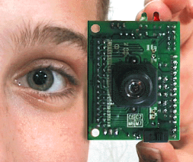

# Ufak Elektronik Göz - CmuCam

Ufak Elektronik Göz - CmuCam

 CmuCam, ucuz ve fazla voltaj gerektirmeyen bir elektronik gözdür. Hareket halinde olan robotların üzerine takmak icin uygun bir devredir.               CmuCam verisini seri port üzerinden verdiği için, dış mikroislemciler ile bağlantısını kurmak çok rahattır (mesela PIC devreleri ile). Saniyede 17 resim çıkartabilen CmuCam'in özellikleri şunlar:               * Renkli bir cismi takip edebilmek   * Objektif önündeki istenen bölgenin RGB (renk) seviyesini ölçebilmek   * Otomatik olarak ilk gördüğü cisme kitlenip, onu izleyebilmek   * Motor kontrolünü direk olarak, kendi devresi üzerinden yapabilmek    * Görüntüyü 'tamamen' sayısal resim olarak, seri port üzerinden gönderebilmek   * İzlenen cismin görüntüsünü tamamen sayısal resim olarak gönderebilmek.                           Bu yazımızda, Java dili kullanarak PC'niz üzerinden CmuCam ile bağlantı kurmayı öğretecegiz.               CmuCam bağlantısı seri port üzerinden olduğu için, ilk önce JavaComm adlı paketi indirmemiz gerekiyor. Sun sitesinden bu arayüzleri indirebilirsiniz. Aldığıniz dosyayı açıp, istediğiniz dizin altında kurabilirsiniz. Not: Tavsiyemiz, CmuCam paketi içinden çıkan seri port kütüphanesini kullanmamanız olacak. Bu arayüzler, standart olmadığı için, her ortamda bulumayacağınız arayüzlerdir. JavaComm şu anda her ortamda (JStamp gibi ufak işlemciler icin bile) destekleniyor.          CmuCam Arayuzu          CmuCam ile bağlantı kurup, komut vermek, veri transferi yapmak, hep seri port üzerinden oluyor. O yüzden, cağırılacak o bir tane Java işlemini bulamayacaksınız. Seri port protokolü, baytları sıraya dizerek gönderdiği için, bu sırayı gözetmek çok önemli olacak.               Mesela, seri port üzerinden 'DF' harflerini gönderirseniz, CmuCam bu komutu 'objektif önünde ne varsa resmini çek, geri yolla' olarak algılıyacaktır, ve sonuçları gene seri port üzerinden geriye gönderir. Aşağıdaki kod parçası, bunun örneğini veriyor.               package camera;import java.io.IOException;import java.io.OutputStream;import java.io.InputStream;import java.io.*;import javax.comm.SerialPort;import javax.comm.SerialPortEvent;import javax.comm.CommPortIdentifier;public class Tracker {protected InputStream inStream;protected OutputStream outStream;public  static void main (String [] args) {Tracker t = new Tracker();t.start();} // end mainpublic void start() {try { // seri portu hazirla initializeSerialPort(); // butun resmi gonder komutu sendMessage("DF\r");  try { Thread.sleep(1000); } catch(InterruptedException e){} while (true) {   // sonucu oku, ekrana yaz   rcvVal = (byte) inStream.read();   System.out.println((char)rcvVal);    } // end while} catch (java.io.IOException ioe) { System.out.println("Error: IOException"); System.exit(1);} // end catch block}public void sendMessage(String msgString) {try { outStream.write(msgString.getBytes());} catch (IOException ioe) { System.out.println("IOException caught in Track.sendMessage");}}public void initializeSerialPort() {SerialPort serialPort;CommPortIdentifier commPortId;try { commPortId = CommPortIdentifier.getPortIdentifier("com2"); if (!commPortId.isCurrentlyOwned()) {   if (commPortId.getPortType() == CommPortIdentifier.PORT_SERIAL) {     try {       serialPort = (SerialPort) commPortId.open("SerialListener",0);       serialPort.setSerialPortParams(115200,         javax.comm.SerialPort.DATABITS_8,         javax.comm.SerialPort.STOPBITS_1,         javax.comm.SerialPort.PARITY_NONE);         System.out.println("params set..");         // Get output and input streams       outStream = serialPort.getOutputStream();       inStream = serialPort.getInputStream();     } catch (javax.comm.UnsupportedCommOperationException ucoe) {       System.out.println("Error: UnsupportedCommOperationException");       System.exit(1);     } catch (javax.comm.PortInUseException piue) {       System.out.println("Error: PortInUseException");       System.exit(1);     } catch (java.io.IOException ioe) {       System.out.println("Error: IOException");       System.exit(1);     } // end catch block   } else {     System.out.println("Error: comm port is not a serial port");     System.exit(1);   } // end if port is serial } //  end if port is not owned} catch (javax.comm.NoSuchPortException nsp) { System.out.println("NoSuchPortException"); System.exit(1);}}}              Ekranda yazılan kodlar, RGB ekran kodlarının temsili hâlidir. CmuCam belgelerinden bunların 'sırasının' ne anlama geldiğini öğrenebilirsiniz. Sonuçta belli baytlar, X ve Y koordinatları temsil ediyor olacaklar.              Örnek kodu derlemek için, ANT build.xml ayartanım dosyası verelim.           <project name="cmucam4j" default="java" basedir=".">  <property name="build" value="${basedir}/build" />  <property name="classes" value="${build}/classes" />  <path id="cp">      <pathelement path="${classpath}" />      <pathelement location="${classes}" />      <pathelement location="c:/commapi/comm.jar" />  </path>  <target name="java" depends="init">      <javac destdir="${classes}" srcdir="${basedir}">          <classpath refid="cp" />          <include name="*.java"/>      </javac>  </target>      <target name="run" depends="java">         <java fork="yes" classname="camera.App" failonerror="true">            <classpath refid="cp" />         </java>      </target>   <target name="init">      <mkdir dir="${classes}/" />  </target></project>      Yararli bağlantılar          CmuCam satın almak için su adrese gidebilirsiniz.               CmuCam ana sitesi  buradan erişilebilir.      

