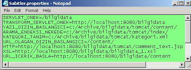

# Bilgi İşlem Tasarım Kalıpları

Bilgi İşlem Tasarım Kalıpları

 Tasarım kalıpları adı verilen akım, Batı'da özellikle bilgi işlem yazılımcıları tarafından son yıllarda çok ilgi görmüştür. Bir tasarım kalıbı basit bir açıklama ile bir nevi reçetedir. Bu reçete, sürekli karşımıza çıkan bir sorun tipine karşı bulunmuş, gene sürekli verilmiş olan ve işe yarar bulunmuş bir çözümdür.                            Bir yazılım kalıbını tasvir için, önce, hangi soruna ilaç olduğunu saptamak gerekir. Bu şartlar tanımlandıktan sonra, çözüm de bu bağlamda verilir, ve örneklerle süslenek kalıp dağarcığına katılır.               Bir yazılım kalıbı, hem çözüm getirmesi açısından, hem de bu çözüme bir isim vermesi açısından çok yararlıdır. Çünkü, artık bu verdiğimiz isim ile "hakkında konuşabildiğimiz" bu kalıbı daha rahat tartışabilmeye başlarız, ve iletişimimiz daha berraklaşır.               Site J2EE kodları da bu tür kalıplar ile doludur. Her ne kadar bu kalıpları yazı yazı paylaşmaya uğraşmış olsakta, bu kalıpların tamamını veren, ve ilgili özel yazılara bir referans içeren bir "ana katalog" çalışması daha yapılmamıştı. Okumakta olduğunuz bu yazı, bu eksiği kapatmaya uğraşacak. İdealimizde, bu yazının, önünüzde çözmek zorunda olduğunuz problem ile karşılaşır karşılaşmaz bakacağı bir başlangıç noktası olmasıdır.              Bu açıştan sonra kalıplara başlayalım.          Kalıp: İstek -> Sonuç                    İhtiyaç          İnternet/J2EE bazlı yazılımımız içinde, kullanıcı bir bağlantıya tıkladıktan sonra, veri tabanından bilgi toplayıp ekranda göstermemiz gerek.           Çözüm          * Tıklanan bağlantı ya bir Servlet'i gösterir, ya da, FORM POST'un hedefi Servlet'tir. Her hâlükarda, Servlet'e kontrol geçtiğinde, bu  servlet'e gönderilen bilgiler istek.getParameter("parametre") gibi bir  kullanım ile okunurlar.    * Parametreler ile sorgu işletilir (JDO, JDBC, vs)   * Veri tabanından gelen sonuç, bir döngü içerisinde okunur, ve aynı anda bir ArrayList listesine bu sonuçlar eklenir.   * Okuma bitince eldeki ArrayList, oturum (session) üzerine eklenir.   * Kontrol, redirect (yönlendir) komutu ile sonucu listeleyecek JSP sayfasına gönderilir.   * Sonuç JSP sayfası, ArrayList'i oturumdan alır, ve JSTL etiketleri kullanarak döngü içerisinde gösterir.         İlgili Yazılar          * JSP'nin Geleceği - JSTL         Kalıp: Dosya/Metin Taraması                    İhtiyaç          Bir dosya, ya da, bir String metni içinde özel bir kelime bulunması lazım. Bulununca bu kelime ya değiştirilecek, ya da bulunduğu rapor edilecek.           Çözüm          Jakarta ORO paketini kullanarak düzenli ifade kullanın, ve Perl'e benzer bir stilde aradığınız kelimeyi bulun. StringTokenizer ile vakit kaybetmeyin. Düzenli ifadeler aradığınız metin formunu çok esnek bir şekilde tanımlayabilmenizi sâglar.           İlgili Yazılar          * ORO         Kalıp: Tomcat Ölçeklemek                    İhtiyaç          Sitemiz bir tek Tomcat servisi ile çalışıyor, ve kullanıcı sayımız artmaya başladı. Site ölçeklenmesi lazım.          Çözüm          Birden fazla Tomcat servisi kullanarak ziyaretçi yükünü dağıtın. Bunun için hem Apaçe, hem de Tomcat sevisinde bazı eklemeler yapmanız lazım.           İlgili Yazılar          * Tomcat ile Dağıtık (Distributed) Sistem İnşâsı         Kalıp: Bilgisayarlararası Dosya Gönderimi                    İhtiyaç          Bilgisayar A'dan bilgisayar B'ye kayıt göndermemiz gerekiyor. scp (ya da rcp) komutu aynı kayıtları tekrar tekrar gönderiyor. Sadece farkları gönderebilen bir teknoloji yok mu?          Çözüm          Rsync kullanarak, ilk sefer her şeyi gönderdikten sonra ikinci ve ya üçüncü sefer sadece farkları göndermeniz mümkündür. Rsync, ssh üzerinden de çalışabildiği için güvenli bir çözümdür.           İlgili Yazılar          * Rsync         Kalıp: XML dosyasına değer eklemek                    İhtiyaç          Elimizde XML dosyasındaki herhangi bir etiket altına yeni bir değer eklememiz gerekiyor. Bunun en basit yolu nedir?          Çözüm          Java dünyasında XML çözümleri tam bir çorbadır. Süzerek seçebildiğimiz kadarı ile, ekleme yapmak için en rahat cözüm Jaxen'dır.          İlgili Yazılar          * Jaxen = XPath + JDOM         Kalıp: Java İçinde Sabit Değerler (Constants)      İhtiyaç                        Java programına lazım olan bazı sabitler (constants) var. Bu sabitleri nerede saklayalım?           Çözüm          Sabit değerleri, yani servis programınız başladıktan çökünceye kadar hep aynı olacak değerleri, muhafa etmek için Java properties dosyalarını kullanabilirsiniz. Properties dosyaları metin bazlı, metinyazar (editör) ile değiştirilebilen dosyalardır. Java ile bu dosyaları okumak için, ResourceBundle nesnesini kullanın. Bu nesne properties dosyasını bulmak için WEB-INF/classes altına bakacaktır. Properties dosyalarınızı bu dizin altına bırakın. J2EE dısındaki mimariler (mesela Swing), properties dosyasını CLASSPATH'e dahil olan herhangi başka bir dizin altına bırakabilirler.           İlgili Yazılar          * Properties Dosyaları - Java İçin Ayar Yapmak         Kalıp: XML İçinde Değer Bulmak      İhtiyaç                        XML dosyasında değişiklik değil, sadece okumak amacı ile işlememiz lazım. Hangi arayüzü kullanalım?          Çözüm          XPATH arayüzü bu iş için biçilmiş kaftandır. Unix dizin sözdizimine benzer bir şekli (/enust/biralt/enalt/dosya gibi) kullanarak etiket değerlerine erişebilirsiniz.             İlgili Yazılar          * DOM ve XPATH kullarak XML işlemek   * Basit XPath Örneği   * XPath İle Çocuk Düğümleri Toplamak         Kalıp: Metin (Text) Bazlı Veriyi Oracle'e Yüklemek                    İhtiyaç          Metin olarak virgül ayrıklı bir dosyadaki bilgileri, Oracle şemetiğinde bulunan bir tabloya yüklememiz lazım.           Çözüm          SQL*Loader teknolojisi tam bu işe göre.           İlgili Yazılar          * Oracle SQL*Loader         Kalıp: Java Nesneleri İle Veri Tabanına Erişmek                    İhtiyaç          Veri tabanına SQL sorguları kullanarak erişmek istemiyoruz. Sadece Java nesneleri kullanarak veri tabanına erişmek mümkün değil mi?          Çözüm          JDO ile bu mümkün. Rakip olarak revaçta bulunan Hibernate'de, standart olmamasına rağmen, fena bir cözüm değil. Fakat standartları daha çok savunan bir site olarak, site kodlarinda JDO kullanıyor(duk). Ayrıca gelecek (bu teknolojiyi kullanan iş bulmanız) açısından, JDO'nun geleceği daha parlak.          İlgili Yazılar          * İnternet Yazılımları İçin Örnek Mimari   * Mevcut Şemetik Üzerinde JDO   * Bağlaşım: Nesneler, Veri Tabanları         Kalıp: Java İle E-posta Yollamak                  İhtiyaç          Java kodumuzdan e-posta göndermemiz gerekiyor.           Çözüm          JavaMail bu sorununuzu çözecektir.           İlgili Yazılar          * Java İle Eposta (JavaMail)

