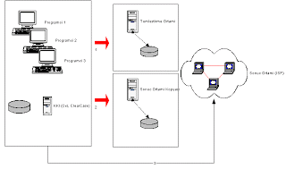

# Geliştirme, Deneme, Sonuç

Projemizin kodlama safhasını dönemlere böldüğümüzü farzedersek, her
dönemin sonucunda yapabileceğimiz iki şey vardır. Ya elimizdeki
kodları sonuç ortamına göndeririz (sürüm) ve böylece kullanıcıların
kullanımına açarız, ya da müşteri rolünü oynayan kimse o dönem için
beklenen özellikleri test eder ama sürüm yapılmaz.  Aşağıdaki
şekillerin neyi kapsadıklarına gelelim: Tümleştirme ortamı, kabul
testlerinin çalıştığı, yani kullanıcıların uygulamayı test ettiği
ortam değildir.

Kullanıcı testleri, en iyi şartlarda sonuç ortam kopyası üzerinde,
olmadıgı zamanlarda ise tümleştirme makinasında ayrı bir servis
şeklinde kurulabilir. Tümleştirme otomatik olarak çalışan, derleme,
birim testleri, "otomatik" kabul testlerini işleten bir
kurulumdur. Teknik lider tarafından betikler ile kurulmuş ve zamanlı
(scheduled) işleyen ortamdır.  (Aşağıdaki şekle bakarak) tümleştirme
ortamı, otomatik ve periyodik olarak (mesela her 30 dakikada bir) en
son kodları kaynak kontrol idare programından çeker, derler, ve
otomatik testlere tâbi tutar.  Geliştirme sırasında kodlanan
nesneleri, tümleştirme ve sonuç ortam kopyasına test edilmek üzere
göndermemizin iyi olacağını belirtmek gerekir.

Bazı takımlar sonuç ortam kopyasına gönderme yapmayı, gerçek sürüm
yapılmadan hemen önce yapmayı seçebilir, fakat sonuç ortam kopyasına
sürüm yapmak, her dönem sonunda (ya da daha sık olarak) iyi bir seçim
olacaktır. Sebeplerine geleceğiz.  Eklemek gerekir ki, bazı projelerde
sonuç ortam kopyası bile olmayabiliyor, özellikle Internet
yazılımlarında, bu çok tehlikeli bir durumdur. Özellikle sonuç ortamı
işletim sistemi geliştirmeden değişik ise, işletim sistemi
farklarından ortaya çıkabilecek bazı hataların en son ana kadar ortaya
çıkmaması mümkündür. Diğer sebeplerde vardır.

Sonuç Ortam Kopyası

Bir İnternet yazılımı, ya da herhangi bir bilgi işlem mimarisi
muhakkak birden fazla katman içerir.  En azından elde olan ikinci bir
entite olarak veri tabanı vardır. Bu veri tabanının nerede olduğu,
nasıl bağlanılacağı gibi bilgileri içeren ayartanım dosyaları kaynak
kod ağacınızın bir parçası olabilir.  Ya da, uygulamanızın ihtiyacı
olan bazı bilgiler XML dosyalarında tutuluyor olabilir. Bu XML
dosyalarının durmakta olduğu dizin, uygulamanıza nasıl
bildirilecektir? Dizin yeri, bir .java dosyası (yani kod) içinde
tutuluyorsa, bu kötü bir programcılık adeti olarak bilinir; çünkü bu
şekilde yazılmış olan kodu alıp başka bir ortama koyduğumuz zaman kod
çalışmayacaktır. Ortam değiştirirken değişmesi "gerekmeyen" kod
yazmak, ulaşmamız gereken amaçlardan biridir.  Kodumuz nasıl yazılmış
olursa olsun, yukarıda bahsedilen türden hataları sonuç ortamına
gelmeden önce yakalamak, projemiz için yararlı olacaktır. İşte sonuç
ortam kopyası (staging) yararı budur.  Bu hataların çıkmasının sebebi,
geliştirme ortamının kuruluş itibarı ile sonuç ortamından her zaman
değişik olmasıdır. Bu değişim, sonuç ortamında belki de birden fazla
makina olması, veri tabanının muhtemelen birden fazla makina üzerinde
yer alabilmesi, veri tabanı kullanıcı isim/şifresinin sonuç ortamında
değişik olması, bazi işletim sistemi dizinlerinin erişim izinlerinin
değişik olması gibi olasılıklardır.  Tabii geliştirme ortamının bile,
sonuç ortamına olabildiği kadar benzetirseniz, kod aktaran
betikleriniz daha basit olacaktır. Ama arada muhakkak bir fark
olacaktır, işte bu farklardan gelecek olan potansiyel hataları önceden
yakalamak için, sonuç ortamına benzeyen bir ortam üzerine bol bol kod
göndermesi yaparak testten geçirmek yararlı olur.  Sonuç kopyasını,
isminin belirttiği gibi sonuç ortamına çok benzeyecek şekilde
kurmalıyız. Sonuç ortamını mesela Oracle veri tabanı sürüm 9.1.0
(atıyorum) ile kurulmuş ise, kopyanın da aynı sürümü en son ufak
numarasına kadar taşıması gerekir.

Eğer sonuç Tomcat kurumu /usr/local/tomcat altında, ve kodlarımız
/usr/projeler/proje123 olarak koyulmuş ise, kopyada aynı şekilde dizin
yapısını kurmalıyız. Eğer sürüm ortamı veri tabanı (büyük bir
ihtimalle) ayrı bir makina üzerinden erişiyor ise, kopyanında aynı
şeyleri yapması isabetli olur.  Süreç Proje dahilinde, bir dönemin
nasıl geçebileceğini özetleyelim.

* (Her gün) Programcılar kod yazar, test ederler, ve KKİ'a eklerler

* (Her gün) Tümleştirme makinasında işleyen bir Rubi ya da Perl
betiği, her yarım saatte bir en son kodu çıkartır, kendi ortamında
derler, test eder, sonuçları bildirir.

* (Özellik bitince) Bir programcı takımı, özelliklerinin kodlaması
bittiğinde (dönem sonunu beklemeden) müşteriye haber verir, test
edilmesini istedikleri özelliğin olduğunu söylerler. Bu anda, müşteri
ya kendisi, ya da bir programcı yardımı ile, sonuç ortam kopyasına en
son kodu gönderilmesini sağlar. Özellik burada test edilir.

* (Son) Dönem sonuna gelince, bir gün öncesinden, sonuç kopyasına
gönderme betikleri tekrar işletilir.

* (Son) Müşteri beklediği özelliklerin hepsini bu ortamda bir daha
test eder

* (Son) Sürüm yapmaya karar verildi ise, kopyaya gönderen betiklerin
benzeri (ya da aynısı) kullanılarak sonuç ortamına sürüm yapılır.

Script Neye Benzer?

Sonuç kopyasına kod gönderen betiğin ne yapması lazım? Tabii ki .java,
.xml, .jar dosyalarını rsynch veya scp ile makineler arasında
kopyalaması gerekir. Bu bir.  Ayrıca, veri taban şematiğini sıfırdan
kurmamıza yarayan, .sql dosyaları içindeki bulunan DDL dilindeki
CREATE TABLE, ALTER TABLE, vs. içeren komutları da kopyada) işletmemiz
gerekir. Bunu yapmamızın sebebi herhalde açıktır. Veri taban şematiği
proje süresince değişen, gelişen bir şeydir, ve bildiğimiz gibi kod,
bir bakıma şematiğe birebir bağımlıdır. O yüzden en son kodun, en son
şematik üzerinde çalışması gerekmektedir. Bütün betiklerinizin, bu
yüzden, DDL komutlarını boş bir veri tabanı üzerinde sıfırdan tekrar
işletmesi isabetli olur. Bu sayede DDL içinde yapılması mümkün
hataları da önceden yakalayacaksınız.  Eğer sonuç ortamı kullanılmaya
başlandı ise, bu sistemin güncellenmesi özel bir sistem bakıcısı
tarafından yapılacaktır, çünkü bu durumda DROP ve CREATE komutlarını
veri tabanında kullanamayız. Sistem kullanılmakta olduğu için verileri
kaybetmemiz mümkün değildir, sistem bakıcı bu gibi durumlarda yeni
şematiğin öncesi ile farklarını otomatik olarak bulur (TOAD programı
buna izin veriyor) ve bu farkları ALTER komutları olarak üreterek
sonuç ortamı üzerinde işletir.

