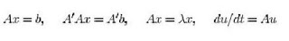

# Gereğinden Fazla Calculus

Gereğinden Fazla Calculus

(MİT üniversitesi Matematik hocası Gilbert Strang'in MİT üniversitesine hitaben bir yazısından alınmıştır)Calculus I, Calculus II, Calculus III - öğretim sistemimizde ne kadar büyük bir dengesizlik! Matematiğin geri kalan kısmı Calculus tarafından boğuldu denebilir. Bu kadar Calculus dersinden sonra takip eden ders herhalde Türevsel Denklemler (gene Calculus), Calculus'tan önceki ders'te herhalde Calculus'a Giriş dersi idi. Arkadaşlar, bu dengesizliği düzeltmek bizim görevimiz, bunu başkasından bekleyemeyiz. Lineer cebir'in ne kadar önemli bir ders olduğunu biliyoruz. Bu ders seçmeli/rasgele alınan bir ders değil, uygulama olarak birçok öğrenciye Calculus'dan daha faydalı olacak bir ders. Artık sayısal bir dünyada yaşıyoruz.Bu konu hakkında dünyadaki hocalara öncü ve örnek olmamızı istediğim için, Lineer Cebir'in faydalarından bahsetmek istiyorum. Özetle şöyle düşünüyorum: Eğer şu ankinden daha fazla öğrenci Lineer Cebir öğreniyor ise, matematik bölümü bir şeyleri doğru yapıyor demektir. İstatistik ve Ayrıksal Matematik te lazım. Umarım bölüm başkanı ve rektör onaylar. İnanıyorum ki bu sayede öğrencilerimi için doğru şeyi yapmış olacağız.İzin verirseniz, lineer cebir ders basamaklarından bahsedeyim. Mesela dersin her aşaması belli denklemlerin çözümüne, ya da o denklemleri çözmeye temel olan fikirlere ve algoritmalara  göre ayırılabilir. Bu safhalar birbirini tamamlamalıdır. Mesela 4 denklemi merkez olarak alabiliriz.        En önemli nokta, herhangi bir uygulama için (gerçek dünyada) bir doğrusal 'sistemi' görebilmek. Şu bizim ünlü A matrisimizi bulabilmek, tanımlayabilmek ne kadar önemli değil mi? Bunun sonrasında tabii ki o matris üzerinde işlem yapmamıza yardımcı olacak fikirler takip edecek.* Alt-uzaylar ve bazlar, izdüşümler ve dikgenlik, özvektörler ve özdeğerler* Algoritmalar da çok önemli (matris çarpımı da buna dahil)* Ax = kolonların katışımı, A = LU ile yokedilmesi, sonra Gram-Schmidt işlemiEn mühim konu da 'doğrusal dönüşüm'. Eğer bir problem içinde matrisin bazına ne olduğunu biliyorsak, her şeyi biliyoruz demektir. Ben örneklere odaklanabilirim, siz ispatlara odaklanabilirsiniz, ama sınıfın ne beklediğine her zaman kulağımızı açık tutalım.Tekrar ana konuya döneyim, çünkü hepimizin yardımını ve eylemini gerektiriyor. Lineer cebir hakkında çoğunlukla destek görüyoruz, ya da aldırmazlık görüyoruz. Öteki hocaların da kendi yapacak işleri var, hattâ ve hattâ üst düzey mühendisler bile lineer cebiri istenmeyen bir şey olarak görebiliyorlar. Belki de  bilgisayarların işleri nasıl değiştirdiğinin farkında değiller. Fakat sonuçta öğrencileri önde tutarak doğru seçimi yapacaklardır. Öğrenciler durumu anladığında hocalarımız da doğru seçimi yaptıklarını inanacaklarına eminim.Calculus I, II ve III derslerinin kendisinin reform edilmesi bu sunumun dışında. Bu dersler de önemli, ama hayat-memat seviyesinde değil. Öğrencilerin çoğuna 'yararlı' olacak türden matematik öğretmek bizim görevimiz.Gilbert Strang

