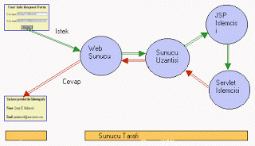

# JSP Kullanarak Web Uygulaması Yazmak - 1

JSP Kullanarak Web Uygulaması Yazmak - 1

 Eğer CGI ya da Java servlet kullanarak web uygulaması geliştirdiyseniz, program içinden HTML üretmek nasıl olur biliyorsunuz. Bu programlar, HTML belgesinin hem sabit (statik) hem de değişken (dinamik) kısmını hep beraber üretirler. Eğer değişken üretim kısmını ötekinden ayırmak istiyorsanız, JSP teknolojisi yardımınıza koşuyor.               JSP teknolojisini kullanarak, uygulamanızın gösterim kısmını iş mantığı kısmından ayırmanız mümkün olacak. JSP çok uygun bir 'acele geliştirme' ortamı (RAD). Bu yazıda günümüzün en modern geliştirme tekniklerinden olan JSP'yi detaylı olarak öğreneceğiz.           Değişken Internet          İnternet, sabit ve birbirine bağlı sayfalar ortamından, günümüzdeki e-ticaret ortamına dönüştü. Ger geçen gün daha zor işler yapan bu yeni uygulamalar için 'değişken bilgiyi gösterebilecek' türden bir teknoloji lazım idi.               İlk nesil teknolojilerden biri CGI'dır. CGI'ın aslında tek yaptığı Web sunucusundan işletim sistemine bağlantı yaparak, bazı dış programları işletebilmekten ibaretti. CGI'ın problemi her web bağlantısı için yeni bir işletim sistem süreci (process) başlatması sebebiyle ölçeklenememek olmuştur, bildiğimiz gibi yeni bir süreç başlatmak işletim sistemi dünyasında pahalıdır, yani zaman alır.              İkinci nesil çözümler dahilinde, her Web sunucu firması kendi sunucusu için bir eklenti piyasa sürdü. Tek problem bu eklentinin, o web sunucuna özel olmasıdır, mesela ASP teknolojisi IIS web sunucusu gerektiriyor idi (ve Windows). Diğer teknolojilerden Java servlet teknolojisi sunucu tarafında kodlamayı daha rahatlatsa da, servlet'ler bildiğimiz Java nesnesi olduğu için, programcıların kodla/derle/yolla döngüsü içine girmeleri gerekiyordu. JSP 3. nesil bir çözüm olarak hem 2. nesil çözümlerini kullanabilme, fakat daha rahat geliştirme ortamı sağlayıp, birden fazla web sunucusu ve işletim sistemi üzerinde çalışabilme yeteneğine sahip olduğu için daha çok rağbet görüyor.          Java Server Pages (JSP)          JSP, JavaTM2 Enterprise Edition (J2EE) tarifnâmesinin önemli bir parçası olarak birçok ortamda mevcut. Mesela WebLogic, IBM WebSphere, Live JRun, Orion gibi ticari ürünler üzerinde JSP kullanabilirsiniz.           JSP ASP karşılaştırması          JSP ve ASP özellik olarak birbirine benziyor. İki teknoloji de, etiket (tag) kullanarak programlama dil kodlarını sayfa içine koymanıza izin verir. Oturum (session) takibi, veri tabanı bağlantısı idaresi gibi şeyler iki teknoloji altında da mümkün. İki ufak fark:  * ASP kodları VBScript ile yazılır, JSP'ler Java ile yazılır. Bu yüzden ASP'ler işletim sistemine bağlıdır, JSP'ler sistemlerden bağımsızdır.    * Arka planda bileşen mimarisi olarak ASP ActiveX kullanır, JSP JavaBeans teknolojisi kullanır.             Ufak farklardan sonra, şirketinizde hangi teknolojinin kullanılacağı sorusu için, daha önemli farklara gelelim:  * Hız ve Ölçek: ASP sayfaları önbellekte tutularak hızlandırılabilmesine rağmen, ASP sayfaları her defasında silbaştan yorumlanır. JSP'ler Servlet Java nesnelerine 'derlenir' ve bu nesneler ilk lazım oldukları anda belleğe yüklenirler. Sonraki bütün kullanımlar bu bellekten servis edilir. Bu yüzden JSP'lerin hız ve ölçeklenebilme avantajı vardır.    * Uzatılabilen Etiketler: JSP'lerin ileri seviye özelliklerinden biri uzatılabilen etiketler kavramıdır. Bu mekanizmayı kullanarak programcılar kendi etiketlerini kendileri yaratabilirler. Yani, JSP'nin dilini istediğiniz gibi uzatabilirsiniz. Bunu ASP'de yapmak mümkün değildir.          Yazılım Ortamı          JSP ortamında geliştirme yapmak için JSP ve Servlet tarifnamelerine uygun bir web sunusu ve o sunucuya bağlı bir kap ortamına ihtiyacınız var. Kap ortamı JSP ve Servlet'lerin içinde çalıştığı bir kap olacak. Tomcat 3.2.1 sürümü Java Servlet 2.2 ve JSP 1.1 standartlarına uygun bir kap ortamıdır.                Tomcat kurmak için:   * JAVA_HOME çevre değişkenine Java Standard Edition (J2SE), yani Java derleyicisinin olduğu dizin değerini verin.    * TOMCAT_HOME çevre değişkenine Tomcat programının olduğu dizin değerini verin.   * Tomcat başlatmak için TOMCAT_HOME/bin/startup.bat ya da TOMCAT_HOME/bin/startup.sh programını kullanabilirsiniz. Olağan değer olarak port 8080 kullanılacaktır.   * .jsp dosyalarını TOMCAT_HOME/webapps/examples/jsp altında koyabilirsiniz, JavaBean'lerinizi TOMCAT_HOME/webapps/examples/web-inf/classes altına koyabilirsiniz.         JSP'ler nasıl işler          En basit açıklama olarak, JSP bildiğimiz HTML sayfası ile beraber olan biraz Java kodundan ibarettir. Dosya uzantısı olarak .jsp kullanmanız gerekir, .html ya da .htm kullanmayın. Çünkü .jsp uzantısını gören web sunucu, bu dosyanın değişik işlem gerektirdiğini anlayacak, böylece dosyayı web kabına havale edecektir.              Ã�rnek 1:tarih.jsp<HTML><HEAD><TITLE>JSP Ã�rneÄ�i</TITLE></HEAD><BODY BGCOLOR="ffffcc">
<H2>Ay ve Saat</H2><%java.util.Date bugun = new java.util.Date();out.println("Bugünün tarihi: "+bugun);%>
</BODY></HTML>             Bu örnekte gördügümüz, normal HTML kodu ile biraz Java kodu.  etiketi Java kodunun bittiğini haber veriyor. tarih.jsp tarayıcınızdan çağırılınca, şöyle bir sonuç çıkacak. (İngilizce tercüme en kısa zamanda yapılacak)                        Perde Arkasında Olanlar          tarih.jsp sayfas çağırıldığında, JSP işlemcisi tarafından derlenecek ve Java servlet'ine dönüştürülecektir. Bu noktadan sonra bu Servlet aynen öteki normal Servlet'lerin tâbi olduğu işlemlere tâbidir. Sınıf yükleyicisi kullanılarak Servlet belleğe yüklenir, ve değişken HTML üreterek sonucu tarayıcıya gönderir. (Şekil 2'ye bakınız).                             Eğer aynı JSP sayfası tekrar çağırılır ise, hafıza da zâten olan Servlet tarafından iş görülür; eğer JSP'de değişiklik olduysa, JSP tekrar derlenip yeni bir servlet çıkarılacaktır.           Programcık Öğeleri          Örnekte Date nesnesini kullanırken, bütün paket ismini beraberinde kullandık. Eğer bunda kısaltma yapmak istiyorsanız, page kelimesini kullanmanız gerekir.              Ã�rnek 2:tarih2.jsp<%@page import="java.util.*" %><HTML><HEAD><TITLE>JSP Ornek</TITLE></HEAD><BODY BGCOLOR="ffffcc">
<H2>Tarih ve Saat</H2><%java.util.Date bugun = new java.util.Date();out.println("Bugunun tarihi: "+bugun);%>
</BODY></HTML>             Ya da, <%= etiketini kullanarak, daha kısa bir şekilde kullanım yapabilirdik:             Ã�rnek 3:tarih3.jsp<%@page import="java.util.*" %><HTML><HEAD><TITLE>JSP Ã�rneÄ�i</TITLE></HEAD><BODY BGCOLOR="#ffffcc">
<H2>Tarih ve Saat</H2>Bugunun tarihi: <%= new Date() %>
</BODY></HTML>             Gördügünüz gibi aynı şeyi değişik şekillerde yapmak mümkün. Etkili JSP programları için akılda tutmanız bazı şeyler:              * <% ... %> kullanarak tanım yapabilirsiniz.    * Programcık dilini belirtmek için <%@page ... %>  ibaresini kullanabilirsiniz. (Olağan değer Java'dır). import kelimelerini de bunun altında kullanabilirsiniz. Örnek: <%@page language="java" import="java.util.*" %>.   *   kullanarak 'işlem' tanımlayabilirsiniz. Mesela <%! int x = 10; double y = 2.0; %>.   * <%= ... %> kullanarak deyim belirtip sonucu dönüşüm ile String yapabilirsiniz. Mesela: <%= a+b %> ya da <%= new java.util.Date() %>.   * include ibaresini kullanarak <%@ include ... %> diyerek başka dosyanının içeriğini ana JSP sayfasına otomatik ekleyebilirsiniz. Mesela: <%@include file="copyright.html" %> .

