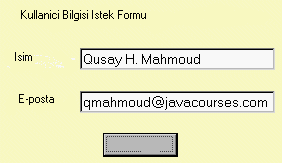

# JSP Kullanarak Web Uygulaması Yazmak - 2

JSP Kullanarak Web Uygulaması Yazmak - 2

 E-ticaret uygulamalarında en çok yapılan şeylerden biri kullanıcı hakkında bilgi istemek, ve bir HTML formunu dolduran kullanıcının bilgisini sunucuya iletmektir. JSP kullanarak alacağımız bu bilgiler request (istek) adlı Java nesnesinin içinde tarayıcıdan servlet kabına iletilecektir. request işlendikten sonra cevap response (cevap) nesnesi içinde tarayıcıya geri gönderilir. Bu iki nesne programcıya açıktır.               Örnek olarak HTML formlarını JSP ile nasıl işleyeceğimizi gösterelim. Birinci bilgi alanı isim, öteki e-posta adresi için olsun. Gördüğümüz üzere, HTML formu JSP dosyası içinde tanımlanmış. request.getParameter() işlemi, form içinden ihtiyaç olan bilgileri almak için kullanılıyor.              isle.jsp sayfası, kullanıcının girdiği bilgilere bağlı olarak ekrana isim ve e-posta bilgilerini yazıyor. Eğer form değerleri null (sıfır) ise, form tekrar gösteriliyor, eğer değer var ise girilen değerler gösteriliyor. Önemli bir nokta da, form sayfası ve işleyici sayfanın aynı sayfa olması. Bu biraz karışık gelebilir.             Ã�rnek 4:isle.jsp<HTML><HEAD><TITLE>Form Ã�rneÄ�i</TITLE></HEAD><BODY BGCOLOR="#ffffcc"><% if (request.getParameter("isim")==null && request.getParameter("eposta") == null) { %>
<H2>Kullanıcı İstek Formu</H2><FORM METHOD="GET" ACTION="isle.jsp">
Ä°sim: <input type="text" name="isim" size=26>
E-posta adresi: <input type="text" name="eposta" size=26>
<input type="submit" value="Isle"></FORM>
<% } else { %><%! String isim, eposta; %><%isim = request.getParameter("isim");eposta = request.getParameter("eposta");%>
<B>Ekteki bilgiyi verdiniz</B>:
<B>Ä°sim</B>: <%= isim %>
<B>Eposta</B>: <%= eposta %><% } %></BODY></HTML>             isle.jsp formu web sunucusundan istendiğinde, ekteki görüntü gelecek.                             İsim ve e-posta girildikten sonra, ve form sunucuya verildikten sonra sonuç olarak ekteki gibi bir görüntü göreceksiniz.                         Yeniden Kullanılır Bileşenler          Yukarıdaki örnek basit bir örnek idi, kod miktarı az fazla değil. Elimizde daha fazla kod olduğu zaman, iş mantığını görsel kodlar ile karıştırmamak çok önemlidir. Eğer bu iki kod tipini birbirinden ayırırsak, bir tarafı öteki tarafı etkilemeden değiştirmemiz mümkün olur. Sonuç ortamına hazır JSP'ler sadece ve sadece görsel kısım için kullanılmalıdırlar. Peki o zaman iş mantığını nasıl kodlayacağız diye sorabilirsiniz..              JavaBean teknolojisi burada yardımımıza yetişiyor. JavaBean'ler taşınabilir (portable) işletim sisteminden bağımsız bir bileşen modeli olarak bir kere yazdığımız bileşenleri her yerde kullanmamızı sağlayabilir. JSP örneğinden yola çıkarsak, bir JavaBean, kullanıcının girdiği bilgiyi ya depolayarak ya da sayfaya veri olarak yollayarak iş mantığı kısmını halletmiş olacak, gelen veriyi formatlayan kısım JSP sayfası olacak.           Faydalar          JSP ile beraber JavaBean kullanmanın birkaç yararı var.               * Çokkullanılır bileşenler: Değişik uygulamalar (ya da sayfalar) aynı JavaBean'ni kullanabilir/paylaşabilir.   * Görsel mantık/iş mantığı ayrılır: Verinin ekranda gösteriliş tarzını iş mantığını etkilemeden değiştirebilirsiniz.          Örnek: JSP ile JavaBean kullanmak          Şimdi, yukarıdaki örneği JavaBean kullanacak şekilde değiştirelim. Form içinde iki alan var, isim ve e-posta. JavaBean dünyasında bunlara özellik (property) denir. İlk önce JavaBean üzerinde getX ve setX işlemleri yazılır; X harfini özellik ismi yerine kullanıyorum. Yani eğer elimizde getIsim ve setIsim işlemleri var ise, demek ki özellik 'isim'. Örnek 5'te örnek bir JavaBean görebilirsiniz.              Bileşenlerin öteki şirketlerin yazdığı  bileşenler ile aynı ortamlarda çalışabilmesi için bazı kuralları takip etmek gerekiyor. (Zaten bu kurallar JavaBean mimarisi tarafından zorunlu kılınmıştır).              * Her JavaBean bildirgeç gerektirmeyen bir kurucu işlem sağlamak zorundadır. Bunun sebebi, bu kurucunun Beans.instantiate işlemi tarafından kullanılacak olması.   * Bileşeninizin kalıcılık (persistence) özelliği olmalı, yani, Serializable ya da Externalizable arayüzünü 'yaşama geçirmesi' gerekir.               Örnek 5:FormBean.javapackage ornek_paket;import java.io.*;public class FormBean implements Serializable {private String isim;private String eposta;public FormBean() {isim = null;eposta = null;}public void setIsim(String isim) {this.isim = isim;}public String getIsim() {return isim;}public void setEposta(String eposta) {this.eposta = eposta;}public String getEposta() {return eposta;}}              FormBean bileşenini JSP'den kullanabilmek için, bean'i yaratmanız gerekir. Bunu  etiketi ile yapabilirsiniz. Hemen sonraki satır  bean yaratıldıktan sonra işleme geçecektir, ve bean'in iç özelliklerine ilk değerleri vermek için kullanılır. Her halûkarda isim ve eposta tek bir satır kullanarak değer verilmiş olacak.                <%! String sizinisim, sizineposta; %><% sizinisim = request.getParameter("isim"); %><jsp:setProperty name="formbean" property="isim" value="<%=sizinisim%>"/>              Özelliklerin bir kere ilk değeri verildikten sonra, esas değerler (ekran için) else altındaki <jsp:getProperty> tarafından alınacak. Örnek 6;ya bakabilirsiniz.              Ã�rnek 6:isle2.jsp<jsp:useBean id="formbean" class="kullanici.FormBean"/><jsp:setProperty name="formbean" property="*"/><HTML><HEAD><TITLE>Form Ornegi</TITLE></HEAD><BODY BGCOLOR="#ffffcc"><% if (request.getParameter("isim")==null && request.getParameter("eposta") == null) { %>
<H2>Kullanici Bilgi Istek Formu</H2><form method="GET" action="isle2.jsp">
Isminiz: <input type="text" name="isim" size=27>
Eposta adresiniz: <input type="text" name="eposta" size=27>
<input type="submit" value="Isle"></FORM>
<% } else { %>
<B>Verdiginiz Bilgiler</B>:
<B>Ä°sim</B>: <jsp:getProperty name="formbean" property="isim"/>
<B>Eposta</B>: <jsp:getProperty name="formbean" property="eposta"/><% } %></BODY></HTML>         Sonuç          Kaliteli web uygulamaları yazmak isteyen programcılar, bugün olduğu kadar yarınlarda işlerine yarayacak teknolojileri öğrenmelidirler. JSP ve XML böyle teknolojilerdir. Ek bilgi olarak, bütün Java programcılara J2EE Örnek Mimari  programına bakmalarını tavsiye ederim. Bu örnek mimari bazı yararlı püf noktaları vermek ve büyük tasarımlara örnek teşgil etmesi sebebiyle çok yararlı bir çalışma.

