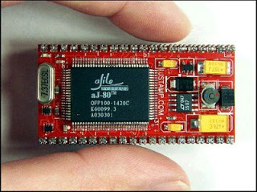

# JStamp - Elde Taşınan Java

Java dilinin yaratılış amacı küçük sistemler idi. Kablolu televizyon
üzerinde duran kontrol kutusu için tasarlanan Java, şimdi büyük
sistemlerde kullanılsa bile, ilk önceleri kibrit kutusuna sığmak amacı
güdüyordu. Daha iyi bir dil arayan nesnesel programcuları, Java'nin
üzerine atlayıp, birçok değişik yöne çekmişlerdir. Bu yüzden Java,
Internet sayfa programlarından, veri tabanı işlemcilerine kadar her
yerde kullanılmaya baslamıştır.  Java, hic kuşkusuz nesnesel
programcılığa büyük rahatlık getirdi. C++ dilinin yaptığı hatalardan
ders alarak, kurallarını temiz tuttu, ve programcılık hatalarını
azaltmaları için programcılara "yardım" etmiş oldu. Ayrıca, Java'nın
sektöre kazandırdığı çok önemli kavram, "arakod" kavramı olmuştur.
Diğer diller makina koduna derleme yaparken, Java, arakod denilen
"sanal" bir makina için derleme yapıyordu. Tabii o zaman arakod
caliştırmak için bu sanal makinanin her işletim sisteminde 'yaratmak'
gerekmiştir. Su anda asağı yukarı her işletim sistemi için bir sanal
makina yazılmış durumda.  Simdi gelelim ufak sistemlere. C++
örneğindeki gibi, Assembler dili ile uğrasmak istemeyen ufak sistem
programcıları, ve, Java yaratıcılarının ilk amaçlarını hiç
unutmamaları sayesinde ufak sistemler icin Java yönünde bir atılım
başladı.

Javelin Stamp, TINI adlı ürünler bu alanda çözüm getirmeye
uğrastılar. TINI devresi, ufak alanda TCP/IP servisi sağlamak amacı
ile yola çıktı, Java Stamp aynı firmanin ürünü olan Basic Stamp
kavramını Java'ya taşımak için yola çıktı. Bu iki devre başarılı
oldular.  Burada PIC kavramından bahsetmemiz lazim. Javelin Stamp ve
TINI bir PIC sistemidir. PIC, Programmable Integrated Circuit yani
Programlanabilir Devre anlamına gelir. OOPIC, Nesnesel
Programlanabilir Devre olarak anılır. Yani Javelin Stamp ve TINI bir
OOPIC sistemidir (Java kullandikları ve küçük oldukları için).  Bir
PIC sisteminin genelde yaptığı, giriş uçlarından gelen '1' yada '0'
sinyallerini saklayıp ve işleyip, çıkış PIN'leri üzerinde '1' ve '0'
yaratmaktır. Bunu öyle basit bir seymiş gibi görmeyin: Sonuçta, coğu
veriyi 1/0 olarak temsil etmek mümkündür. Sonuç sinyali olarak 1/0'lar
kapı açıp kapama, motor başlatma gibi işler yapabilirler. Üstüne
üstlük, şimdiki PIC'ler üzerinde seri port bağlantısı var (PC'niz
üzerindeki COM1 yada COM2 olduğu gibi) ve büyük miktarda veriyi
böylece alıp, işleyebiliyorlar.  Java seçeneklerine dönelim. Javelin
Stamp ve TINI iyi olsalar bile, hafıza kapasiteleri çok az olduğu için
(32K civarı) bazı uygulamalar için eksik kaldılar.

Örnek olarak, etrafta dolaşabilen bir robotun gördüğü nesneleri
tanıması, yani görüntü işlemesi örneğini verebiliriz. Bu tur işlemler
için, yeni nesil bir Java devresi gerekiyordu. Buyrun size JStamp.
JStamp devresinin özellikleri JStamp, 512K bellek, ve 70Mhz
mikroişlemci hızı ve küçücük ölçüleri ile elde taşınan uygulamalar
için biçilmiş kaftan olmuştur. En önemli özelliği, üzerinde aj-80
denen, Java arakodları kökten destekleyen bir işlemci
kullanmasıdır. Yani aj-80 işlemcisi "tam tamına bir Java makinası"
diyebiliriz.

Sanal bir makina değildir, yani, Java arakodları aj-80 üzerinde
"anakod" haline gelmiştir.  Örnek bir uygulama gösterelim. Mesela,
JStamp kullanarak, herhangi bir PIN (çıkış noktası) üzerinde 3
Volt'luk bir voltaj yaratalım. Bu voltajı '1' sinyali anlamında
kullanabiliriz.

```java
import com.ajile.drivers.gpio.GpioPin;

  public class SinyalYarat{
    GpioPin pin;
    
    public static void main (String [] args) {

      pin = new GpioPin(GpioPin.GPIOA_BIT4);
      pin.setOutputPin(true);
      motor1.setPinState(true);
    }
}
```

Burada GPIOA_BIT4, çıkış noktalarından birinin adıdır. Bütün PIN'lerin
tarıfını görmek için su adrese bakabilirsiniz.  Bu kadar basit. Ayrıca
JStamp üzerinde iki tane RS-232, yani seri port bulacaksınız. Büyük
miktarda veri transferi için bunları kullanabilirsiniz. 152000 baud'a
kadar hızlı veri transferi yapmak mümkün.  JSTamp üzerine Flash ROM
desteği de bulunuyor. 512 K ölçüde olan Flash ROM içinde, devre
kapansa bile 'kaybolmayan' türden olması gereken programlar tutabilir.




