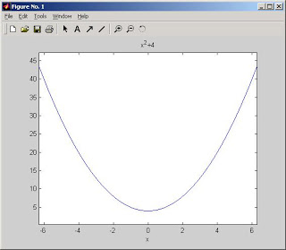

# Matlab Yerine Octave

Matlab Yerine Octave

Not:  2010 itibariyle tavsiyemiz matematiksel bilimsel hesaplar, grafikleme  isleri icin Python dili uzerinden ve Numpy, Scipy paketlerinin kullanilmasidir.Matlab programı, matematik formüllerini otomatik olarak çözmek için şahane bir program. Artık çoğu üniversitede matematik dersleri için öğrencilere Matlab veriliyor. İstatistik, olasılık, sembolik formül çözümü, grafikleme, doğrusal cebir gibi işlemleriniz için Matlab'i kullanabilirsiniz. Matlab'in en güçlü tarafı doğrusal cebir hesaplamalarıdır. Bunda tabii ki Matlab'in tarihi önem kazanıyor, programın ilk kullanıldığı alan doğrusal cebir problemleri idi. >> A = [2 3 4; 5 6 7]A =2     3     45     6     7>> A'ans =2     53     64     7>> A'*Aans =29    36    4336    45    5443    54    65>> A'*ABurada A adında bir matris yarattık, devriğin aldık, ve devriğini matrisin kendigi ile çarptık.>> x = sym('x');>> f = x^2 + 4>> diff(f)ans =2*x  Yukarıda x adlı bir sembol tanımladık, f fonksiyonu girdik, ve türevini aldık. Fonsiyonu ezplot(f) komutu ile fonksiyonu grafik olarak gösterebiliriz.>> ezplot(f) Ya Matlab Yoksa?Fakat Matlab para ödemeniz gereken bir program. Bulamayanlar için Octave Matlab yerine geçebilecek bir program. Serbest yazılım olduğu için herkese açık.Octave'ın yaratıcıları, programı Matlab ile birebir uyumlu yapmak için yola çıkmışlar. Hakikaten de, çok yaklaşmışlar. Matlab script programları, .m dosyaları üzerinde durur. Bu dosyalardan çoğunu işlettiğimizde Octave ile aynen işlediğini gördük.Grafik için, Octave gnuplot adlı programa dısardan çağrı yapıyor, fakat bu da hiç problem değil, çünkü gnuplot programı da bedava.  Octave'i Ubuntu uzerinde kurmak cok kolay: sudo apt-get install octave3.2 octave-optim octave-image. En son iki paket imaj isleyebilmek ve optimizasyon yapabilmek icin. kaynak kodlarından derlenerek kurulabilir. Windows üzerinde Cygwin (Unix komut satırını Windows'a getiren) kullanilabilir. Windows için en basiti, zaten derlenmiş işler kodlardan kurmak. Bu halde bile cygwin programına ihtiyaç var, unutmayın. Octave'ı şuradan indirebilirsiniz. Winzip programı kullanarak, tar.gz dosyayına tıklayın ve cygwin üzerine açın. Açmak derken ters-sıkıştırma yapmak anlamında söylüyorum. Bu işlem bittikten sonra, gnuplot ile bağlantı kurabilmek için, pipe-gnuplot adlı işler kod lazım. Bu işler dosyayı c:\cygwin\usr\local\bin altına koyun. Şimdi, c:\cygwin\usr\local\share\octave\site\m\startup\octaverc ayar dosyasına girip, aşağıdaki şekilde değiştirin....gnuplot_binary = "pipe-gnuplot c:/gp373w32/wgnupl32"..Tabii bunun işlemesi için, gnuplot programının, c:/gp373w32 altında olması lazım. Tipik ProblemBaşıma gelen ilk hata, cygwin kurulurken, less adlı komutun kurulmamış olmadı idi. Cygwin kurucu programını tekrar başlatarak bu yardımcı kodu ekledim, ve Octave çalışmaya başladı. $ octave-2.1.40.exeGNU Octave, version 2.1.40 (i686-pc-cygwin).Copyright (C) 1996, 1997, 1998, 1999, 2000, 2001, 2002 John W. Eaton.This is free software; see the source code for copying conditions.There is ABSOLUTELY NO WARRANTY; not even for MERCHANTIBILITY orFITNESS FOR A PARTICULAR PURPOSE.  For details, type `warranty'.Please contribute if you find this software useful.For more information, visit http://www.octave.org/help-wanted.htmlReport bugs to .gnuplot_binary = pipe-gnuplot c:/gp373w32/wgnupl32gnuplot_has_multiplot = 1page_output_immediately = 1ans = :/usr/local/share/octave/2.1.40/m/statistics//:/usr/local/share/octave/2.1.40/m/control//octave-2.1.40:1> a = [3 4 4; 5 6 6]octave-2.1.40:2> a'ans =3  54  64  6

