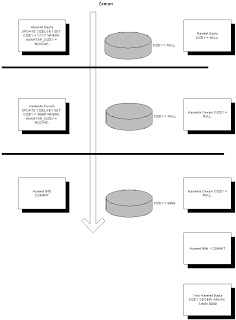

# Oracle ve İşlem İdaresi

Veri tabanlarını kullanırken anlamamız gereken çok önemli bir kavram
işlem (transaction) kavramıdır. Veri tabanı nedzinde işlemler, zamana
bağlı olarak gelişirler, ve bu konuda işlemler, veri tabanına direk
bağlı olan programların veriyi 'hangi zamanda, nasıl' göreceğini
kontrol ederler.  Yani, dış dünyadan veri tabanının içine bakmamız bir
işlem çerçevesinde gerçekleşir.

Üstteki resim ile işlemlerin nasıl kullanıldığını görüyoruz. Benzetme
ile anlatmak gerekirse, bir işleme başlamak şuna benzer: Mesela veri
tabanı bir apartman dairesi olsun, o zaman işleme başlamak, kişinin
(kullanıcı) evin bütün odalarına (veriye) bakıp, akılda tutup, sonra
bir odaya girmesidir. Bu odaya girince, kişi aklında olan bilgileri
işleyip hakkında kararlar verebilir, vs.  O sırada, öteki odalarda ve
de evin içinde yapılan kalıcı değişiklikleri göremez.

İşlem bitimi, Oracle COMMIT kelimesi ile olur, ve benzetmemizdeki
kişinin odanın dışına çıkıp yaptığı değişiklikleri evin içine kalıcı
olarak koymasına ya da, dısarıda yapılmış olanları görmesi demektir.
Buna işlemlerin kendilerini birbirlerinden 'izole' edebilme özelliği
denir.  Kilit Sistemi ve İşlem Sınırları Ayrıca, işlemlerin veri
izolesi için kullanılmasına ek olarak, Oracle kilit sisteminin de
işlem kavramında direk bağlandığını göreceksiniz.

Yani, SELECT * FROM CIZELGE1 WHERE DIZEY1 = '111' FOR UPDATE; komutu
sonucunda, DIZEY1 değeri 111 olan veri satırı (row) kitlenecektir. Bu
satır, aynı bağlantı üzerinde COMMIT komutu verilene kadar kitli
kalacaktır.  Aynı işlem sırasında kitli satıra erişmek isteyen öteki
kullanıcılar, eğer yukarıdaki komutun AYNISINI işletirlerse, beklemede
kalacaklardır.  Beklemeden geri dönmek istiyorlar ise, FOR UPDATE
kelimesinden sonra NOWAIT (hiç bekleme) kelimesini eklemeleri gerekir.
İslem Ne Zaman Başlar?  Bir işlem, zaten bir işlem içinde
bulunmuyorsanız, herhangi bir SQL komutuna kullandığınızda otomatik
olarak başlayacaktır. Yani BEGIN TRANSACTION (işleme başla) gibi bir
komuta gerek yoktur. Bir önceki işlemi COMMIT ile bitirdiyseniz, aynı
bağlantı üzerindeki ilk SQL komutu otomatik olarak sonraki işlemi
başlatır.

