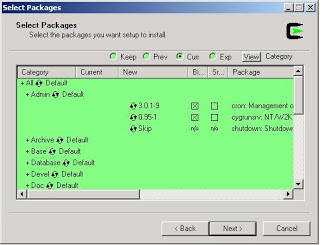

# NT Üzerinde Cygwin İle Cron

Cron, zamanlı (planlı) süreç işletabilen faydalı bir Unix
aracıdır. `crontab -e` ile değiştirilen planı cron süreci alıp,
gerekli programları gereken zamanda işletir.  Fakat, eğer bir
talihsizlik sonucu Windows ortamı üzerinde iş yapmak zorunda kaldı
iseniz, Unix araçlarını (cron) dahil Cygwin sayesinde
kullanabilirsiniz. Cygwin üzerinde ls, diff, find gibi tanıdık bütün
komutları bulacaksınız.

Bir tek komut, cron, problem çıkartacak. Cron'un kontrol kısmı, Unix
üzerinde arka plan süreci (deamon) olarak çalışıyor, işletim sistemi
bunu başlarken otomatik olarak başlatıyor. Fakat cygwin Windows
sistemine sonradan eklendiği için, aynı etkiyi yaratmak için, cron
programını Windows "servisi" olarak kurmamız gerekecek.

`cygrunsrv -I cron -p /usr/sbin/cron -a -D`

Yukarıdaki komutu kullanarak, cron'u servis haline getirebilirsiniz.
Eğer cygrunsrv yok ise, cygwin kuruluş programı "Admin" dizini
altından kurun.  Cron, NT servisi olarak kurulduktan sonra diğer
servisler gibi Services altında gözükecektir.  Crontab içeriği...

```
$ crontab -e

* * * * * echo "test 123" >> c:/temp/a.out

> ~> ~> :wq (vi altinda kaydet ve kapat demektir)
```




