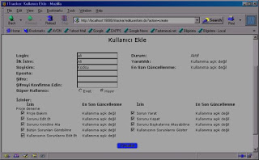

# Projelerde Hata Takip Düzeni

Bilgi işlem projelerinde hata takip için bir sistem kurmanız gereken
vakit, stabil bir uygulamanın ortaya çıkmaya başladığı ve sistemi
müşterilere göstermeye başladığınız zamana yakın bir arada olmalıdır.
Hatalar, herhangi bir programcının herhangi bir JSP
sayfasında/özelliğinde çıkan hatayı tamir etmesi gibi bir istek
olabilir; Bu gibi istekler zamanla biriktikçe, hangisinin tamir
edilmiş olduğu, test etmeye hazır olduğu gibi konular idare açısından
saç yolduracak seviyeye gelebilirler. 20-30 tane bu şekilde hata bile
bir hata takip sistemi kurmamızı gerektir.  Bu sistemin ana
özellikleri şunlar olmalıdır.

Sistem;

* Programcılara ait hataları sadece onlara gösterebilmeli

* Hataların tamir durumunu kaydedebilmeli

* Test edilecek/bitmiş hataların hangileri olduğunu testçilere
gösterebilmeli

* Hataların testçiden programcıya, ve tamir edildikten sonra
programcıdan testçiye geri olan iş akışını destekleyebilmeli.

* Hataların değişim tarihçesini, herkezin düştüğü notları kayıtlı
tutabilmeli ve gösterebilmelidir

Bu ana hatları destekleyecek en iyi uygulama türü, portal şeklinde
olan bir hata takip sistemidir. Buna karşılık, Excel tablolarında hata
takip yapmak çok külfetli olacaktır, çünkü bu şekilde tablolarda iş
akışı, tarihçe tutmak imkansızdır.

Tek bir Excel tablosunda birkaç programcının hatalarının en son
durumunu kaydedilip birleştirilmesi çok zordur.  Portal bazlı hata
takip programı, her programcıya ve testçiye (genelde bir tane olur)
bir giriş ismi verecek, testçilerin yarattığı hataları programcılara
göndermesini sağlayacaktır.  İş Akışı İş akışının genel hatları şöyle
olur. Testçi, hata portal'ına kendi kullanıcı ismini kullanarak girer
projenin uygulamasında gördüğü bir hatayı sisteme ekler. Bu hatayı,
bir programcıya atar. Bu programcı, o hatanın çıktığı kodu yazan, ya
da o kodu iyi bilen bir başka programcı olabilir.  Bu programcı, günün
herhangi bir saatinde portal'e girip hataları listesini kontrol
edecektir (ya da hata portal'inden otomatik e-posta almıştır, portal
hata atanır atanmaz programcıya e-posta atmak için ayarlanmış
olabilir), ve listesindeki kendine atanmış hatayı görür. Herkesin
benimPortal listesi, kendine atanan hataları göstermesi için
ayarlanmıştır (buna testçi de dahil, çünkü ona da hatalar atanabilir)
Programcı hatanın detayına tıklar, ve tanımı okur. Kendi geliştirme
ortamında hatayı tekrar ettirerek (duplicate) kendi de görür, ve tamir
etmek için kolları sıvar.

Programcı hatayı tamir edince, yeni kodu kaynak kontrol sistemine
ekler. Projenin teknik lideri her gün başında test makinasına zaten
sürüm yapıyordur, ya da acil bir sürüm yapılarak (o hata çok önemli
ise) test makinasına en son kodlar atılır.  Programcı, portal'den
tamir edilmiş hatanın detayına tekrar inerek, bu sefer bir değişiklik
yapar. Hatanın statüsünü "Çözüldü" olarak değiştirir, ve hatanın yeni
sahibi olarak "testçi" arkadaşını seçer.

Hatayı kaydeder. Şimdi programcı kendi benimHataPortal ekranına
döndüğünde, tamir etmiş olduğu hatanın kaybolduğunu görecektir. Ne
güzel! Yapacak iş azaldı!  Bu hata tabii kaybolmadı. Testçi kimse,
benimHataPortal'ına girdiğinde (ya da aynı şekilde e-posta aldığında)
portal'a girecek, ve listesindeki hatayı görecektir. Testçilerin hata
alması garip olmamalı, testçinin görevi sadece test etmek olduğu için
bu hatanın onun listesinde olmasının tek bir anlamı vardır: Hata tamir
edilmiştir, ve tekrar test edilmeye hazırdır.  Test makinasında da en
son kodlar olduğuna göre, testçi arkadaş bu makinaya bağlanarak
hatanın olduğu kısma/bölüme giderek kontrolünü yapar.  Eğer hata
gerçekten tamir olduysa, testçi portal'a dönerek o hatanın detayına
gelecek, ve "Kapandı" statüsüne getirecektir. Başka yapması gereken
bir şey yoktur. Ama eğer hata hâlâ orada ise, o zaman hatanın
statüsünü "açık" olarak değiştirmeli, ve sahibi olarak (tamir ettiğini
zanneden) programcıyı atamalı, yani, hatayı programcıya geri
göndermelidir!

Ve bu şekilde iş akışı tekrar başlamış olur.  Eğer hata tamir olmuş
ise, kapandı statüsünü alan hata herkezin listesinden kaybolacak, yani
tamir edilen hataların arasına karışmış olacaktır.  Ekler * Dikkat
edilmesi gereken bir nokta, bir hatanın tamir olmuş ama, o hatadan
bağımsız başka bir hata aynı ekranda/bölümde bulunmasında ortaya
çıkar. Bu yeni hatanın eski hata üzerine not düşülmemesi
gerekir. Çünkü yeni hata değişik bir hatadır. Ayrı şekilde takip
edilmesi gerekecektir.  * Üstte tarif edilen düzende bir nüans farkı
şöyle olabilir: Testçi hatayı atar (programcıyı seçerek). Ama
programcı, tamirden sonra tesçiye geri atama yapmaz. Sadece hata
statüsünü "çözüldü" ye getirir. Bu durumda testçinin görevi, periyodik
bir şekilde portal üzerinde statüsü "çözüldü" durumunda olan hataları
kontrol etmektir çünkü hatayı geri kendi benimPortal listesinde
görmeyecektir.  ITracker Evet, genel hatları ile tarif ettiğimiz bu iş
akışını ITracker programı ile gerçekleştirmeye
çalışacağız. ITracker'in nasıl kurulacağını başka bir yazıda
işlemiştik.  Programa admin olarak ilk girdiğinizde bu ekranı
göreceksiniz. (Eğer bu ekran İngilizce geldiyse, My Preferences
altından Turkish seçerek Türkçe ekrana gelebiliriz) Yukarıdaki ekranda
bekleneceği gibi hiçbir proje yok. İlk yapmamız gereken, bir proje
yaratmak.

İlk önce Sistem Bakımı seçeneğine tıklayın.  Proje Bakımı | Bakım Yap
seçeneğinden Proje Listesi ekranına gelin.  Şimdi üst sağda bulunan
sayfa ikonuna basarak yeni proje yaratma sayfasına gelebilirsiniz.
Üstteki örnek bilgileri girerek hemen bir proje yaratmamız
mümkün. Proje ismi "deneme" olarak seçildi.  Kullanıcılar Şimdi de
kullanıcılar yaratmamız gerekiyor. Bu kullanıcılar, projede görev
yapan programcılar, proje müdürü gibi kimseler olacaklar. ITracker'ı
kullanan herkese ayrı bir kullanıcı ismi gerekecek, çünkü herkes
kendine ait olan sorunlari (hataları) kendi kullanıcısı üzerinden
görecek.

Aşağıda ilk kullanıcıyı yaratıyoruz. Kullanıcının ismi ali, ve bu
kimse projede sorumlu kişilerden biri. Ali, testçi görevini
yürütecek. Ali, uygulamayı test edip çıkan hataları programcılara
atamak ile görevli.  Ali'yi eklediğimiz ekrana dikkat ederseniz,
Ali'ye birçok hak verdiğimizi görüyoruz. Bunlardan en önemlisi Proje
Bakım ve Sorunu Kapat haklarıdır. Proje müdürü (ya da testçisi) olarak
Ali, sorunları tamir edildikten sonra tekrar test edip, sorunun
çözülüp çözülmeyeceğine karar verebilecek tek kişi
olmalıdır.

Programcılar sorunları kapatmamalı, Ali'ye test edilmesi için
yollamalıdır.  Aynen Ali'yi yarattığımız gibi, Veli'yi de benzer
şekilde ekleyebiliriz. Tabii Veli'de testçilere özel haklar olmayacak.
Hata Eklemek Bu noktada, Ali ve Veli sistemi kullanmaya hazırlar. Ali
testçi, Veli programcı. Şimdi, Ali'nin sisteme nasıl sorun eklediğini
görelim.  Ali, ilk giriş yaptığında benimITracker ekranını
görecek. Buradan, üst kısımdaki Proje Listesi seçeneğinden "deneme"
projesini görebilir. Ali, en solda bulunan üçlü ikon gurubundan
ortadakini seçerek, yeni bir sorun ekleyecek ve Veli'ye
atayacak. Görelim.  Atanma yapıldıktan sonra, görmek için Veli olarak
sisteme girebilirsiniz.

İşte listede gördüğünüz gibi bir sorun Veli'ye atanmış.  Not: Eğer
Veli, benimITracker'ında çıkan listesini, sadece ona atanmış sorunlara
indirmek istiyorsa, bunun ayarını rahatlıkla yapabilir. En üstteki
"Tercihlerim" seçeneğinden, .. "benimITracker Bölümlerimi Sakla"
kısmına gidip, orada Atanmış Sorunlar hariç bütün diğer listeleri
kapatabilir.  Şimdi gelelim iş akışımızda önemli bir bölüme: Veli,
uygulama kodlarını hatasını tamir etmek üzere değiştirdi, kendi
geliştirme makinasında test etti ve tamir edildiğine karar
kıldı. Şimdi, bu hatanın "tekrar test için Ali'ye geri gönderilmesi
gerekiyor.  Hata listesinden bu hatayı değiştirmeyi seçip, aşağıdaki
gibi bir giriş yaparsa, hatayı Ali'ye geri göndermiş olacaktır
(kırmızı ile işaretli alanlardan) Bu sayede Ali, kendi benimITracker
sayfasından, tamirini istediği hatanın geri gelmiş olduğunu görecek,
bu hatayı test ederek eğer tamir olmuşsa Kapat seçeneği ile hatayı
kapatacaktır. Kapanmış statüsündeki hatalar kimsenin benimITracker
listesinde gözükmezler. Onlar tamir edilmiştir!

