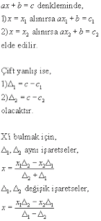
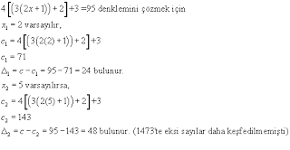
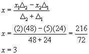

# Cebirde Çift Yanlış Yöntemi - Ali Kuşçu

(Aşağıdaki makale, ünlü Anadolulu matematikçisi Ali Kuşçu'nun Fâtih
Sultan Mehmet'e 1473 tarihinde sunduğu eserinden alınmıştır. Eserin
ismi el-Muhammediye fi el-hisab'tır. Çift yanlış yöntemi, doğrusal
denklemlerde bilinmeyen(ler)i hesaplamak için
kullanılmaktaydı.

Makale, dil ve matematiksel simgeler olarak günümüze uyarlanmıştır).
Çift yanlış yöntemi, bilinmeyeni dilediğimiz herhangi bir sayı
varsaymamız ve üzerine sonuca ulaşana değin soranın sözünden
anladığımız şekilde işlem yapmamızdır. Sonuç bilinen sayıya uyuyorsa
istenen sayı odur. Uymuyorsa yaptığımız işlemden hâsıl olan ile
bilinen sayı arasıdanki farkı alırız. Bu birince yanlış olarak
adlandırılır. Sonra bilinmeyeni başka başka bir sayı
varsayarız. İkinci bir sonuca ulaşana dek yaptığımız işlemleri ona da
uygularız. Sonuç bilinen sayıya uyuyorsa istenen o sayıdır. Uymuyorsa
onun ile bilinen sayı arasındaki farkı alırız. Bu da ikinci yanlış
olarak adlandırılır. Daha sonra iki yanlıştan bir doğru çıkartılır.
Şöyle ki: Birinci varsayılan ile ikinci yanlış, benzer biçimde ikinci
varsayılan ile birinci yanlış çarpılır. Her iki yanlış beraberce
bilinen sayıdan artık ya da eksik ise iki çarpım sonucunun farkını iki
yanlışın farkına böleriz. Bu işlemden çıkan sonuç talep edilen
bilinmeyen sayıdır. Artıklıkta ve eksiklikte muhtelif iseler iki
sonucunun toplamını iki yanlışın toplamına böleriz. Çıkan sonuç talep
edilen sayıdır [1].  Çok basit bir örnek Ve buradan ikinci förmüle
göre,

Kaynakça

[1] Kutadgubilik Felsefe ve Bilim Araştırmaları Yayını, Mart 2003 Sayısı

