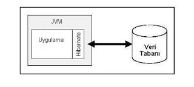
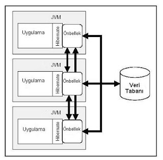

# Hibernate ve Önbellekleme

Hibernate ve Önbellekleme

   Eğer bir bilgi işlem uygulaması, herhangi bir tip veriyi veri tabanından   yazdığından daha fazla okuyorsa, o veriyi tabandan servislemek yerine   hafızadan servislemek daha hızlı olacaktır. Önbellekleme   tekniğinin altında yatan fikir, özet olarak, budur.                Önbellek tekniğini çoğu uygulamada görebilirsiniz. Meselâ, her modern ticari   veri tabanı paketi (Oracle, DB2, Informix), kullanıcı ile tablolara erişim   arasında bir önbellek katmanı koyarlar. Aynı sorguyu birden fazla arka arkaya   işletirseniz, ikinci sorgunun sonuçları önbellekten veriliyor olacaktır. Veri   tabanları, özellikle eski olanları, bu tür optimizasyonları artık hakkıyla   yapmışlardır. Parçası olduğum bir projede, önbellekleme dahil işlem   (transaction) ve eşzamanlı (concurrency) işletim kontrolleri, veri erişimi   gibi altyapı kodlarını elle yazmakta olan takım, projenin geciktiğini   farkedince bu kodları atıp şunu demişti: "Sonuçta Oracle da önbellekleme   yapıyor, buna güveneceğiz". (Not: Yıl 1996 idi, yâni doğru dürüst yardımcı   paketler daha ortada yoktu).                Hakikaten de, bir bilgi işlem uygulamasının %80 kadar zamanının veri tabanında   geçtiğini düşünürsek, veriye erişim ile alâkalı iyileştirmelerin veri tabanı   tarafında en iyi olarak yapılacağını da görmemiz gerekir.           Ayrı Önbellek Paketleri            Peki o zaman son zamanlardaki başgösteren uygulama servisini içinde,   ayrı işleyen önbellek paketleri arayışının sebebi nedir?                Bu arayışın nüksetme zamanının, programcılari veri tabanından daha iyi izole   eden araçlar (JDBC ve daha üst seviyede kalıcılık araçları) kullanımlarının   artması ile aynı zamanlarda olması ilginçtir. Özellikle modern kalıcılık   araçları, proje takımlarını hem veri tabanı paketinden bağımsız olabilme hem   de bunu temiz bir kodla yapabilme yeteneğini çok rahat sağladıkları   için (pür JDBC kodu rezalettir), teknik liderler şunu düşünür   olmuşlardır. "Artık yazdığım kodu, hem Oracle hem de MySql üzerinde   işletebilirim".                Bu fikir takip edersek, evet Oracle'dan bağımsız olabiliriz, ama Oracle'ın o   uzun yıllardır optimize edilmiş önbellek katmanını da   kullanamayacağız. En azından, o "diğer" veri tabanı paketinin   önbellekleme kodlarına gözü kapalı güvenemeyeceğiz.  Sonuç: Önbellekleme artık   uygulamanın bir parçası olmalıdır, ve bu tür özellikleri sağlayabilen "veri   tabanından ayrı" paketler aranmalıdır.                Tabii şunu da eklemek gerekir: Veri tabanı önbellekleme yapsa bile, uygulama   seviyesinde de elle önbellekleme yapması uygun/gereken uygulamalar   vardır. Teknik olarak en basit türden önbellekleme tekniği, bir transaction   başında önbelleğe okuyan ve bu veriye birçok kez erişen, ve sonra   önbellek içindeki verileri atan ve tekrar başlayan uygulamadır. (Transaction   sınırlarını aşan önbellekleme, önbelleğin güncellenmesi problemini beraberinde   getirir, bunun elle yapılmasını kod temizliği açısından tavsiye   etmiyoruz. Hattâ, yazının geri kalanında önbelleklemenin hiçbir şekilde,   elle yapılmamasını tavsiye ettiğimiz göreceksiniz. Bu tür altyapı   (infratructure) türü kodları bu işte uzmanlaşmış kimselere/paketlere   bırakılmalıdır).          Hibernate            Şimdi gelelim Hibernate bağlamında önbellek kullanımına. Hibernate paketini   kalıcılık aracı olarak seçmemizin önemli bir sebebi de, bağlantı havuzu,   önbellekleme gibi işleri dış araçlara bırakmış olması, ve kendi öz kodu   olarak, sadece veriye erişim problemine odaklanmış olmasıdır. Önbellekleme   ihtiyaçları, Hibernate içinde tanımlanmış olan kod çengelleri sayesinde ve bu   çengellere takılabilen her dış paket sayesinde halledilmiştir.                Bu çengellere takılabilen açık kaynak önbellek paketleri arasında EHCache,   OSCache, SwarmCache, JBoss TreeCache sayılabilir. Hibernate ile uyumlu ticari   önbellek paketleri de vardır: Coherence, GigaSpaces bunlardan sayılabilir.                                      Dağıtık (Distributed) Önbellek Kullanımı            Kavram ve kullanım açısından tek JVM içinde önbellek oldukça basit olduğu   için, bu seçeneği daha fazla tartışmayacağız. Mimarinizi etkileyebilecek   kararlar ve çoğu teknik liderin bilmediği, Hibernate'i dağıtık bir   mimari içinde kullanırken elde olan seçeneklerdir, yâni dağıtık mimarida   önbelleğin nasıl kullanılacağıdır.                Genel olarak konuşmak gerekirse, ilk prensibimiz şu olmalıdır. Occam'ın   Usturası desturundan yola çıkarak "iki açıklama arasından, en basitini   seçiniz" sözünü, mühendisliğe uygularsak, her zaman en basit, temiz ve işleyen   yolu seçmemiz gerekir.  Dağıtık mimari için önbellek kullanımı, tek   JVM için önbellek kullanımından farklı olmamalıdır. Eğer önbellek kullanmak   için mimari değişiriyorsanız, kendinizi tokatlayın. En görünmez (transparent)   olması gereken ihtiyaç için, mimarinizi feda etmektesiniz.                Alt resimde görülen mimari, bir gerçek hayat uygulamasından   alınmıştır. Tasarımı yapan mimar, uygulamayı fonksiyonel olarak dağıtmayı   planlamış (her parça bir fonksiyonel öbeğe tekabül etmektedir).  Uygulamasını   hızlandırmak için de önbellek kullanmayı mimar daha baştan aklına koymuştur.                Ve akabinde, "peki, önbellek içeriği değiştiğinde diğer öbeklerin bundan nasıl   haberi olacak?"  sorusu ile karşı karşıya kalmıştır. İşte bu noktada, teknik   liderin pergeli şaşmış, ve basitlik için önbelleği feda edip veri tabanına   bırakmak yerine, bütün dağıtık fonksiyonel birimleri tek bir makinaya,   önbelleğin tutulduğu yere yöneltmeyi seçmiştir. Üstelik erişilen veri kolon   seviyesinde olduğundan, bu seçim, network üzerinden birimler arasında çok   fazla git/gel'e (chatter) sebebiyet verecektir. Önbellek kodunun elle   yazılacak olması ayrı bir külfettir, ve bakım (maintanance) gerektiren kodu   arttırdığı için ayrı bir eksidir.  Ne açıdan bakarsak bakalım, bu mimari   idaresi kodlaması zor bir mimaridir.                 Önbellek "paylaşmak" için network'e giden kod yazmayın.                              Doğru prensipler/altın kurallar (rule of thumb) insanı yeteri kadar   teknik bilgisi olmasa da başına ağrıdan kurtarır. "Basitlik" ve "network üzerinden   getXX yapılmaz" prensibini taşımayan lider, "illâ önbellek" için mimarinin   temizliğini ve performansı feda etmiştir. Bahsedilen tabloların büyüklüğü de   hiçbir kendine saygısı olan veri tabanına problem verecek ölçüde değildir, üstelik   bahsedilen erişim nokta sorgusu yapacaktır. PRIMARY KEY, DB, tek satır sonuç.          Dağıtık Önbellek            Fakat eğer Hibernate seçenekleri seçim torbasında ise, dağıtık mimariler için   OSCache ve JBossTree Cache mevcuttur.                Bu paketlerin çalışması çok ilginç: Meselâ makina #1,makina #2,makina #3 aynı   uygulamanın değişik öbekleri (cluster) olsunlar. Ya da fonksiyonel şekilde   bölünmüş ama aynı veriye erişen hatta değiştiren katmanlar olsunlar, hiç   farketmez.                Her uygulama parçası, kendi önbelleğini başlatabilir. Ve her uygulama   parçasının önbelleği, Hibernate kullandığı ve hibernate.properties dosyasında   uygun şekilde OSCache ya da JBoss Tree Cache kulllandığı anda, diğer önbellek   birimleri ile multicast protokolü üzerinden -yayın (broadcast) bazlı-   iletişime geçmektedirler. Alt katmandakı önbellek kodu bizden habersiz bir   şekilde (JBoss Tree Cache durumunda) yeni eklenen ya da (OSCache durumunda   ise) silinen nesnelerin ne olduğunu birbirlerine bu protokol üzerinden iletip,   tüm önbelleklerin tüm makinalarda güncel ve birbirleri ile uyumlu kalmasını   sâğlamaktadırlar. Eh zaten veri tabanın da kapı anahtarı Hibernate'in elinde   olduğu ve bu önbellek araçlarının Hibernate'e eklemlenmiş olduğunu düşünürsek,   önbellek veri tabanı ile de uyumlu hâlde olacaktır.                Ve tüm bu aynı tutma (synchronization) işlemi tamamen arka planda, kodcuya   görünmez bir şekilde yapılmaktadır. Programcının tek yapması gereken, ayar   babında, önbelleğin ne kadar büyük ya da küçük olacağını tanımlamaktır.   Akılda tutulması gereken programlama püf noktası, JBoss Tree Cache için   commit() işleminin, OSCache için de session.close() komutunun önbelleklere   bilgi göndermeyi tetiklemesidir. JBoss Tree Cache değişen nesneleri, OSCache   ise silinen nesnelerin diğer önbelleklerden silinmesini haber verir.                Yâni sıfır ek kod yazarak, alttaki resme kavuşmuş oluyoruz.                              Performans olarak, bir Ethernet network'ünün zaten donanım olarak yayın bazlı   olduğunu düşünürseniz, yayın bazlı donanım üzerinde yayın bazlı protokolün   (multicast) çok hızlı olacağı sonucu çıkar.

