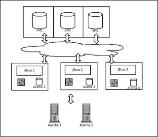

# Arama Mimarisi

Arama Mimarisi

Kisilerin profilini ve arkadasliklarini idare eden bir sistemde, profil esleme (matching), ya da kisileri isim bazinda arama gibi ozellikler icin arka planda arama kabiliyetinin olmasi gerekiyor.Daha once, uygulamamizin verisel bazli dagitik olabilmesi icin Voldemort veri tabanini sectigimizi soylemistik.VM, tekil id bazli objelere hizli bir sekilde erisebilen, depolayabilen ve dagitabilen bir anahtar-deger tabanidir.ID haricindeki alanlar uzerinden indeksleme yapmak icin, ek bir ozellige ihtiyacimiz var.Piyasada bu is icin genellikle Lucene kullanilir (ve yatay sekilde dagitik olsun diye bir onceki yazida Katta/Hadoop dusunuluyordu). Biz arama icin mysql fulltext ozelligini kullanmayi sectik. Katta ve Hadoop seksi ozelliklere sahipler fakat isi simdilik gereginden fazla zorlastiracaklar. "Idare edilecek bir kume teknolojisi daha" olacaklar.Mimariyi su sekilde kurmaya karar verdik (yerel calisan Lucene olsaydi da mimari aynidir -Katta degil, o baska-).1) JBoss isleten App Server makinalarinin her birinin kendine ozel, sahsi mysql tabani olacak.  2) Her app server'da isleyen bir toptan isleyici (batch job) belli araliklarla uyanip, Voldemort'a "en son eklenen objeleri" alacak.  3) Bu objeler ilgili alanlarina gore arama tabaninda indekslenecek. 4) Bu sayede her app server kendine hususi, ve "tum tabani" yansitan bir arama tabanina sahip olacak.Bir app server cokerse, tekrar ayaga kalktiginda kaldigi yerden indekslemeye devam edebilecek.Voldemort'a obje ekleme, guncelleme islemi, indeksleme isleminden tamamen bosanacagi icin performans konusunda mysql bir sorun ol(a)mayacak.Niye bir toptan islemci her app server'da "tum objeleri" VM'den aliyor, app server web aksiyonlari hem tabana eklerken, hem indeklese olmaz mi?Olmaz, cunku 1) arama tabaninin merkezi olmamasi lazim (olcekleme amaciyla -ve yatay dagitik olmayacagina Katta'dan vazgecince buna otomatik olarak karar vermis olduk-) ve 2) her app server, kume ortaminda ekleme isteklerinin sadece bir bolumunu karsiliyor olacagi icin (yuk dagitimi istekleri dagitiyor) o zaman her app server hususi arama tabanina her objeyi ekleyemeyecekti. Voldemort'a giderek her app server her objeyi ekleyebilir."Arama tabani cok buyuyebilir mi?" sorusu akla gelebilir, fakat tum online VM tabanini buraya eklemiyoruz. Sadece arama icin gerekli seyleri ekliyoruz.Arama tabanini online tabandan nasil bu kadar rahat ayirabildik? Onemli bir faktor, arama ozelliginin "en son en mukemmel" online kopyaya sahip olma mecburiyeti olmamasi idi... Bu taban, birkac dakika geriden takip edebilir, bu onemli degil. Bu sayede arada sirada uyanan bir toptan isleyici "herkese yerel" bir arama tabani uzerinden indeksleme yapabildi."Eklenen en son objeleri bana ver" ozelligi icin Voldemort projesiyle irtibata gectik. Onlar da boyle bir ozelligi uzun suredir dusunduklerini soylediler, biz vesile olduk.  Bu ozelligin kodlamasini oncelikli olarak ele almaya karar verdiler. Bu ozellik olmadan, ilk basamak olarak biz, nasil olsa tek makina baslangici yapacagimiz icin hem VM hem fulltext eklemeyi web aksiyonu icinden ayni anda yapacagiz.Fakat yeni ozellik hazir olunca (ve biz cok app server ortamina gecince), bu baglanti koparilacak ve toptan islemci devreye sokulacak.Arama motorunda mysql kullanarak rdbmslerin iliskisel karmasasina geri donmuyoruz aslinda; Burada tutulacak fulltext tablolari son derece basit tablolar olacaklar.CREATE TABLE `xxx_index` (                  `id` binary(32) NOT NULL,                  `index_me` varchar(255) default NULL,          PRIMARY KEY  (`id`),                       FULLTEXT KEY `index_me` (`index_me`)             ) ENGINE=MyISAM;Arama yapmak icinselect id from xxx_index where match(index_me) against ('filan')Geri dondurulen id alinip, Voldemort'ta objenin tamamina erisim icin kullanilabilecek. Arkadas listeleri, profil detaylari vs. tamamen VM'den geliyor olacak.Final mimari:

