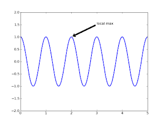

# Matplotlib

Matplotlib

Bilimsel hesaplamada Matlab yerine Python cabasinin son basamagi veri ve fonksiyon grafikleme icin Matplotlib olacak. Bu kutuphane islemek icin Numpy'a gereksinim duyuyor. Kurmak icin sitesinden kaynaklari indirdik, ve actiktan sonra dizinde daha onceki gibisudo python setup.py buildsudo python setup.py installOrnek program olarakimport numpy as npimport matplotlib.pyplot as pltax = plt.subplot(111)t = np.arange(0.0, 5.0, 0.01)s = np.cos(2*np.pi*t)line, = plt.plot(t, s, lw=2)plt.annotate('local max', xy=(2, 1), xytext=(3, 1.5),          arrowprops=dict(facecolor='black', shrink=0.05),          )plt.ylim(-2,2)plt.show()Ustteki sozdizimin Matlab kullanimina oldukca benzedigini dikkatinizi cekerim; Bu sayede Matlab kullanicilarinin yazilimlarina gecisini rahatlatmayi ummuslar herhalde. Sonuc altta:

