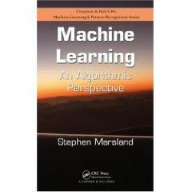

# Stephen Marsland - Yapay Ogrenim Kitabi

Stephen Marsland'in yapay ogrenim kitabini tavsiye ediyoruz. Kitabin
iyi taraflari yapay ogrenimde son zamanlarda sikca gorulen simulasyon,
ornekleme vurgusunu kitapta yansitmasi, ayrica tum orneklerin Python
uzerinden verilmesi. Hem ogrenim hem gercek uygulamalarda bilimsel
hesaplama icin Matlab'den Python'a bir gecis var - Matlab'in ticari
bir urun olmasi ve dilinin Python kadar genel kullanimda olan bir dil
olmamasi bu gecisi tetikleyen ana sebeplerden. Kitabin sitesi surada,
tum Python ornek kodlari oradan indirilebilir.

