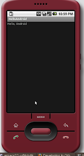
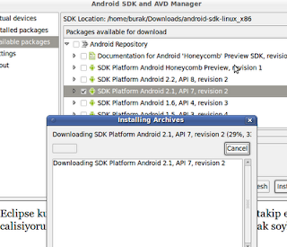

# Android Geliştirme Ortamı

Google'in cep telefonlari icin one surdugu Android etrafinda bayagi
hareketlenme var. G1 telefonu bir suredir piyasada. Simdi de HTC Hero
adli bir telefon cikti, telefon hakkindaki yorumlar iyi. Android
gelistirme ortami kurmaya gelelim: Su adresi ziyaret
edin.

http://developer.android.com/sdk/index.html

Isletim sisteminiz icin olani indirin (bizim icin Linux). Paketi acin,
ve [DIZIN]/tools dizinine girin. Burada "android" adindaki programi
calistirin. Available Packages secenegine bakin, listelenen sitenin
sol ok tusuna basinca normalde indirme baslamali. Fakat bu site bizde
https uzerinden baglanti problemi verdi, o yuzden Settings altinda
"Force https .. " diye baslayan secenegi sectik, "Save and Apply"
dugmesine basip programi kapatip tekrar baslattik. Ikinci sefer liste
indirildi. Listede ne varsa secin ve "install" deyin. Is bittikten
sonra UI programindan cikin ve tools dizini altinda komut
satirindanandroid list targetskomutunu isletin.

Onceden liste bos gelecekti, simdi install ettiginiz seyleri goruyor
olmaniz lazim. Artik Hello World ornegini yazabiliriz. Alttaki sayfaya
bakalim:http://developer.android.com/guide/tutorials/hello-world.htmlBir
"cep telefon" hedefi yaratalim:android create avd --target 2 --name
my_avdEger Android grafik arayuzu uzerinden target yaratmak
istiyorsak, o zaman tools/android komutu ile programi baslatiriz,
"Available packages" seceneginden bir SDK seceriz ve kurariz. Sonra
Settings altinda "Force https .." diye giden secenegi seceriz, ve
"Virtual Devices" bolumune gideriz. Oradan artik "New" ile yeni bir
avd ekleyebiliriz. Burada kullandigimiz isim ile "emulator -avd myavd"
komutu isleyecektir.

Eclipse kullanicilari ustteki sayfadaki gerekli olanlari takip
edebilir. Biz build.xml bazli calisiyoruz, o durumda iskelet dizin,
build.xml yaratmak soyle:

```
android create project --package com.android.helloandroid --activity HelloAndroid --target 2 --path [GELISTIRME DIZINI]
```

Diger IDE'ler hakkinda daha fazla
detay

http://developer.android.com/guide/developing/other-ide.html

Uretilen HelloWorld.java koduna gidip sunlari yazabilirsiniz:

```java
package com.android.helloandroid;

import android.app.Activity;

import android.os.Bundle;
import android.widget.TextView;

public class HelloAndroid extends Activity {
/** Called when the activity is first created.
*/@Overridepublic void onCreate(Bundle savedInstanceState) {
  super.onCreate(savedInstanceState);
  TextView tv = new TextView(this);
  tv.setText("Hello, Android");
  setContentView(tv);}
}
```

Simdi emulatoru baslatialm:

```
emulator -avd my_avd
```

Emulator arka planda isliyor iken, gelistirme dizinine gidipant
installile uygulamayi derleyip emulasyon aletine install edelim. Eger
kod degistirilirse, `ant reinstall` ile tekrar kod gonderilebilir. Kod
isleyisi hakkinda problemleri gormek icin tools altinda "adb logcat"
faydali. Bu kadar. Simdi emulator'den menuyu acip HelloAndroid
uygulamasinan gidin ve uzerine tiklayin. Ustteki resim gibi bir cikti
gelmesi lazim.





