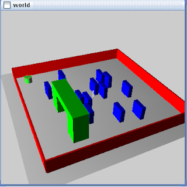

# Simulatorden Deger Toplamak

Simbad adli robot simulatorunden bahsetmistik. Bu simulatorde isleyen
robotun aninda (online) Sci/Numpy hesaplarini yapacak kodlarla
iletisiminde SrPy tavsiye etmistik. Fakat, aslinda test amacli olarak,
Jython uzerinden simulatoru bir kez isletip, olcum verilerini bir
dosyada toplamak, sonra ayri anlik olmayan (offline) bir sekilde o
dosya uzerinde Python hesap kodlari isletmek te olabilir. Boylece
SrPy'a gerek kalmaz.

Ustte ornek bir Simbad dunyasi (kodu altta). Sol ust kosedeki robot
uzerinde 12 tane sonar algilayicisi var, bu algilayicilar 0'incisi en
onde olmak uzere saat yonu tersine dogru artan sekilde esit
araliklarla robotun uzerine takili ve verileri her '10 sayac degerinde
bir' olmak uzere okunup dosyaya yaziliyor. Ayrica her 'ileri' ve 'sola
don' komutlari ayni dosyaya tek bir satir olmak uzere yazilmakta. Ekte
verilen cikti dosyasinda 'Inf' degerleri goruluyor, bu sonar
algilayicisinin 'sonsuz (infinity)' degerini dondurdugu anlamina
geliyor, yani onunde buyuk bir bosluk var, ve algilanabilecek bir
engel varsa bile, cok uzakta. Bu durum gercek dunyadaki sonar
verileriyle uyusuyor aslinda, cogunlukla Inf degerleri islenmeden
gecilir (discard).

Bizim makinada her saniye basina 20 sayac degeri dusuyor, ona gore
kinematik hesaplari yapabilirsiniz.

Jython ile dunyayi baslatip "Run" tusuna basinca, robot dunya
cevresinde tam bir tur atacak, sonra ilk asagi gidisi bir daha
tekrarlayacak, bu sirada verileri toplayacak. Ornek veri dosyasi da
ekte bulunabilir.

