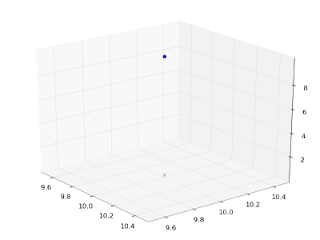

# 3d Nokta Ilerletmek (translation)

3d Nokta Ilerletmek (translation)

3d boyutlarda belli kordinattaki bir noktanin degerlerini herhangi bir eksen uzerinde arttirmak / azaltmak istersek, tercume matrisi (translation matrix) kullanmak lazim. Konunun detaylari 3d grafik programlama kitaplarinda bulunabilir; Alttaki ornek 10,10,10 kordinatindaki bir noktayi 10,10,0 noktasina hareket ettiriyor, z kordinatini 10 kadar azaltiyor.from mpl_toolkits.mplot3d import Axes3Dfrom pylab import *fig=plt.figure()ax = Axes3D(fig)p = [[10],[10],[10], [1]]ax.plot(p[0], p[1], p[2], 'o')T = [[1, 0, 0, 0],   [0, 1, 0, 0],   [0, 0, 1, -10],   [0, 0, 0, 1]]print pp = dot(T, p)print pax.plot(p[0], p[1], p[2], 'x')plt.show()

