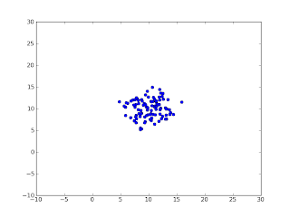

# Cok Boyutlu Gaussian'dan Orneklemek

Cok Boyutlu Gaussian'dan Orneklemek

Cok boyutlu (multivariate) Gaussian dagilimindan orneklemek icin multivariate_normal cagrisi kullanilabilir.from pylab import *from numpy import *def gen(): return random.multivariate_normal([10,10], [[5,0],[0,5]])p = gen()for i in arange(100):  p = vstack((p,gen()))plot(p[:,0], p[:,1], 'o')xlim((-10,30))ylim((-10,30))show()Cagriya parametre olarak gecilen degerlerden ilki ortalama (mean) degeri. Yukarida 2 boyutlu kordinatta [10,10] olarak vermisiz, yani dagilimin ortasi x=10, y=10. Ikinci parametre kovaryans (covariance), dagilimin genisligi. Bu deger Gaussian icin tam yuvarlak, kuresel (spherical) olabilir, ya da elipse, morf edilmis kure olabilir, vs.. Bilinmezlik (uncertainty) ne olduguna gore degisir. Mukemmel yuvarlak bilinmezlik icin kovaryans birim (identity) matrisin katlari olur, yani [[1,0],[0,1]]'in katlari. Biz [[5,0],[0,5]] olarak sectik.Burada ayrica vstack cagrisi ile yatay boyutu birbirine tam uyan matrislerin nasil ust uste konulabilecegini de goruyoruz.100 kere bu Gaussian'a "zar attirinca" sonuc alttaki grafik:

