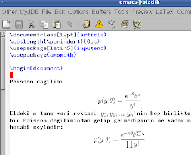

# preview-latex

preview-latex

Emacs icinde tex dosyalari edit ederken, matematik formullu bolgelerinin formulu grafik olarak gostermesini istiyorsak, preview-latex modu kullanilabilir. Kurmak icin Ubuntu uzerinde sudo apt-get install preview-latex ; Bu cagri Emacs ayarlarini otomatik olarak yapar.Emacs'i baslatinca .tex dosyasi icindeyken menude Preview secenegi gorulecektir. Ustunde oldugunuz noktayi, ya da tum dosyayi grafiklettirmek yani preview yapmak  mumkun. Bir tus kombinasyonu grafik bolgeyi tekrar duz tex haline dondurebiliyor, arada hizla gidip gelinebiliyor.Eger formuller ekran icinde ufak gozukuyorsa, imajlari buyutmenin yolu basit. Ayar dosyasi .emacs icinde(custom-set-variables ...'(preview-scale-function 1.2))gibi bir kullanimla imajlar buyutulebilir. 1.2 formulleri "1.2 kat buyut" anlamina geliyor.Diger ayarlar'(preview-auto-cache-preamble nil) '(preview-image-type (quote dvipng))Kaynak

