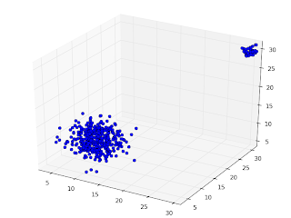

# 3 Boyutlu Normal Dagilim, 3D

3 Boyutlu Normal Dagilim, 3D

3 boyutlu bir normal dagilima (multivariate Gaussian) zar attirip grafiklemek icin su kodlar kullanilabilir. Iki tane 3d Gaussian plot ettik, farkli \mu degerleri var, ve kovaryanslarinda diagonal disinda degerler sifir, yani 3 degiskenin birbiri ile hic korelasyonu yok. Bu sebeple her dagilimin da grafikleri tam yuvarlak halde cikiyor.from mpl_toolkits.mplot3d import Axes3Dimport numpy as npimport matplotlibimport matplotlib.pyplot as pltfig = plt.figure()ax = Axes3D(fig)n1 = np.random.multivariate_normal([10,10,10], np.eye(3)*5, size=400)print n1n2 = np.random.multivariate_normal([30,30,30], np.eye(3)*0.4, size=40)print n2n = np.append(n1, n2, axis=0)ax.plot(n[:,0], n[:,1], n[:,2], 'o', zs=0, zdir='z', label='zs=0, zdir=z')plt.show()

