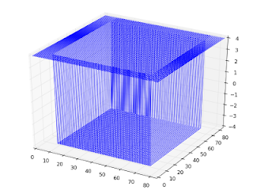

# Matristeki Z Degerlerini 3 Boyutta Gostermek

Matristeki Z Degerlerini 3 Boyutta Gostermek

Elimizde bir u matrisinin oldugunu dusunelim, ki bu matris bir u(x,y) fonksiyonunun ayriksal (discrete) temsili olsun. 3 boyutta bu grafik hizli bir sekilde nasil basilir?u(x,y) basit olarak z kordinatini temsil ediyor olacak. Peki ax.plot cagrisi icin gereken xs, ys degerleri nedir? Bu degerler u matrisinin kordinatlari olarak farzedilebilir. u[1,2] degeri zs olursa, xs=1, ys=2 kabul edilir. Alttaki ornekte u "fonksiyonu" 3d grafigin en ust katmaninda 8 genisligindeki bir "dis bantta" 4 degerini tasiyor, diger her yerde, yani ic bantlarda asagi dogru iniyor, -4 degerini tasiyor. Ortaya cikan grafik bir konveks sekle sahip, alti cukur (ve ici bos) olan bir cisim. 3 boyutta grafiklemek icin su yeterli:import matplotlib.pyplot as pltfrom mpl_toolkits.mplot3d import Axes3Dimport numpy as npdef plot_u(u):   fig = plt.figure()   ax = Axes3D(fig)   x = []   y = []   for (i,j),val in np.ndenumerate(u):       x.append(i)       y.append(j)   ax.plot(xs=x, ys=y, zs=u.flatten(), zdir='z', label='ys=0, zdir=z')   plt.show()Bu grafiklemenin islemesinin puf noktasi surada: ndenumerate ile gezerken elde ettigimiz x,y degerleri u.flatten() ile elde edilen degerlere aynen tekabul ediyor (demek ki iki Python cagrisi benzer sekilde yazilmislar). Eger boyle bir direk eslesme olmasaydi, ustteki grafikleme metodu ise yaramazdi.

