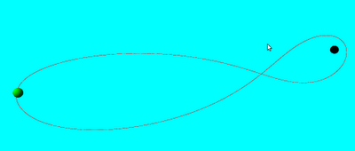

# vpython

3 boyutlu animasyon, fiziksel objelerin modellenmesi icin bir paket:
vpython. Fizik derslerinde egitim amaclari icin ideal. Paket fiziksel
objelerin sanal olarak 3 boyutlu ortama konulmasi, onlarin diger
objelere verecegi tepkilerin kodlanmasi icin ozellikler sunuyor.

Ubuntu 11 uzerinde kurmak icin

```
sudo apt-get install python-visual
```

Eger KineticKit eklemek istersek, suraya bakilabilir.

Orneklerden biri sabit ay ve dunya kosullarinda Apollo 13 uzay
seferinin takip ettigi yolu simule etmek. Sonuc animasyonlu olarak
gosterilecek. Kodlar alttaki baglantida.

VPython paketinden cikan bazi ornek kodlar surada. Cok objeli bir
yayli sistemi canli olarak gosteren ilginc bir program
crystal.py. Sonuc alttaki gibi (yuklenmesi biraz zaman alabilir). Bu
animasyonu yapan kod 160 kusur satirlik bir koddan ibaret. Tum
fiziksel kosullari tanimlanmis ve canli halde isliyor. Bu tur
simulasyonlari yapmak cok daha fazla kodlama ve eskiden ozel
bilgisayarlar gerektirirdi.

Kaynak




