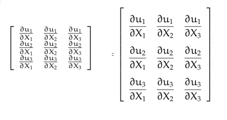

# LaTeX 

Programlama dili ile komut yazarak güzel formatlı doküman üretmenin
sanatını LaTeX mükemmeleştirdi. Microsoft Word gibi ürünler
'gördüğünüz elinize geçen sonuçtur' (what you see is what you get,
WYSIWYG) sloganı ile yaşarlar, fakat aslında bir doküman,
bilgisayardaki pek çok şey gibi, bir dil olarak görülebilir ve o
şekilde kodlanabilir.  Özellikle zaten başka amaçlar için kod yazan
bizler için bu yaklaşım daha çekici olmuştur. WYSİWYG yaklaşımı
sürekli dökümanın nihai halini grafiksel olarak kullanıcıya göstermeye
uğraştığı için çok fazla işlemci zamanı harcar, diğer yandan
dil-ile-doküman yaklaşımının daha optimal olduğu iddia edilebilir, az
sayıda komut ile pek çok farklı şekilde belge üretebiliriz, ve bu
komutları basit bir editör ile bir dosyaya girebiliriz.

Kurmak için Ubuntu üzerinde

```
apt install texlive-latex-extra texlive-latex-recommended texlive-base
```

Bunlar oldukca buyuk programlar, şimdiden uyaralım.

Kurduktan sonra `pdflatex dosya.tex` ile TeX dosyasindan PDF uretilebilir.

HTML içinde LaTeX komutları kullanmak istiyorsak bkz [1] yazısı.

### `\equiv`

Bir şeyin tanımı (defined as) için kullanılan sembol, eşitlik
işaretinin üçlü olanı.

### `\overline{kelime}`

Bazen `\bar` yeterli olmuyor, tüm kelimelerin üstünü kapsayacak bir
çizgi gerekiyor.

### `\underbrace{formül}_{altta ne söyleyecek}`

Formüllerin altına not olarak yazılacak şeyler için.

### `\cancel{ne}` ve `cancelto{neye}{neyi}`

Formullerde bazen bir seyin uzeri cizilip onun iptal edildigi
gosterilir. Sadece uzeri cizmek icin `\cancel`, eger cizip neye dogru
iptal oldugu icin `\cancelto` kullanilabilir. Kullanmak icin
`\usepackage{cancel}` ile cancel paketini almak lazim.

### `\leadsto`

Soldan sağa kıvrık ok işareti. Laplace Transformunu temsil etmek için
kullanılıyor bazen.

### `\stackrel{üst}{alt}`

Bir operatörü, işareti diğerinin üstüne koymak için kullanılabilir,
mesela biraz önceki `\leadsto` sembolünün hemen üstünde bir -1 sayısı
çıksın istiyorsam, `\stackrel{-1}{\leadsto}` kullanırım.

### `\buildrel`

Aynı şey, iki operatörü üst üste koymak. Üstteki örnek için `\buildrel
-1 \over \leadsto` kullanabilirdim.

### `\nabla`

Gradyan sembolü olan ters üçgen işareti

### `\oint`

Ortasında bir yuvarlak çizilmiş olan entegral işareti, eğri üzerinden
entegral alırken kullanılan sembol.

### `\mathbb{harf}`

Doğal sayılar N, reel sayılar R kümelerini gösterirken sol taraflarına
bir ekstra çizgi daha çekilir ve bu harfler daha "kalın" gözükür,
`\mathbb` bu işi yapıyor. `\usepackage{mathrsfs}` paketi dahil
edilmeli.

### `\mathscr{harf}`

Aşırı sükseli, bol kıvrımlı türden harfler için.

### LaTeX ile Sözde Program (Pseudocode) ve Matematik Sembolleri

Eğer TeX dokümanı içinde sözde kod gösterilecekse çoğu zaman şatafatlı
paketler (mesela algorithmicx, pseudocode, vs gibi) gerekli
değildir. Bu paketler ufaçık bir program için apayrı başka bir
programlama dili öğrenmenizi gerektiriyor, for, while, ıf gibi
komutların o paketlerin istediği şekilde yazılması gerekiyor mesela,
`\IF`, `\WHILE` gibi..

Düz kod göstermek için kullanılan Listings paketi kullanılabilir, eğer
bu kod içinde matematik sembolleri gerekiyorsa, mathescape seçeneği
eklenir, mesela

```
\begin{lstlisting}[language=Matlab,mathescape]..\end{lstlisting}
```

gibi, boylece `$$` isaretleri arasinda hala matematik sembolleri mumkun
olur.

### Matris İçeriğini Büyütmek

Su sekilde bir matris ufak sekilde cikabilir,

```
\nabla u = \frac{\partial u_i}{\partial X_j} =
\left[\begin{array}{ccc}
\frac{\partial u_1}{\partial X_1} & \frac{\partial u_1}{\partial X_2} & \frac{\partial u_1}{\partial X_3} \\
\frac{\partial u_2}{\partial X_1} & \frac{\partial u_2}{\partial X_2} & \frac{\partial u_2}{\partial X_3} \\
\frac{\partial u_3}{\partial X_1} & \frac{\partial u_3}{\partial X_2} & \frac{\partial u_3}{\partial X_3} 
\end{array}\right]
```

Bölümleri gösterirken LateX font boyunu küçültebiliyor. Büyük font
kullanmak için `\arraystretch` ve `\dfrac` lazım,

```
\renewcommand*{\arraystretch}{2.5}
\nabla u = \frac{\partial u_i}{\partial X_j} =
\left[\begin{array}{ccc}
\dfrac{\partial u_1}{\partial X_1} & \dfrac{\partial u_1}{\partial X_2} & \dfrac{\partial u_1}{\partial X_3} \\
\dfrac{\partial u_2}{\partial X_1} & \dfrac{\partial u_2}{\partial X_2} & \dfrac{\partial u_2}{\partial X_3} \\
\dfrac{\partial u_3}{\partial X_1} & \dfrac{\partial u_3}{\partial X_2} & \dfrac{\partial u_3}{\partial X_3} 
\end{array}\right]
```

Sonuç, öncesi solda sonrası sağda olacak şekilde,



Kaynaklar

[1] [MathJax: Web Sayfalarinda Javascript ile Matematik Formülleri](../../2017/11/mathjax-javascript-ile-matematik.html)

