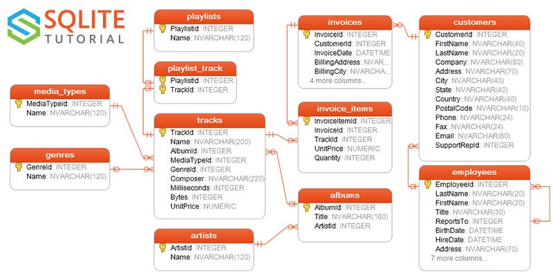

# SQL

SQL iliskisel tabanlari sorgulamak icin kullanilir.  

Chinook

Bu tabanın nasıl kurulacağını [2]'de anlattık. Chinook iTunes gibi bir
dijital medya satış şirketini işletmek için gereken veriyi
içeriyor. Verilerin bazıları gerçek iTunes'dan alınmış, müşterilerle
alakalı kısımları yapay.



Varlık-İlişki (Entity-Relationship -ER-) diyagramına bakınca ana
iliskileri gorebiliyoruz. 


```python
import sqlite3, pandas as pd

DB = '/tmp/chinook.db'

def runsql(sql):
    conn = sqlite3.connect(DB)
    c = conn.cursor()
    rows = c.execute(sql)
    for row in rows: print (row)
    conn.close()
    
def psql(sql):
    conn = sqlite3.connect(DB)
    c = conn.cursor()
    rows = c.execute(sql)
    df = pd.DataFrame(rows.fetchall())
    return df
```


Hangi ülkenin müşteri en çok ödeme yaptı? (Chinook-SQL-Exercise/top_country.sql)


```python
sql = """
SELECT "Country", MAX("Total Sales For Country") as "Total Spent"
FROM 
  (SELECT BillingCountry as "Country" , SUM(Total) as "Total Sales For Country"
FROM Invoice 
GROUP BY BillingCountry);
"""
runsql(sql)
```

```text
('USA', 523.0600000000003)
```


```python
sql="""
SELECT LastName, Title FROM Employee limit 5
"""
runsql(sql)
```

```text
('Adams', 'General Manager')
('Edwards', 'Sales Manager')
('Peacock', 'Sales Support Agent')
('Park', 'Sales Support Agent')
('Johnson', 'Sales Support Agent')
```

Pandas ile

```python
psql(sql)
```

```text
Out[1]: 
         0                    1
0    Adams      General Manager
1  Edwards        Sales Manager
2  Peacock  Sales Support Agent
3     Park  Sales Support Agent
4  Johnson  Sales Support Agent
```


Referans

[1] [psycopg2](../../2012/06/psycopg2-python-ile-api-bazli-postgresql-erisimi.md)

[2] [sqlite](../../2018/03/sqlite-basit-sekilde-hzl-diske-deger-yazma.md)

[3] https://github.com/Olamiotan/PythonStarter

[4] https://database.guide/2-sample-databases-sqlite/

[5] https://data-xtractor.com/knowledgebase/chinook-database-sample/

[6] https://github.com/KAPrueved/Chinook-SQL-Exercise

[7] Mando Iwanaga

* https://medium.com/@mandoiwanaga08/introduction-to-sql-beginner-level-7acb59286e7b
* https://medium.com/@mandoiwanaga08/sql-continued-3ff70f613d96
* https://medium.com/@mandoiwanaga08/sql-part-3-a1a3730b7624
* https://medium.com/@mandoiwanaga08/sql-part-4-1d61ada63b5
* https://github.com/mandoiwanaga/sql_practice
* https://github.com/mamineofficial/Query-a-Digital-Music-Store-Part-I-SQL

[8] https://shichaoji.com/2016/10/10/database-python-connection-basic/

[9] [Veri Tabanları, Kurumsal Java 2005 Kitabından, PDF](https://github.com/burakbayramli/classnotes/raw/master/sk/2012/03/db-kj.pdf)


