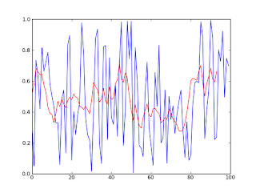

# Zamansal Veriyi Puruzsuzlestirmek (Smoothing)

Bazen ham veriyi oldugu gibi grafikleyince cok inisli, cikisli
olabiliyor, ki cogu zaman gormek istedigimiz bir trend oluyor. O zaman
grafigi daha kabaca, puruzsuz bir egri olarak gostermek
gerekebilir. Puruzleri gidermek icin bircok teknik var, "surekli
hareket eden ortalama penceresi (running average)" bu yollardan
biri. Fikir basit, belli buyuklukte (mesela 3,4 ya da 7 ogelik) bir
pencere hayal edilir, ve bu pencere teker teker tum verileri alacak
sekilde hareket ettirilir, ve pencerenin icine dusen tum degerlerin
ortalamasi alinir, ve esas verideki veri yerine bu ortalama
kullanilir. Ornek altta. Grafikte mavi renkli esas veri (rasgele
uretildi), kirmizi olan daha kavisli olan ortalama.

```
from pylab import *
import numpy as np
import random

WINDOW = 7; weightings = repeat(1.0, WINDOW) / WINDOW

data = [random.random() for x in range(100)]

av = convolve(data, weightings)[WINDOW-1:-(WINDOW-1)]

plot(data)

hold(True)

plot(av,'r')

show()
```




