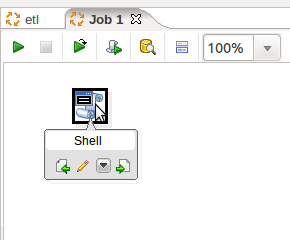
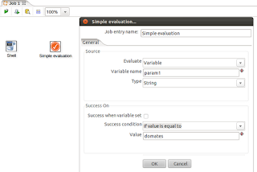
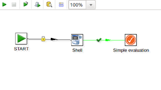

# Veri Transferi Tasarimi, Pentaho, Spoon, ETL

Veri Transferi Tasarimi, Pentaho, Spoon, ETL

Verileri network uzerinden baska makinadan, belki dosya formatinda alip, onu tabana yuklemek, oradan alip baska bir tabana aktarmak, vs gibi isler ETL adi ile anilir. ETL'in her parcasini olusturan parcalari ayri ayri elle kodlayabilirsiniz, fakat bu parcalarin bir araya konulmasi icin bir aracin kullanilmasi iyi olur. Pentaho Spoon ve Kitchen bu is icin uygun.

http://sourceforge.net/projects/pentaho/files/Data%20Integration/

adresinden indirilir. Acinca data-integration adinda bir dizin goreceksiniz. Dizine girip

sh spoon.sh

ile gorsel araci baslatabilirsiniz. New | Job ile bir ETL tanimlamaya hemen baslayabilirsiniz. 

Solda gorulen ogeler surukle-birak ile sag tarafa aktarilabilir. Ogelerin uzerine mouse getirilince sola, saga baglanti yapmanizi saglayacak secimler gorulecek.

Yesil secim o basamagin basarisi durumunda ne yapilacagini tanimlar. O oktan sonra ikinci kez ok secimi yaparsaniz, bu sefer basarisizlik halinde nereye gidilecegi tanimlanir, bu iki ok sirasiyla yesil, kirmizi olarak gozukecekler.

Bizim en cok kullandigimiz oge Scripting altindaki Shell ogesi. Cunku python bazli SQL yukleyip cagiran (arada onu degistiren) bir suru script bazli kodumuz vardi, ve bunlari en rahat entegre etmenin yolu ustte gorulen Shell ogesi ile oldu.

ETL tanimlaninca onu bir isimle kaydedersiniz, bir dosya.kjb dosyasi olacak. Bu dosyayi alip

sh kitchen.sh -file=dosya.kjb -norep=Y  -log=/tmp/etl.log

ile isletebilirsiniz. Yani spoon tasarlar, kitchen isletir.

Simdi daha cetrefil tasarimlara gelelim. Eger komut satirindan (kitchen) ile ETL'e parametre gecmek istiyorsaniz, Edit | Settings ile Parameters tab'ina gidin, ve burada parametre ismini tanimlayin. Bu parametre neler yapabilirsiniz? Mesela script ogesinde General tab'inde "Insert script" secin, ve Script tab'inde

sh /falan/filan/dosya-${param1}.sh

gibi bir kullanim olabilir, yani param1 ne ise ${param1}'in yerine o gececektir.

Ya da, Simple evaluation ogesini secersiniz, 

ve degisken X degerine sahip ise ETL bir yone gitsin seklinde akis yonunu degistirebilen karar noktalari tanimlayabilirsiniz. Yani programlamadaki "if" komutunun benzerini gorsel ETL'de kullanabilirsiniz. 

Disaridan parametreyi gecmek icin kettle cagrisi soyle olur

sh kitchen.sh -file=dosya.kjb -norep=Y -param:param1=patates  -log=/tmp/etl.log

Birden fazla parametre icin birden fazla -param ifadesi eklenebilir. 

Not: Baslangic noktasini tanimlamak icin solda General altinda START ogesini en basa koymayi unutmayin.

