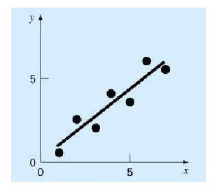
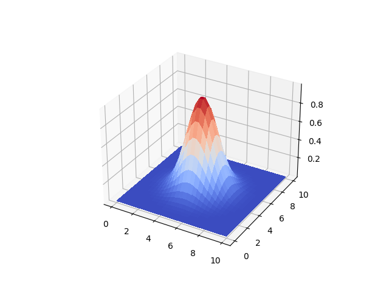

# Aradeğerleme (Interpolation)

Özet olarak aradeğerleme eldeki veriye dayanarak bilinmeyen veriyi
tahmin etmek, boşlukları doldurma tekniklerine verilen isimdir. Eğer
elde x,y verisi var ise ki bu verinin f(x) = y gibi bir fonksiyondan
(artı gürültü) ile elde edildiği varsayılır, elde olmayan bir yeni x
verilince bunun eşleneceği y değeri acaba ne olur?

Bu bağlamda aradeğerleme model uydurma, modele sorma ikilisi ile
çözülebilir, mesela elimde alttaki gibi değerler var, veriye bir düz
çizgi uyduruyorum, yeni nokta 7 değeri sorulunca modele danışıyorum,
ve oradan gelen y sonucu aradeğerlenen sonuç oluyor.



Fakat illa ki formülsel bir model varlığı da gerekli değil; bazı
teknikler yakındaki noktalara bakarak yakın x, ya da eğer y değerleri
varsa yine yakın y değerleri döndürebilir. Her iki teknik te çok
boyutta kullanılabilir, hem x hem y değerleri vektör içinde olacaktır.

Konunun daha matematiksel açıklamalarını [1,2,3,4] yazılarında
bulabiliriz.  Bu yazı daha çok pür yazılımsal tekniklere odaklanacak,
ve direk kütüphane çağrılarına bakacağız. Daha çok yemek tarifi daha az
formül.

### RBF

Bu tekniği daha önce [1]'de detaylı işledik. Fakat açıkça söylemek
gerekirse en yavaş işleyen aradeğerleme tekniklerinden biri
RBF'tır. Yine de bazen kullanışlı olabilir, basit bir örnekte görelim,
ana fonksiyon üç boyutlu bir fonksiyon olsun,

```python
from matplotlib import cm

def func(x, y):
    s1 = 3; x1 = 5.0; y1 = 5.0
    g1 = np.exp( -4 *np.log(2) * ((x-x1)**2+(y-y1)**2) / s1**2)
    return g1 

x = np.linspace(0,10,30)
y = np.linspace(0,10,30)
xx,yy = np.meshgrid(x,y)
zz = func(xx,yy)
fig = plt.figure()
ax = fig.gca(projection='3d')
surf = ax.plot_surface(xx, yy, zz, cmap=cm.coolwarm,linewidth=0, antialiased=False)
plt.savefig('aradegerleme-interpolation_02.png')
```



Eğer `func` fonksiyonu elde olmasaydı, onun verilerine bakarak RBF ile
yeni bir nokta için, 4,4 diyelim, aradeğerlemeyi alttaki gibi
yapardık,

```python
from scipy.interpolate import Rbf
rbfi = Rbf(xx,yy,zz,function='gaussian')
print ('Aradeg:',rbfi([4],[4]), 'Gercek:',func(4,4))
```

```text
Aradeg: [0.53970076] Gercek: 0.540029869446153
```

Görüldüğü gibi kullanım oldukca basit; x,y,z değerlerini iki boyutlu
matris oalrak verdik (tek boyutlu vektör de işliyor), RBF objesi
üzerinden ek değerler için aradeğerleme yaptık.

### CloughTocher2DInterpolator

Hızlı işleyen bir kod, CloughTocher2DInterpolator.

```python
from scipy.interpolate import CloughTocher2DInterpolator

interp = CloughTocher2DInterpolator(list(zip(xx.flatten(), yy.flatten())), zz.flatten())
print (interp([4],[4]))
```

```text
[0.54049742]
```

Benzer bir sonuc elde ettik.

```python
x2 = np.linspace(0,10,50)
y2 = np.linspace(0,10,50)
xx2,yy2 = np.meshgrid(x2,y2)
zclough = interp(xx2,yy2)
fig = plt.figure()
ax = fig.gca(projection='3d')
surf = ax.plot_surface(xx, yy, zz, cmap=cm.coolwarm,linewidth=0, antialiased=False)
plt.savefig('aradegerleme-interpolation_03.png')
```


Farkettiysek üstteki ızgara her ekseni 50 parçaya böldü, `interp`
objesi 30 parçalık izgara üzerinden yaratılmıştı; böylece elde olmayan
bir sürü değeri sormuş olduk ama nihai grafik hala orijinale
benziyor. Ayrıca Clough/Tocher yaklaşımı çok hızlı işler.

### Pandas

Pandas paketinin de içinde aradeğerleme yapabilen kodlar var, bunlar
bir DataFrame tablosunun eksik değerlerini doldurmak için kullanılabiliyor.
Mesela,

```python
import pandas as pd
arr = [1,2,3,np.nan,5,6,7,6,5,np.nan,4,3]

df = pd.DataFrame(arr)
print (df)
```

```text
      0
0   1.0
1   2.0
2   3.0
3   NaN
4   5.0
5   6.0
6   7.0
7   6.0
8   5.0
9   NaN
10  4.0
11  3.0
```

`NaN` degerleri eksik. Doldurmak icin basit lineer aradegerleme yapilabilir,

```python
print (df.interpolate(method='linear'))
```

```text
      0
0   1.0
1   2.0
2   3.0
3   4.0
4   5.0
5   6.0
6   7.0
7   6.0
8   5.0
9   4.5
10  4.0
11  3.0
```

Görüldüğü gibi 3 ile 5 arasındaki değer 4 ile dolduruldu, 5 ile 4 arasındaki
4.5 ile.

### Matriste Boş Değerleri Yakın Değerle Doldurmak 

Eğer içinde nan yani "tanımsız" ve "boş" değerler olan bir vektörümüz
var ise, bu tanımsız değerlerin yerine, yine aynı vektörde, ve o boş
değerin iki yanindaki değere yakın olan bir değerle doldurmak
isteyebiliriz.

Mesela vektor

```
1, nan, nan, 2, 2, nan, 0
```

olsun, ve `nan` diyen yerlerde 1 ve 2 arası, sonraki `nan` yerine 2 ve 0
arası değerler olmalı.

```python
data = np.array([1, np.nan, np.nan, 2, 2, np.nan, 0])
print (data)
bad_indexes = np.isnan(data)
good_indexes = np.logical_not(bad_indexes)
good_data = data[good_indexes]
interpolated = np.interp(bad_indexes.nonzero()[0], good_indexes.nonzero()[0], good_data)
data[bad_indexes] = interpolated
print (data)
```

```text
[ 1. nan nan  2.  2. nan  0.]
[1.         1.33333333 1.66666667 2.         2.         1.
 0.        ]
```

Peki işlemi bir matris üzerinde, ve her kolon için ayrı ayrı yapmak
istersek?

```python
def pad(data):
    bad_indexes = np.isnan(data)
    good_indexes = np.logical_not(bad_indexes)
    good_data = data[good_indexes]
    interpolated = np.interp(bad_indexes.nonzero()[0], good_indexes.nonzero()[0], good_data)
    data[bad_indexes] = interpolated
    return data

A = np.array([[1, 20, 300],
              [np.nan, np.nan, np.nan],
              [3, 40, 500]])
A = np.apply_along_axis(pad, 0, A)
print (A)
```

```text
[[  1.  20. 300.]
 [  2.  30. 400.]
 [  3.  40. 500.]]
```


Kaynaklar

[1] [Dairesel Baz Fonksiyonları (Radial Basis Functions -RBF-)](https://burakbayramli.github.io/dersblog/stat/stat_175_rbf/dairesel_baz_fonksiyonlari__radial_basis_functions_rbf__yukseklik_verisi_daglar.html)

[2] [Eğri Uydurma, Aradeğerleme (Interpolation) - 1](https://burakbayramli.github.io/dersblog/compscieng/compscieng_app20cfit1/egri_uydurma_aradegerleme__interpolation___1.html)

[3] [Eğri Uydurma, Aradeğerleme (Interpolation) - 2](https://burakbayramli.github.io/dersblog/compscieng/compscieng_app20cfit2/egri_uydurma_aradegerleme__interpolation___2.html)

[4] [Eğri Uydurma, Aradeğerleme (Interpolation) - 3](https://burakbayramli.github.io/dersblog/compscieng/compscieng_app20cfit3/egri_uydurma_aradegerleme__interpolation___3.html)


