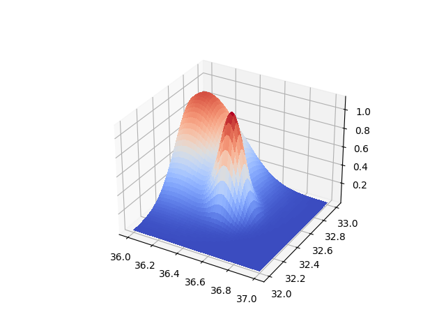
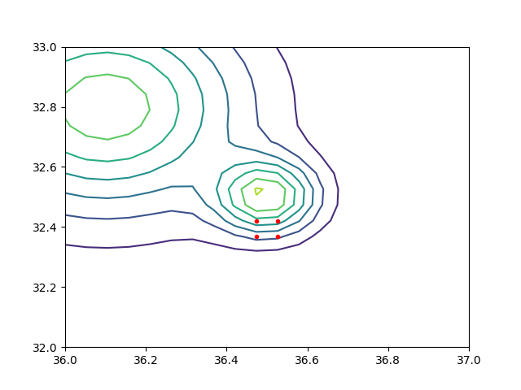

# Aradeğerleme (Interpolation)

Özet olarak aradeğerleme eldeki veriye dayanarak bilinmeyen veriyi
tahmin etmek, boşlukları doldurma tekniklerine verilen isimdir. Eğer
elde x,y verisi var ise ki bu verinin f(x) = y gibi bir fonksiyondan
(artı gürültü) ile elde edildiği varsayılır, elde olmayan bir yeni x
verilince bunun eşleneceği y değeri acaba ne olur?

Bu bağlamda aradeğerleme model uydurma, modele sorma ikilisi ile
çözülebilir, mesela elimde alttaki gibi değerler var, veriye bir düz
çizgi uyduruyorum, yeni nokta 7 değeri sorulunca modele danışıyorum,
ve oradan gelen y sonucu aradeğerlenen sonuç oluyor.


Fakat illa ki formülsel bir model varlığı da gerekli değil; bazı
teknikler yakındaki noktalara bakarak yakın x, ya da eğer y değerleri
varsa yine yakın y değerleri döndürebilir. Her iki teknik te çok
boyutta kullanılabilir, hem x hem y değerleri vektör içinde olacaktır.

Konunun daha matematiksel açıklamalarını [1,2,3,4] yazılarında
bulabiliriz.  Bu yazı daha çok pür yazılımsal tekniklere odaklanacak,
ve direk kütüphane çağrılarına bakacağız. Daha çok yemek tarifi daha az
formül.

### Pandas

Pandas paketinin de içinde aradeğerleme yapabilen kodlar var, bunlar
bir DataFrame tablosunun eksik değerlerini doldurmak için kullanılabiliyor.
Mesela,

```python
import pandas as pd
arr = [1,2,3,np.nan,5,6,7,6,5,np.nan,4,3]

df = pd.DataFrame(arr)
print (df)
```

```text
      0
0   1.0
1   2.0
2   3.0
3   NaN
4   5.0
5   6.0
6   7.0
7   6.0
8   5.0
9   NaN
10  4.0
11  3.0
```

`NaN` degerleri eksik. Doldurmak icin basit lineer aradegerleme yapilabilir,

```python
print (df.interpolate(method='linear'))
```

```text
      0
0   1.0
1   2.0
2   3.0
3   4.0
4   5.0
5   6.0
6   7.0
7   6.0
8   5.0
9   4.5
10  4.0
11  3.0
```

Görüldüğü gibi 3 ile 5 arasındaki değer 4 ile dolduruldu, 5 ile 4 arasındaki
4.5 ile.

### Matriste Boş Değerleri Yakın Değerle Doldurmak 

Eğer içinde nan yani "tanımsız" ve "boş" değerler olan bir vektörümüz
var ise, bu tanımsız değerlerin yerine, yine aynı vektörde, ve o boş
değerin iki yanindaki değere yakın olan bir değerle doldurmak
isteyebiliriz.

Mesela vektor

```
1, nan, nan, 2, 2, nan, 0
```

olsun, ve `nan` diyen yerlerde 1 ve 2 arası, sonraki `nan` yerine 2 ve 0
arası değerler olmalı.

```python
data = np.array([1, np.nan, np.nan, 2, 2, np.nan, 0])
print (data)
bad_indexes = np.isnan(data)
good_indexes = np.logical_not(bad_indexes)
good_data = data[good_indexes]
interpolated = np.interp(bad_indexes.nonzero()[0], good_indexes.nonzero()[0], good_data)
data[bad_indexes] = interpolated
print (data)
```

```text
[ 1. nan nan  2.  2. nan  0.]
[1.         1.33333333 1.66666667 2.         2.         1.
 0.        ]
```

Peki işlemi bir matris üzerinde, ve her kolon için ayrı ayrı yapmak
istersek?

```python
def pad(data):
    bad_indexes = np.isnan(data)
    good_indexes = np.logical_not(bad_indexes)
    good_data = data[good_indexes]
    interpolated = np.interp(bad_indexes.nonzero()[0], good_indexes.nonzero()[0], good_data)
    data[bad_indexes] = interpolated
    return data

A = np.array([[1, 20, 300],
              [np.nan, np.nan, np.nan],
              [3, 40, 500]])
A = np.apply_along_axis(pad, 0, A)
print (A)
```

```text
[[  1.  20. 300.]
 [  2.  30. 400.]
 [  3.  40. 500.]]
```

### RBF

Bu tekniği daha önce [4]'de detaylı işledik. Fakat açıkça söylemek
gerekirse en yavaş işleyen aradeğerleme tekniklerinden biri
RBF'tır. Yine de bazen kullanışlı olabilir, basit bir örnekte görelim,
ana fonksiyon üç boyutlu bir fonksiyon olsun,

```python
from matplotlib import cm

def func(x, y):
    s1 = 3; x1 = 5.0; y1 = 5.0
    g1 = np.exp( -4 *np.log(2) * ((x-x1)**2+(y-y1)**2) / s1**2)
    return g1 

x = np.linspace(0,10,30)
y = np.linspace(0,10,30)
xx,yy = np.meshgrid(x,y)
zz = func(xx,yy)
fig = plt.figure()
ax = fig.gca(projection='3d')
surf = ax.plot_surface(xx, yy, zz, cmap=cm.coolwarm,linewidth=0, antialiased=False)
plt.savefig('aradegerleme-interpolation_02.png')
```


Eğer `func` fonksiyonu elde olmasaydı, onun verilerine bakarak RBF ile
yeni bir nokta için, 4,4 diyelim, aradeğerlemeyi alttaki gibi
yapardık,

```python
from scipy.interpolate import Rbf
rbfi = Rbf(xx,yy,zz,function='gaussian')
print ('Aradeg:',rbfi([4],[4]), 'Gercek:',func(4,4))
```

```text
Aradeg: [0.53970076] Gercek: 0.540029869446153
```

Görüldüğü gibi kullanım oldukca basit; x,y,z değerlerini iki boyutlu
matris oalrak verdik (tek boyutlu vektör de işliyor), RBF objesi
üzerinden ek değerler için aradeğerleme yaptık.

### CloughTocher2DInterpolator

Hızlı işleyen bir kod, CloughTocher2DInterpolator.

```python
from scipy.interpolate import CloughTocher2DInterpolator

interp = CloughTocher2DInterpolator(list(zip(xx.flatten(), yy.flatten())), zz.flatten())
print (interp([4],[4]))
```

```text
[0.54049742]
```

Benzer bir sonuc elde ettik.

```python
x2 = np.linspace(0,10,50)
y2 = np.linspace(0,10,50)
xx2,yy2 = np.meshgrid(x2,y2)
zclough = interp(xx2,yy2)
fig = plt.figure()
ax = fig.gca(projection='3d')
surf = ax.plot_surface(xx, yy, zz, cmap=cm.coolwarm,linewidth=0, antialiased=False)
plt.savefig('aradegerleme-interpolation_03.png')
```

[Sonuç](aradegerleme-interpolation_03.png)

Farkettiysek üstteki ızgara her ekseni 50 parçaya böldü, `interp`
objesi 30 parçalık izgara üzerinden yaratılmıştı; böylece elde olmayan
bir sürü değeri sormuş olduk ama nihai grafik hala orijinale
benziyor. Ayrıca Clough/Tocher yaklaşımı çok hızlı işler.

### Izgara İçinde En Yakın Değer Aradeğerlemesi

Eğer bir ızgara içinde düştüğümüz hücreyi bulabilirsek, o hücrenin
dört köşesinin x,y,z değerleri ile aradeğerleme yapılabilir. Burada
iki lineerli (bilinear) aradeğerleme tekniği var, her kenara olan
uzaklığı ölçüp bunlarla bir ağırlık değeri yaratıyor ve o ağırlıklara
göre 4 bilinen z değerini kullanıp yeni z değerini üretiyor.

Buna benzer bir yaklaşımla biz de kendi tekniğimizi yaratabiliriz,
mesela içine düştüğümüz hücrenin dört kenarına olan bir basit uzaklık
hesabı yaparız, uzaklığı benzerliğe çeviririz (yakın olan daha önemli
olsun diye) ve bu ağırlıklarla dört köşe z değerinin ağırlıklı
ortalamasını alırız.

Örnek veriyi yaratalım,

```python
from matplotlib import cm
np.random.seed(0)
def func(x, y):
    s1 = 0.2; x1 = 36.5; y1 = 32.5
    s2 = 0.4; x2 = 36.1; y2 = 32.8
    g1 = np.exp( -4 *np.log(2) * ((x-x1)**2+(y-y1)**2) / s1**2)
    g2 = np.exp( -2 *np.log(2) * ((x-x2)**2+(y-y2)**2) / s2**2)    
    return g1 + g2 
D = 20
x = np.linspace(36,37,D)
y = np.linspace(32,33,D)
xx,yy = np.meshgrid(x,y)
zz = func(xx,yy)
fig = plt.figure()
ax = fig.gca(projection='3d')
surf = ax.plot_surface(xx, yy, zz, cmap=cm.coolwarm,linewidth=0, antialiased=False)
plt.savefig('aradegerleme-interpolation_04.png')
```



```python
def find_corners(xi,yi):
    idx1 = np.searchsorted(x, xi, side="left")
    idx1 = len(x)-idx1-1
    idx2 = np.searchsorted(y, yi, side="left")
    idx2 = len(y)-idx2-1
    return [(idx1-1,idx2-1),(idx1-1,idx2-2),(idx1-2,idx2-1),(idx1-2,idx2-2)]

def cdist(p1,p2):    
    distances = np.linalg.norm(p1 - p2, axis=1)
    return distances
```

Örnek bir noktanın içinde olduğu hücrenin indis değerleri,

```python
cs = find_corners(36.5,32.4)
print (cs)
```

```text
[(9, 11), (9, 10), (8, 11), (8, 10)]
```

```python
def grid_corner_interpolator(x, y, points):
    a = np.array([x,y]).reshape(-1,2)
    b = np.array(points)[:,:2]
    ds = cdist(a,b)
    ds = ds / np.sum(ds)
    ds = 1. - ds
    c = np.array(points)[:,2]
    iz = np.sum(c * ds) / np.sum(ds)
    return iz

def test(intx,inty):
    cs = find_corners(intx,inty)

    i,j = cs[0][0],cs[0][1]
    i,j = cs[1][0],cs[1][1]
    i,j = cs[2][0],cs[2][1]
    i,j = cs[3][0],cs[3][1]
    
    i0,j0 = cs[0][0],cs[0][1]
    i1,j1 = cs[1][0],cs[1][1]
    i2,j2 = cs[2][0],cs[2][1]
    i3,j3 = cs[3][0],cs[3][1]
    
    introw = [(xx[i0,j0],yy[i0,j0],zz[i0,j0]),
              (xx[i1,j1],yy[i1,j1],zz[i1,j1]),
              (xx[i2,j2],yy[i2,j2],zz[i2,j2]),
              (xx[i3,j3],yy[i3,j3],zz[i3,j3])]
    res = grid_corner_interpolator(intx,inty,introw)

    print ('aradeg',res, 'gercek',func(intx,inty))
```

```python
test(36.5,32.4)
test(36.1,32.1)
test(36.8,32.2)
test(36.111,32.711)
```

```text
aradeg 0.5203198060581533 gercek 0.5624999999999915
aradeg 0.012292103603170563 gercek 0.014328188407904384
aradeg 0.000476645535074579 gercek 0.0006370371360601354
aradeg 0.9209512999874692 gercek 0.9326947927222742
```

Altta yardımcı olabilecek bir grafikleme fonksiyonu, yeni nokta için onun
içine düştüğü hücrenin köşelerini kontur grafiği içinde gösteriyor.

```python
def plot_corners(intx,inty):
    cs = find_corners(intx,inty)
    plt.contour(xx,yy,zz)
    i,j = cs[0][0],cs[0][1]
    plt.plot (xx[i,j],yy[i,j],'r.')
    i,j = cs[1][0],cs[1][1]
    plt.plot (xx[i,j],yy[i,j],'r.')
    i,j = cs[2][0],cs[2][1]
    plt.plot (xx[i,j],yy[i,j],'r.')
    i,j = cs[3][0],cs[3][1]
    plt.plot (xx[i,j],yy[i,j],'r.')

plot_corners(36.5,32.4)
plt.savefig('aradegerleme-interpolation_05.png')
```

```text
10
[36.         36.05263158 36.10526316 36.15789474 36.21052632 36.26315789
 36.31578947 36.36842105 36.42105263 36.47368421 36.52631579 36.57894737
 36.63157895 36.68421053 36.73684211 36.78947368 36.84210526 36.89473684
 36.94736842 37.        ]
8
[32.         32.05263158 32.10526316 32.15789474 32.21052632 32.26315789
 32.31578947 32.36842105 32.42105263 32.47368421 32.52631579 32.57894737
 32.63157895 32.68421053 32.73684211 32.78947368 32.84210526 32.89473684
 32.94736842 33.        ]
```




Kaynaklar

[1] <a href="https://burakbayramli.github.io/dersblog/compscieng/compscieng_app20cfit1/egri_uydurma_aradegerleme__interpolation___1.html">Eğri Uydurma, Aradeğerleme (Interpolation) - 1</a>

[2] <a href="https://burakbayramli.github.io/dersblog/compscieng/compscieng_app20cfit2/egri_uydurma_aradegerleme__interpolation___2.html">Eğri Uydurma, Aradeğerleme (Interpolation) - 2</a>

[3] <a href="https://burakbayramli.github.io/dersblog/compscieng/compscieng_app20cfit3/egri_uydurma_aradegerleme__interpolation___3.html">Eğri Uydurma, Aradeğerleme (Interpolation) - 3</a>

[4] <a href="https://burakbayramli.github.io/dersblog/compscieng/compscieng_app20cfit4/aradegerleme__interpolation___4__dairesel_baz_fonksiyonlari__radial_basis_functions_rbf_.html">Aradeğerleme (Interpolation) - 4 - Dairesel Baz Fonksiyonları (Radial Basis Functions -RBF-)</a>
