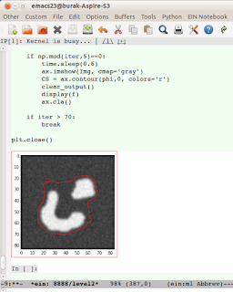

# Not Defteri Icinde Animasyon

Not Defteri Icinde Animasyon

Daha once yazdigimiz kesit seviyeleri yazisini not defteri ortamina gecirdik, ve bu yazida kesit seviyeleri diferansiyel denklemi hesaplanirken, onun uzerinden yapilan imaj bolumu aninda not defteri icinde gosteriliyor. Not defteri icinde animasyon gostermek icin kullanilan kalip

from IPython.display import clear_outputf, ax = plt.subplots()
..
while True: # bir dongu
    ...
    ax.imshow(...)    CS = ax.contour(...)     clear_output()    display(f)    ax.cla()

Biz ax.imshow, ax.contour kullandik, fakat ax uzerinde pek cok grafiksel islem yapilabilir tabii ki.

Not: iPython not defterinin indirilip yerel, ya da kod isletilmesine izin veren bir defter servisi uzerinde isletilmesi lazim.

