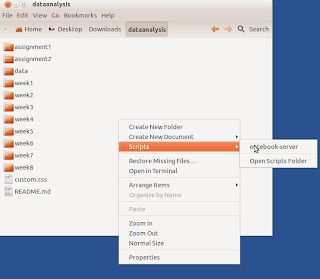

# Ubuntu, Nautilus, Dosya / Dizin Uzerinde Islem Yapmak

Ubuntu masaustu dizin gezme programi (explorer) Nautilus'u
kullanirken, eger  icinde olunan bir dizin, dosya uzerinde islem
yapmak istersek, bir gorsel kisayol tanimlayabiliriz. Nautilus
yapisina gore `$HOME/.gnome2/nautilus-scripts` altina atilan her script,
mouse'ta sag tiklama yapilinca menude Scripts altinda cikar. Mesela
notebook-server adinda bir dosya yaratmissak (dosya chmod 755 ile
isler hale getirilmelidir), sag tiklama sonrasi su goruntu cikar,


Script icinde 

```
#!/bin/sh
cd `echo $NAUTILUS_SCRIPT_CURRENT_URI | sed -e 's/file:\/\///g'`
... burada o dizine gore ek islem yap ...
```

olabilir mesela, sed ile yapilan islem $NAUTILUS_SCRIPT_CURRENT_URI
icinden file:/// ibaresini cikartmak icin. Bu degiskene Nautilus
tarafindan otomatik olarak "sag tiklamanin yapildigi dizinin degeri"
geciliyor, ama URI oldugu icin icinde file:/// ibaresi var. Biz de o
degeri cikartiyoruz. Ardindan istenilen ek islem yapilabilir.



