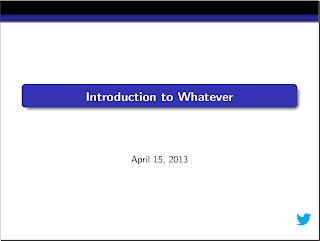

# LateX ile Prezentasyon - Beamer

LateX ile Prezentasyon - Beamer

Daha once baska bir prezentasyon paketinden bahsetmistik. Beamer adli bir paket kullanmasi daha kolay bir program. 

Eger suradaki apt-get listesi var ise, beamer kurulmus olacaktir, yok ise

apt-get install latex-beamer

ile kurulabilir. En basit ornek

\documentclass{beamer}\usetheme{Darmstadt}\usefonttheme[onlylarge]{structurebold}\setbeamerfont*{frametitle}{size=\normalsize,series=\bfseries}\setbeamertemplate{navigation symbols}{}\title{Introduction to Whatever}\logo{%    \includegraphics[width=1cm,height=1cm,keepaspectratio]{logo-dosyasi}}\begin{document}\begin{frame}{Header}Text text\end{frame}\end{document} 

Dosya logo-dosyasi bir imaj dosyasidir ve eps eklentisinde olmasi gerekiyor, ImageMagick ile baska bir formattan rahatca eps cevrimi yapilabilir.

Paketin pek cok ozelligi var, suradan dosyalar indirilip, doc altindaki pdf okunabilir, examples altindaki orneklere bakilabilir.

Eger yazicidan basmak istersek, ve iki sayfa tek tarafta olacak sekilde cikti istersek (prezentasyonlar genelde oyle basilir) ama yazici problem cikartiyorsak, yaziciya gondermeden once PDF uzerinde degisim yapilabilir, mesela

pdfjam --landscape --nup 2x1 dosya.pdf --outfile dosya2.pdf

Bu script cagrisi ile 2 sayfa teke indirgenmis olur.

