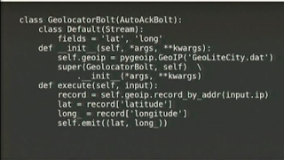

# Storm, Python, Gercek Zamanda Veri Islemek

Storm, Python, Gercek Zamanda Veri Islemek

Storm, Hadoop'un toptan (batch) dunyada  yaptigini gercek zamanli (real-time) veri akislarinda, hesaplarinda yapmaya ugrasiyor. Yatay olarak olcekleme (scaling) destekleniyor, veri akisinin muhakkak / en az bir kere islenme garantileri var. Islem noktalarinda emit() cagrisi gorulebilir, veri akisi alip veri akisi yaratmak mumkun yani. FieldsGrouping kavrami ile Hadoop'un esle/indirge basamagindaki indirge basamagi benzer kavramlar. Ustteki prezentasyon ilginc, cunku JVM / Java bazli Storm icin arkadas bir Python arayuzu yaratmis. Kod suna benziyor:

