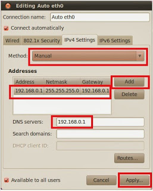

# Yerel Ağ (Network) Kurmak - Ubuntu

Ubuntu temelli bir yerel ag (network) nasil kurulur? Ubuntu uzerinden
bunu yapmak aslinda cok basit (dis Internet baglantisinin paylastirma
konularina daha girmiyoruz), dinamik IP adres kullanmadan, tum
makinalara bir statik (ve yerel) IP adresi atayarak bu ag
kurulabilir. Belki evde bir Hadoop kumesi kurmak istiyorsunuz, vs.

Once tum makinalarda sshd kurulursa iyi olur:

```
apt-get install openssh-server
```

Ag kurmak icin su resimdeki hareketler





Adres olarak 192.168.0.1 sayisi kullanildi, bu adres dis baglantilar
icin anlamsiz bir sayidir, sadece yerel ic ag icinde gecerlidir. Bu
tur disaridan bagimsiz IP adresleri vardir. Eger ikinci, ucuncu
makinayi eklerseniz, 0.2, 0.3, vs. gibi bu makinalar adreslenebilir.

Fiziki baglanti icin en azindan switch denen bir donanim gerekli. Bu
donanim uzerinde Ethernet kablo baglantilari olur, eger laptop
baglanacaksa, ve son zamanlarda artik laptop'lar uzerinde Ethernet
girisi olmadigi icin, bir USB / Ethernet donusturucusu lazim.

Neyse, switch baglantisi ve IP atamasi yapildigi anda o bilgisayarin
komut satirindan

```
sudo ifconfig
```

isletince yeni IP'nin gorulmesi lazim. Diger makinalar baglaninca,
onlardan bu makinaya

```
ssh 192.168.0.1 -l [kullanici]
```

diye erisebilirsiniz. Eger tum makinalara sifresiz (ama guvenli)
baglanmak icin daha once pek cok kez bahsettigimiz ssh-keygen -t rsa,
ile anahtar uretmek, sonra id_rsa.pub'in alinip oteki makinaya
kopyalanip .ssh/authorized_keys'e eklenmesi, ardindan ustteki ssh (ve
scp) komutu sifresiz olarak giris yapma numarasi kullanilabilir.


