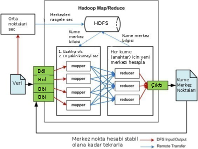
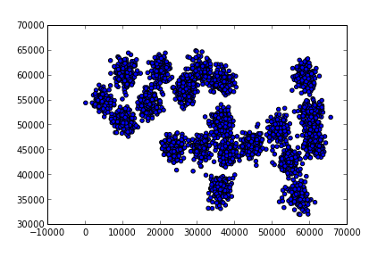

# Paralel KMeans, Hadoop

K-Means algoritmasını [1] nasıl paralel şekilde işletiriz? Özellikle
Hadoop gibi bir Eşle-İndirge (Map-Reduce) ortamını düşünelim. Veri çok
büyük ölçekte olabilir ve bu veriler birden fazla makinaya
bölünecektir. Eşle-İndirge kavramında eşleme safhasında "anahtar
üretiriz", ve sonra indirgeme safhasında Hadoop sistemi öyle kurmuştur
ki aynı anahtarlarlar tek bir makinaya gönderilir, ve bu nihai aşamada
artık anahtar bazında indirgeme (özetleme) yapılır.

Paralel K-Means için anahtar nedir? Anahtar, mesela küme
olabilir. Yani küme 1, küme 2 gibi küme işaretleri / sayıları anahtar
olarak kullanılabilirler.

Peki anahtar ile eşlenecek "değer" nedir?

Öyle bir değer arıyoruz ki üst üste konulabilecek bir şey olmalı, Eİ
sisteminin kuvveti burada, anahtarlar farklı noktalarda
üretilebiliyor, sonra tek noktada üst üste konuyor, o zaman değerler
öyle üretilmeli ki bu üst üste koyma, özetleme işlemi
yapılabilsin. Üst üste konabilecek şey, her veri noktası için, o veri
noktasının ait olduğu küme üzerinden toplama işlemidir. 10.20, 20.5
veri noktasına bakıyorum, bu nokta o anda elde olan küme
merkezlerinden 6'ya en yakın, 10.20, 20.5 verisi ile bir 6 anahtarı
yayınlarım.

Tabii burada tavuk/yumurta problemi var, küme merkezlerini arıyorum,
ama anahtar üretimi için küme merkezi lazım. Bu nasıl olacak?  O zaman
(ilk başta rasgele bile olsa) küme merkezlerinin bilgisi tüm
makinaların erişebileceği bir yerde olmalı. Biz bu veriyi
`centers.csv` adlı bir dosyaya koymaya karar verdik, bu dosya tek
makina ortamında bilinen bir dizinde (mesela /tmp), çok makinalı
ortamda ise HDFS üzerinde herkesin erişebileceği bir yerde olmalı.

Toplamaya gelelim: Normal K-Means'i hatırlarsak, her nokta için o
noktaya en yakın kümeyi buluyordu ve sonra, atama işlemi bitince, her
kümenin altındaki noktaları toparlayıp onların ortalamasını alarak
yeni küme merkezini hesaplıyordu. Paralel ortamda ortalama işlemi üst
üste konabilecek bir şey, çünkü toplama üst üste konabilecek bir
işlem, ve / yani farklı makinalarda küme-nokta, eşlemelerini
üretirsek, indirgeme aşamasında o anahtar için tüm değerleri toplayıp
nokta sayısına böleriz ve yeni küme merkezini elde ederiz.



Şimdi Hadoop ile ilgili bazı lojistik konulara gelelim:

Paralel K-Means için tek bir eşle-indirge işletimi yeterli değil, bu
algoritma döngülü / özyineli (iterative) bir algoritma, 5,10,20 kez
işlemesi gerekebilir.  Her döngü (indirgeme) sonunda yeni küme
merkezleri hesaplanacak, bu merkezler eski `centers.csv` yerini alacak
ve işlem tekrar başlayacak.

Şimdi ham veriyi gösterelim,

```python
from pandas import *
df1 = read_csv("../kmeans/synthetic.txt",comment='#',,sep="   ")
plt.scatter(df1.ix[:,0],df1.ix[:,1])
plt.savefig('kmeans_1.png')
```



```python
from mrjob.job import MRJob
from mrjob.protocol import PickleProtocol
import numpy as np, sys
import pandas as pd
import os, random

def euc_to_clusters(x,y):
    return np.sqrt(np.sum((x-y)**2, axis=1))

class MRKMeans(MRJob):
    INTERNAL_PROTOCOL = PickleProtocol
    
    def __init__(self, *args, **kwargs):
        super(MRKMeans, self).__init__(*args, **kwargs)
        self.centers_ = pd.read_csv("/tmp/centers.csv",header=None,sep="   ")
        self.k = 15
        
    def mapper(self, key, line):
        point = np.array(map(np.float,line.split('   ')))
        c = np.argmin(euc_to_clusters(np.array(self.centers_), point))
        yield(c, point)
                        
    def reducer(self, key, tokens):
        new_centers = np.zeros((1,2))
        counts = 0
        for val in tokens:
            new_centers += val
            counts += 1
        yield('final', (key, new_centers[0] / counts))
        
    def reduce_all_centers(self, key, values):
        new_centers = np.zeros((self.k,2))
        self.f=open("/tmp/centers.csv","w")
        for (cluster,val) in values:
            print cluster, val
            new_centers[cluster] = val
        for row in new_centers:
            self.f.write("   ".join(map(str,row)))
            self.f.write("\n")
        self.f.close()
        
    def steps(self):
        return [self.mr(mapper=self.mapper,reducer=self.reducer),
                self.mr(reducer=self.reduce_all_centers)]
    
if __name__ == '__main__':
    for i in range(15): MRKMeans.run()
```

`reduce_all_centers` çağrısı tüm indirgeyiciler her küme için yeni
orta noktayı hesaplayıp onu yayınladıktan (emit) sonra, tüm yeni
merkezlerin geleceği yer.

Komut satırından tek makina için Hadoop'suz işletelim,

```
!sort --random-sort synthetic.txt > /tmp/synthetic.txt
!head -15 /tmp/synthetic.txt > /tmp/centers.csv
!python kmeans.py synthetic.txt
```

```
/usr/local/lib/python2.7/dist-packages/pytz/__init__.py:29: UserWarning: Module _yaml was already imported from /usr/lib/python2.7/dist-packages/_yaml.so, but /usr/local/lib/python2.7/dist-packages is being added to sys.path
  from pkg_resources import resource_stream
using configs in /home/burak/.mrjob.conf
creating tmp directory /tmp/kmeans.burak.20131202.234454.312709
writing to /tmp/kmeans.burak.20131202.234454.312709/step-0-mapper_part-00000
Counters from step 1:
  (no counters found)
writing to /tmp/kmeans.burak.20131202.234454.312709/step-0-mapper-sorted
> sort /tmp/kmeans.burak.20131202.234454.312709/step-0-mapper_part-00000
writing to /tmp/kmeans.burak.20131202.234454.312709/step-0-reducer_part-00000
Counters from step 1:
  (no counters found)
writing to /tmp/kmeans.burak.20131202.234454.312709/step-1-mapper_part-00000
Counters from step 2:
  (no counters found)
writing to /tmp/kmeans.burak.20131202.234454.312709/step-1-mapper-sorted
> sort /tmp/kmeans.burak.20131202.234454.312709/step-1-mapper_part-00000
writing to /tmp/kmeans.burak.20131202.234454.312709/step-1-reducer_part-00000
10 [ 33655.97916667  59869.70138889]
13 [ 10318.87456446  55430.98780488]
9 [ 21286.26027397  59328.61187215]
0 [ 34297.27789474  43563.19789474]
1 [ 56490.3362069   37260.18103448]
2 [ 56217.97297297  43823.02702703]
3 [ 56453.07407407  34324.16666667]
4 [ 22960.27741935  45942.7483871 ]
5 [ 61346.1443299   47761.37113402]
6 [ 58466.11940299  60120.6641791 ]
7 [ 51691.66477273  48608.63636364]
8 [ 60189.47019868  53209.15231788]
11 [ 62427.68  44841.88]
12 [ 27699.59813084  56743.19626168]
14 [ 41850.40925267  47055.58362989]
Counters from step 2:
  (no counters found)
Moving /tmp/kmeans.burak.20131202.234454.312709/step-1-reducer_part-00000 -> /tmp/kmeans.burak.20131202.234454.312709/output/part-00000
Streaming final output from /tmp/kmeans.burak.20131202.234454.312709/output
removing tmp directory /tmp/kmeans.burak.20131202.234454.312709
using configs in /home/burak/.mrjob.conf
using configs in /home/burak/.mrjob.conf
creating tmp directory /tmp/kmeans.burak.20131202.234456.597838
creating tmp directory /tmp/kmeans.burak.20131202.234456.597838
writing to /tmp/kmeans.burak.20131202.234456.597838/step-0-mapper_part-00000
writing to /tmp/kmeans.burak.20131202.234456.597838/step-0-mapper_part-00000
Counters from step 1:
Counters from step 1:
  (no counters found)
  (no counters found)
writing to /tmp/kmeans.burak.20131202.234456.597838/step-0-mapper-sorted
writing to /tmp/kmeans.burak.20131202.234456.597838/step-0-mapper-sorted
> sort /tmp/kmeans.burak.20131202.234456.597838/step-0-mapper_part-00000
> sort /tmp/kmeans.burak.20131202.234456.597838/step-0-mapper_part-00000
writing to /tmp/kmeans.burak.20131202.234456.597838/step-0-reducer_part-00000
writing to /tmp/kmeans.burak.20131202.234456.597838/step-0-reducer_part-00000
Counters from step 1:
Counters from step 1:
  (no counters found)
  (no counters found)
writing to /tmp/kmeans.burak.20131202.234456.597838/step-1-mapper_part-00000
writing to /tmp/kmeans.burak.20131202.234456.597838/step-1-mapper_part-00000
Counters from step 2:
Counters from step 2:
  (no counters found)
  (no counters found)
writing to /tmp/kmeans.burak.20131202.234456.597838/step-1-mapper-sorted
writing to /tmp/kmeans.burak.20131202.234456.597838/step-1-mapper-sorted
> sort /tmp/kmeans.burak.20131202.234456.597838/step-1-mapper_part-00000
> sort /tmp/kmeans.burak.20131202.234456.597838/step-1-mapper_part-00000
writing to /tmp/kmeans.burak.20131202.234456.597838/step-1-reducer_part-00000
writing to /tmp/kmeans.burak.20131202.234456.597838/step-1-reducer_part-00000
10 [ 34190.76071429  59473.68214286]
13 [  9524.38372093  55188.34689922]
9 [ 19288.00425532  59048.12340426]
0 [ 34495.96781609  42837.15862069]
1 [ 56603.56756757  37301.28378378]
2 [ 54698.1862069   43080.47586207]
3 [ 56850.95180723  34689.86746988]
4 [ 23627.50314465  45589.86792453]
5 [ 60775.48039216  47705.81372549]
6 [ 58623.54054054  59894.10135135]
7 [ 51384.90184049  49124.60736196]
8 [ 60238.23021583  52723.48920863]
11 [ 61762.52830189  45110.81132075]
12 [ 27191.86813187  57337.64835165]
14 [ 41387.76223776  47391.7972028 ]       
...
```

```python
import pandas as pd
df1 = pd.read_csv("../kmeans/synthetic.txt",comment='#',sep="   ",header=None)
plt.scatter(df1.ix[:,0],df1.ix[:,1])
plt.hold(True)
df2 = pd.read_csv("/tmp/centers.csv", sep="   ", header=None)
plt.plot(df2.ix[:,0],df2.ix[:,1],'rd')
plt.savefig('kmeans_2.png')
```


K-Means'i 20 kere işlettik. Eğer istenirse (hatta daha iyi olur) döngü
bir `while` içine konur ve bitiş için "stabilite şartı"
aranır. Stabilite yeni küme merkezinin eskisinden "çok fazla değişik
olup olmadığı" şartıdır, değişim yoksa artık sonucu bulmuşuz demektir,
daha fazla döngüye gerek kalmayacaktır. Biz döngüyü 20 kere döngüyü
işlettik, bu problem için yeterli oldu.

K-Means işini bitirdikten sonra elde edilen sonuçları
okuyabiliriz. Nihai küme merkezleri `/tmp/centers.csv` içinde. Bu
merkezleri alıp, ham veri üzerinde kırmızı nokta olarak gösteriyoruz.

Veriyi 20-30 makinaya dağıtarak parça parça işleyip kümelemeniz
mümkündür. Endüstride son zamanlarda habire duyulan Büyük Veri (Big
Data) olayı işte bu.


Kaynaklar

[1] [K-Means Kümeleme Metodu](https://burakbayramli.github.io/dersblog/algs/algs_080_kmeans/kmeans_kumeleme_metodu.html)

