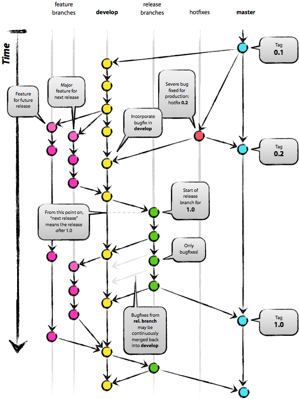

# Projelerde Git

Projelerde kullanilan bazi Git numaralari ve tavsiyeleri:

Eğer Wifi üzerinden git push yapmaya çalışıp `Connection refused` hatası
alırsanız, tamir için `.ssh/config` dosyasına girip

```
Host github.com
  Hostname ssh.github.com
  Port 443
```

yazmak yeterli.

N commit öncesi (mesela 10) ile en son commit arasında hangi dosyalar
değişti:

```
git diff --name-only HEAD~10
```

Sadece diskte ve commit edilmemis icerik ile en son commit edilmis icerik
arasindaki farklar icin

```
git diff HEAD
```

### Git Pull

Artık Github çoğu projede kullanılan bir servis, onu baz alan bazı
tavsiyeleri paylaşmak iyi olur. Tipik bir tür kullanım şöyle olabilir,
kullanıcı

```
git add *
git commit -m 'vs'
git push origin master 
```

ile son kodu göndermektedir, ve gerektiğinde son kodları almak için
`git pull` yapmaktadır. Eğer çakışma var ise, bu durumda Git birleştirme
(merge) yapmaya uğraşır ve çakışmaları programcının çözmesini
ister. Çözme sonrası `git push` işler, fakat `git log`, yani nelerin
yapıldığını gösteren kayıt pek hoş gözükmez.

Alternatif yöntem, ortak depodan en son kodları alırken `git pull`
yerine `git fetch` kullanmaktır. Bu kullanım en son dalları (branch)
alır, fakat yerel dosyalar üzerinde değişim yapmaz. Sonra `git rebase origin/master`
yaparız, bu komut bizim kodumuzu biraz önce alınan son
kod üzerine "istifler" / geri çalar (replay). Git bunu öyle yapar ki
sanki bizim kodumuz mevcut olanın üzerine yazılmıştır, sanki o kodu o
kod biter bitmez hemen almışız, ve onun üzerinde bizimkini yazmışız
gibi... Bu durumda da çakışmalar görülebilir muhakkak, onlar varsa
çözülür; Sonra `git push` daha önce yapıldığı gibi yapılır.

Eger Github'daki depo bizdeki kodlari tamamen ezsin istiyorak,

```
git reset --hard origin/master
```

### Dosyayı Tamamen Silmek

Belki geliştirme dizini içinde geçici dosyalar üretiliyor, ya da şifre
dosyaları yanlışlıkla commit edilmiş, ya da aşırı büyük dosyalar
depoya bir şekilde girdi.. Sonra `git push` sırasında hatayı
farkettik, `git rm` ile dosyayı sildik. Fakat `push` hala çok zaman
alıyor. Problem şurada, Git tüm değişiklikleri teker teker yollamaya
uğraşıyor - dosya eklemesi, sonra onu silme. Şifre durumunda zaten
silsek bile bir şifre dosyasının tarihte kalması durumu var, birisi
`checkout` ile eski hale giderek şifreleri görebilir. Çözüm tamamen
silmek.

Git tarafindan tavsiye edilen yeni yaklasim `git-filter-repo`
kullanimi. Bu ayri bir yardimci kod, indirmek icin

https://github.com/newren/git-filter-repo

Yuksek Git versiyonuna ihtiyaci var, yoksa guncelleme yapalim,

```
sudo add-apt-repository ppa:git-core/ppa -y
sudo apt-get update
sudo apt-get install git -y
git --version
```

Şimdi silme işlemini yapacağımız depo en üst dizinine `cd` ile gidelim,
ve `git-filter-repo` [DİZİN] altında kurulduğunu varsayarak,

```
[DIZIN]/git-filter-repo/git-filter-repo --invert-paths --path dir1/dir2/dosya3.txt
```

ile `dir1/dir2/dosya3.txt` dosyasını tarihten silelim. Tabii önceden
`git-filter-repo` üzerinde `chmod u+x` yapmak gerekebilir.

Üstteki komut işlem yapmak için illa sıfırdan `git clone` edilmiş depo
istiyorum diye yakınabilir, eğer bu mümkünse yapın, değilse üstteki
komuta `--force` eklenebilir.

Komut işledikten sonra uzaktaki depoya ittirmek gerekli, herhangi bir
sebeple uzak (remote) deponun ne olduğu silinmiş ise, `git remote -v`
o listeye bakılır, eklemek için

```
git remote add origin git@github.com:[user]/[repo.git]
```

Artık

```
git push origin --force --all
```

ile kod gönderilebilir.

Dal Yapısı (Branch Structure)

Bizim kullandığımız bir yaklaşım şöyle: master yani ana dal her zaman
"işleyen kodu" temsil eder. Yani master'da ne var ise, sonuç
(production) makinasında o var demektir. Bu bağlantının sIkİ tutulması
iyi olur, yani master'a gönderilen her şey, anında işleme konmalıdır.

Geliştirme için master'dan dallanarak mesela bir dev (geliştirme) dalı
kullanabiliriz, bu daldan her programcı kendisi için ayrı bir dal da
yaratabilir, bu onlara kalmış. Fakat kodcular arası entegrasyon için
dev dalı kullanılır. Çakışmalar vs var ise bu dalda çözülür, master a
göndermeden önce entegrasyon testleri bu dal  üzerinden
işletilir. Eğer sonuç iyi bulunursa buradan master'a birleştirme
(merge) yapılır. Önemli nokta şudur: artık kimse master dalı üzerinde
geliştirme yapmaz. Ana master dalı artık commit edilen bir şey değil,
merge edilen bir şeydir yani.

Gelistirme dali icin onu yaratiriz, ve kullanmaya baslariz, 

```
git checkout dev
```

ile gecis yapariz. Kodlama vs bitince commit edilir. Sonra git push
ile Github'a gonderilir. Birlestirme icin

```
git checkout master
git merge dev
git push origin master
```

yapilir.

### Daha Sofistike Dal Yapılar

http://nvie.com/posts/a-successful-git-branching-model/

Üstteki yazıda tarif edilen şudur: geliştirme (dev) ve sürüm (master)
iki, sürekli orada olan dal vardır. Geliştiriciler belli özellikleri
geliştirmek için dev'den dal ayırırlar. Master her zaman en son, işler
kodu temsil etmektedir, sonuç ortamında işleyen budur. Sürüm yapmak
için dev'den isminde versiyon no'su taşıyan yepyeni bir dal yaratılır,
ve bu dalda artık yeni özellik eklenmez, sadece ufak tefek entegrasyon
pürüzleri çözülür, hatalar onarılır.

Github Projesini Yerel Dosyalardan Sıfırlamayıp Yaratmak

Bazen GH'daki projemizi ismen aynı tutsak bile içeriğini yerel
diskimizden en son dosyalardan yaratıp, Git tarihini sıfırlamak
isteyebiliriz. Sebepler, belki Git kayıtlarının olduğu .git içindeki
dosyalar bozulmuştur (corrupted), ya da Git tarihine aşırı büyük
dosyalar commit edilmiştir, her ne kadar onların git rm ile silmişsek
bile, hala tarihte duruyor olurlar, bu da .git dosyalarını
şişirir. Onları tarihten silebiliriz tabii, ama bazılarını kaçırmiş
olabiliriz. Her halükarda sıfırdan başlamak için pek çok sebep
olabilir. Bunu yapmak için kullanici `burakbayramli` icin ve
`classnotes` projesi icin,

```
cd [PROJE DIZINI]
.git dizinini sil
git branch -m main 
git init
git add .
git commit -m 'Initial commit'
git remote add origin git@github.com:burakbayramli/classnotes.git 
git push --force --set-upstream origin master
```

Dikkat: üstteki adımları takip edince eğer projenizdein GH üzerinde
dallanma (branch) yapmış olan insanlarla bağlantı tamamen
kesilir. Çünkü bu noktada tarihi sildiniz, ve neredeyse yeni baştan
bir proje yaratmış oldunüz.

Üstteki adımların iyi bir tarafı projenizin GH seviyesindeki bilgileri
hala aynı kalır; alınan yıldızlar, takipçiler, vs. değişmez.




### Başka Kullanıcı İsmi ile Github'da Çalışmak

Diyelim ki user1 Github kullanıcısı ile çalışıyoruz, `.ssh/id_rsa` ona
göre ayarlanmış, `.ssh/id_rsa.pub` Github'a kopyalanmış ve şifresiz
şekilde güzelce çalışabiliyoruz. Peki farklı bir Github kullanıcısı
üzerinden çalışmamız gerekse ne yapardık?

Önce bu ikinci kullanıcı için yeni anahtarlar yaratalım,

```
ssh-keygen -t rsa -f ~/.ssh/id_user2
```

Şimdi `~/.ssh/id_user2` ve `~/.ssh/id_user2.pub` olarak iki yeni dosya
göreceğiz. Bu dosyalardan `~/.ssh/id_user2.pub` dosyasını alıp
Github'a anahtar olarak kayıtlarız.

Şimdi bir `~/.ssh/config` dosyası yaratalım,

```
Host github.com
    HostName github.com
    User git
    IdentitiesOnly yes
    IdentityFile ~/.ssh/id_rsa

Host github2
    HostName github.com
    User git
    IdentitiesOnly yes
    IdentityFile ~/.ssh/id_user2
```

Dikkat, `Host` diyen yerde farklı bir isim olması çok önemli.

Şimdi o farklı ismi kullanan repo'ya gideriz, ve `.git/config` dosyasına
bakarız, burada `remote` diyen kısımda

```
[remote "origin"]
	url = git@github2:user2/repo2.git
```

ifadesinin olması gerekli. Bu kadar. Artık ikinci repo dizini altında
iki `git push` ve alakalı komutlar bir kullanıcıya, diğerleri öteki
kullanıcıya gider.

### Belli Bir Tarihe Dönüş

Depo'nun eski tarihteki haline donmek istiyorsak,

```
git checkout "`git rev-list master  -n 1 --first-parent --before=2022-06-02`"
```

### Tüm Tarihte bir Dosyayı Aramak

Sadece en son versiyonda değil gelmiş geçmiş commit edilmiş belki silinmiş
ama hala tarihte olan dosyaları aramak istiyorsak,

```
git log --all --full-history -- "**/*myscript*.py"
```

### Son 7 Gündeki Değişimleri Görmek

```
git log --since="7 day ago" --name-only --pretty=format: | sort | uniq
```

