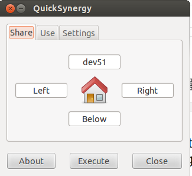

# Bir Bilgisayarın Klavye ve Mouse'unu Diğeri İçin Kullanmak

Diyelim ki evde ve işte farklı bilgisayarlar var, ama tüm bunları tek
bir aletten kontrol etmek istiyoruz, bu durumda fare / klavye paylaşım
yazılımları ise yarayabilir. Artık çoğunlukla herkesin kendi dizüstü
oluyor, ama işyerinde masaüstü (desktop) verilebiliyor mesela, ama biz
bu masaüstünü çoğunlukla ona bağlı kuluştur (!) bir klavye üzerinden
kullanmak istemiyor olabiliriz. Şahsi olarak zaten not defteri yumuşak
klavyelerine çok alıştık, ve öteki türden klavye kullanmakta
zorlanıyoruz.

Çözüm olarak fare / klavye paylaşım araçları faydalı, dikkat -
masaüstü (desktop) paylaşım araçları değil, mesela VNÇ gibi, fare /
klavye paylaşım araçları. Masaüstü paylaşımında bir diğer bilgisayara
girip tamamen onun ekranını başka bir bilgisayarda görüyoruz, ötekinde
ise bir bilgisayarın sadece kontrollerini bir diğerine
aktarıyoruz. Yani hala büyük bilgisayarın büyük ekranına bakıyoruz,
ama klavye ve fare hareketleri dizüstü makinasından geliyor.

Bu alanda en iyi bilinen araç Synergy. Kurmak için  

```
synergy-foss.org/download/?alt
```

Buradan 1.3.8 indirilebilir. Dikkat, eğer Ubuntu 12/13 farkları var
ise, her iki bilgisayarda direk apt-get ınstall iki bilgisayarda
farklı sürümleri kurabilir, ve farklı sürümler birbiriyle
konuşamayabilirler. O sebeple 1.3.8'ın deb dosyasını indirip sudo dpkg
-i ile kurmak en iyisi. Bir not daha: Ubuntu sistem güncellemesi
yaparken 1.3.8 paketini "eski" olarak görüp güncellemeye çalışır, bu
sebeple sistem güncellemesi sonrası tekrar dpkg ile eski versiyona
geçmeniz gerekebilir.

Kurulum yapıldıktan sonra klavyesinin paylaşılacağı "master"
bilgisayardan bir de quicksynergy denen bir araç kurmak iyi
olur. Klavye bilgisinin "gönderildiği" makinada

```
synergyc -f [master bilgisayar ip adresi]
```

Master uzerinde Accessories | Quick Synergy baslatiriz, ve

Share tab'ı içinde dev51 yazdık, bu isim bizim /etc/hoşts içinde hedef
bilgisayarının ip'sine tercüme oluyor. Peki bu resimle ne söylemiş
oluyoruz? Diyoruz ki eğer dizüstünde fareyi hareket ettirirken işaret
dizüstü ekranından yukarı doğru "taşarsa", synergy bu durumu algılıyor
ve fare işaretini öteki bilgisayarda hareket ettirmeye başlıyor!
Klavye yazımı da bu noktadan sonra diğer bilgisayara doğru akmaya
başlıyor! Eğer geri dizüstüne dönmek istersek tam tersini yapıyoruz,
öteki bilgisayarın ekranında fareyi aşağı doğru hareket ettirip alttan
dışarı "taşıyoruz" ve synergy bunu da algılayıp bizi dizüstü
makinasına geri döndürüyor.

Not: Synergy'nin işlemesi için her iki bilgisayarın birbirini yerel ağ
üzerinden görmesi lazım (yani ping ile birbirlerinin ip'sini
görebilmeliler). Eğer şirketinizin İT departmanını uğraştırmak
istemezseniz, iş yerine basit bir network switch götürebilirsiniz, ve
şurada tarif edildiği gibi statik İP'ler üzerinden bir "alternatif ağ"
kurabilirsiniz. Mesela şirket içi ip adresleri 10.1.1.x ile
başlıyorsa, bu alternatif ağı 192.168.1.x üzerinden
tanımlayabiliriz. Bu durumda, dış İnternet bağlantısı bile her iki
bilgisayarda normal şirket ağı üzerinden akmaya devam edecektir, ama
bizim iki bilgisayar birbiriyle 192.168.1.x üzerinden bağlantı
kurabilirler. Statik tanım sırasında tek dikkat edilmesi gereken
switch'e bağlandıktan sonra statik İP tanımını "Wired Connection 2"
gibi "farklı" bir isimde çıkacak ikon üzerinden yapmak. Bunun
haricinde başka hiçbir ek tanıma gerek yok.



