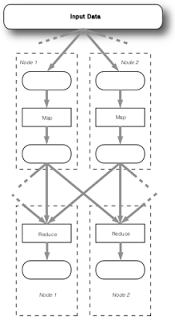

# Eşle-İndirge Mimarisi (Map/Reduce -MR- Architecture)

MR bir veri analiz sürecini iki evreye ayırır. Bunlardan birincisi
eşleme evresidir, ki bu evrede eline geçen veri parçasını alan her
analiz servisi (bunlardan pek çok var, farklı makinalarda), süreçler
kendilerine verilen dosyaya bakarak anahtar-değer ikilileri
üretirler. Kelime sayma örneği için bu anahtarlar kelimeler, sayılar
ise hep 1. Mesela "A A B" için tek bir eşleyici A: 1, A: 1, B: 1
üretir.

Diğer evre, indirgeme sırasında her servisten alınan anahtarlardaki
değerler "birleştirilir" yani daha aza "indirgenir". Fakat dikkat:
birleştirme denince tek bir nihai servisin her şeyi tek başına
indirgediği zannedilmesin; bu evre de birden fazla makinada
işleyebilir.

Anahtarlar birleştirme "birimini" oluştururlar [1]. İndirgeme işlemi
ise iki, üç hatta birden fazla girdiyi işleyebilecek türden bir kod
olmalıdır. Fakat zaten kelime sayma problemin özünde zaten bu vardır,
herşey ayrı ayrı, parça parça toplanabilir, bir İndirgeyici iki
eşlenmiş dosya alıyor diyelim, biri A: 1, A: 1, B: 1, diğeri A: 1,
B:1; bunları A: 3, B: 2 olarak indirgeyebilir / birleştirebiliriz. 
Diğer makinalarda başkaları başka veriler almıştır, onlar kendi
çaplarında kendi birleştirimlerini yapmaktadırlar. İndirgeme ve yük
dağıtım birimi anahtardır, indirgeme safhasında mesela A anahtarı tek
bir makinaya gönderilecektir, o anahtarın birleşiminden o makina
sorumlu olacaktır.


İşin mekaniğine bakınca oldukça basit gibi gelebilir. Fakat şaşırtıcı
kadar çok analiz işlemi üstteki şekilde temsil edilebilmektedir ve
sonuç olarak paralelize edilebilmektedir. Tabii işin mekanığı derken
sadece anahtarlara ayırmaktan bahsetmiyoruz, analiz işleminin, her ne
ise, "azar azar, ayrı ayrı üst üste koya koya sonuca ilerleyebilecek"
şekilde tekrar tasarlanması gerekiyor. Kelime toplama, hatta
toplamanın niye MR ile doğal bir uyumunun olduğunu görüyoruz herhalde,
2,3,4,5 eklerlerken 2+3=5,4+5=9 ardından 5+9=14 elde edebiliriz, ama
diğer bir şekilde 3+4=7,2+5=7 arkasından tekrar 7+7=14 yani aynı
sonucu elde edebiliyoruz. Toplama işleminin ruhunda "sıradan bağımsız
olmak" var, ve bu bağımsızlık paralelize etmekte işimize yarıyor.

Hadoop ile Patent Verisi İşlemek

75-99 yılları arasında hangi patentin hangi hangi patentlere referans
verdiği ve patentler hakkında detaylı verileri Hadoop ile
işleyeceğiz. Veriler alttaki bağlantıdan alınabilir, gerekli dosyalar
cite75_99.txt ve apat63_99.txt (baglantilar altta) Bu dosyaları açıp
biz diyelim ki /data altına koyduk.

Referans verisine bakarsak,

```
head -10 /data/cite75_99.txt

"CITING","CITED"
3858241,956203
3858241,1324234
3858241,3398406
3858241,3557384
3858241,3634889
3858242,1515701
3858242,3319261
3858242,3668705
3858242,3707004
```

Bu veri, hangi patentin hangi diğer patenti kullandığını "tek" patent
bazında göstermekte. Detaylı patent verisine bakalım

```
head -10 /data/apat63_99.txt

"PATENT","GYEAR","GDATE","APPYEAR","COUNTRY","POSTATE","ASSIGNEE","ASSCODE","CLAIMS","NCLASS","CAT","SUBCAT","CMADE","CRECEIVE","RATIOCIT","GENERAL","ORIGINAL","FWDAPLAG","BCKGTLAG","SELFCTUB","SELFCTLB","SECDUPBD","SECDLWBD"

3070801,1963,1096,,"BE","",,1,,269,6,69,,1,,0,,,,,,,
3070802,1963,1096,,"US","TX",,1,,2,6,63,,0,,,,,,,,,
3070803,1963,1096,,"US","IL",,1,,2,6,63,,9,,0.3704,,,,,,,
3070804,1963,1096,,"US","OH",,1,,2,6,63,,3,,0.6667,,,,,,,
3070805,1963,1096,,"US","CA",,1,,2,6,63,,1,,0,,,,,,,
3070806,1963,1096,,"US","PA",,1,,2,6,63,,0,,,,,,,,,
3070807,1963,1096,,"US","OH",,1,,623,3,39,,3,,0.4444,,,,,,,
3070808,1963,1096,,"US","IA",,1,,623,3,39,,4,,0.375,,,,,,,
3070809,1963,1096,,"US","AZ",,1,,4,6,65,,0,,,,,,,,,
```

Şimdi patent detay verisinden bir örneklem (sample) alalım. Daha ufak
bir veri kümesiyle çalışmak ilk başta faydalı olabilir, geliştirme
test etme sürecini hızlandırır.

```
chmod a+r /data/apat63_99.txt
head -1 /data/apat63_99.txt > /data/apat63_99_sampled.txt
cat /data/apat63_99.txt | perl -n -e 'print if (rand() < .05)' >> /data/apat63_99_sampled.txt
```

Hadoop başlatalım

```
ssh localhost -l hduser /home/hduser/Downloads/hadoop*/bin/stop-all.sh

ssh localhost -l hduser /home/hduser/Downloads/hadoop*/bin/start-all.sh
```

```
no jobtracker to stop

localhost: no tasktracker to stop

no namenode to stop

localhost: no datanode to stop

localhost: no secondarynamenode to stop

starting namenode, logging to /home/hduser/Downloads/hadoop-1.0.4/libexec/../logs/hadoop-hduser-namenode-burak-Aspire-S3.out

localhost: starting datanode, logging to /home/hduser/Downloads/hadoop-1.0.4/libexec/../logs/hadoop-hduser-datanode-burak-Aspire-S3.out

localhost: starting secondarynamenode, logging to /home/hduser/Downloads/hadoop-1.0.4/libexec/../logs/hadoop-hduser-secondarynamenode-burak-Aspire-S3.out

starting jobtracker, logging to /home/hduser/Downloads/hadoop-1.0.4/libexec/../logs/hadoop-hduser-jobtracker-burak-Aspire-S3.out

localhost: starting tasktracker, logging to /home/hduser/Downloads/hadoop-1.0.4/libexec/../logs/hadoop-hduser-tasktracker-burak-Aspire-S3.out

/home/hduser/Downloads/hadoop*/bin/hadoop dfs -mkdir /user/hduser/patent

ssh localhost -l hduser /home/hduser/Downloads/hadoop*/bin/hadoop \

dfs -ls /user/hduser/patent
```

```
Found 2 items

-rw-r--r--   1 hduser supergroup ...  /user/hduser/patent/apat63_99.txt

-rw-r--r--   1 hduser supergroup ...   /user/hduser/patent/apat63_99_sampled.txt
```

```
ssh localhost -l hduser /home/hduser/Downloads/hadoop*/bin/hadoop \

dfs -copyFromLocal /data/apat63_99_sampled.txt \

/user/hduser/patent/apat63_99_sampled.txt

copyFromLocal: Target /user/hduser/patent/apat63_99_sampled.txt already exists
```

Amacımız patent verisindeki ülke (country) kodunu kullanarak her ülke
basına ortalama ne kadar patent üretildiğini
hesaplamak. Eşleme-İndirgeme (Map-Reduce) döngüsünde eşleme kısmını
yapacak program aşağıda.

```
#!/usr/bin/python

import os,sys

os.environ['MPLCONFIGDIR']='/tmp' 

import pandas as pd

data = pd.read_csv(sys.stdin,sep=",",index_col=0,usecols=[0,4,8])

df = data[pd.notnull(data.ix[:,0]) \& pd.notnull(data.ix[:,1])].ix[:,0:2]

df.to_csv(sys.stdout,sep="\t",index=False,header=False)
```

İndirgeyici yazmadan önce programımızı iki şekilde test edelim. Bu
şekillerden birisi hiç indirgeyici olmadan, ikincisi IdentityReducer
denen kendisine geçilen veriyi olduğu gibi dışarı atan (ama yine de
ortada bir indirgeyici olduğu için sonradan bazı işlemlerin yine de
yapıldığı) şeklinde. Bu iki kullanım Hadoop kodlarında hata bulma /
temizleme için faydalı olabiliyor.


```
cp mapper.py /tmp/

chmod a+r /tmp/mapper.py

chmod a+x /tmp/mapper.py


ssh localhost -l hduser /home/hduser/Downloads/hadoop*/bin/hadoop \

dfs -rmr /user/hduser/output

ssh localhost -l hduser /home/hduser/Downloads/hadoop*/bin/hadoop \

jar \$HOME/Downloads/hadoop*/contrib/streaming/hadoop-*streaming*.jar\

-input patent/apat63_99_sampled.txt  -output output  \

-mapper /tmp/mapper.py -numReduceTasks 0 


Deleted hdfs://localhost:54310/user/hduser/output

packageJobJar: [/app/hadoop/tmp/hadoop-unjar2555196345671652661/] [] /tmp/streamjob5013687273729997973.jar tmpDir=null

13/02/24 16:30:26 INFO util.NativeCodeLoader: Loaded the native-hadoop library

13/02/24 16:30:26 WARN snappy.LoadSnappy: Snappy native library not loaded

13/02/24 16:30:26 INFO mapred.FileInputFormat: Total input paths to process : 1

13/02/24 16:30:27 INFO streaming.StreamJob: getLocalDirs(): [/app/hadoop/tmp/mapred/local]

13/02/24 16:30:27 INFO streaming.StreamJob: Running job: job_201302241611_0012

13/02/24 16:30:27 INFO streaming.StreamJob: To kill this job, run:

13/02/24 16:30:27 INFO streaming.StreamJob: /home/hduser/Downloads/hadoop-1.0.4/libexec/../bin/hadoop job  -Dmapred.job.tracker=localhost:54311 -kill job_201302241611_0012

13/02/24 16:30:27 INFO streaming.StreamJob: Tracking URL: http://localhost:50030/jobdetails.jsp?jobid=job_201302241611_0012

13/02/24 16:30:28 INFO streaming.StreamJob:  map 0%  reduce 0%

13/02/24 16:30:43 INFO streaming.StreamJob:  map 100%  reduce 0%

13/02/24 16:30:49 INFO streaming.StreamJob:  map 100%  reduce 100%

13/02/24 16:30:49 INFO streaming.StreamJob: Job complete: job_201302241611_0012

13/02/24 16:30:49 INFO streaming.StreamJob: Output: output

ssh localhost -l hduser /home/hduser/Downloads/hadoop*/bin/hadoop dfs  -copyToLocal output /tmp/

head -20 /tmp/output/part-00000

AD 14.0

AE 15.4

AG 13.25

AI 10.0

AM 18.0

AN 9.625

AR 9.188990825688073

AT 10.683988393563704

AU 12.291563832174107

AW 15.5

AZ 11.0

BB 11.0

BE 11.945544554455445

BG 4.9899497487437188

BH 6.5

BM 10.076923076923077

BN 9.0

BO 11.75

BR 9.358426966292134

BS 15.778846153846153
```

Üstteki sonuçta görüyoruz ki anahtarlar üretilmiş, ama çıktılar
anahtara göre sıralanmamışlar. Hatta üstteki sıra girdi sırasıyla
tıpatıp aynı. Şimdi IdentityReducer üzerinden.

```
ssh localhost -l hduser /home/hduser/Downloads/hadoop*/bin/hadoop \

dfs -rmr /user/hduser/output

!ssh localhost -l hduser /home/hduser/Downloads/hadoop*/bin/hadoop \

 jar /home/hduser/Downloads/hadoop*/contrib/streaming/hadoop-*streaming*.jar \

 -input patent/apat63_99_sampled.txt  -output output \

 -mapper /tmp/mapper.py -reducer org.apache.hadoop.mapred.lib.IdentityReducer \

-numReduceTasks 1 

Deleted hdfs://localhost:54310/user/hduser/output

packageJobJar: [/app/hadoop/tmp/hadoop-unjar2314287838929839696/] [] /tmp/streamjob5231815242060775825.jar tmpDir=null

13/02/24 18:03:14 INFO util.NativeCodeLoader: Loaded the native-hadoop library

13/02/24 18:03:14 WARN snappy.LoadSnappy: Snappy native library not loaded

13/02/24 18:03:14 INFO mapred.FileInputFormat: Total input paths to process : 1

13/02/24 18:03:14 INFO streaming.StreamJob: getLocalDirs(): [/app/hadoop/tmp/mapred/local]

13/02/24 18:03:14 INFO streaming.StreamJob: Running job: job_201302241759_0004

13/02/24 18:03:14 INFO streaming.StreamJob: To kill this job, run:

13/02/24 18:03:14 INFO streaming.StreamJob: /home/hduser/Downloads/hadoop-1.0.4/libexec/../bin/hadoop job  -Dmapred.job.tracker=localhost:54311 -kill job_201302241759_0004

13/02/24 18:03:14 INFO streaming.StreamJob: Tracking URL: http://localhost:50030/jobdetails.jsp?jobid=job_201302241759_0004

13/02/24 18:03:15 INFO streaming.StreamJob:  map 0%  reduce 0%

13/02/24 18:03:28 INFO streaming.StreamJob:  map 50%  reduce 0%

13/02/24 18:03:31 INFO streaming.StreamJob:  map 100%  reduce 0%

13/02/24 18:03:40 INFO streaming.StreamJob:  map 100%  reduce 100%

13/02/24 18:03:46 INFO streaming.StreamJob: Job complete: job_201302241759_0004

13/02/24 18:03:46 INFO streaming.StreamJob: Output: output

ssh localhost -l hduser rm -rf /tmp/output

ssh localhost -l hduser /home/hduser/Downloads/hadoop*/bin/hadoop \

dfs  -copyToLocal output /tmp/

head -10 /tmp/output/part-00000

FR 12.0

US 5.0

US 1.0

US 4.0

US 4.0

US 21.0

US 4.0

US 8.0

US 7.0

US 11.0
```

Üstteki sonuçta anahtarların sıralanmış olduğunu görüyoruz.

Şimdi bir indirgeyici (reducer) ekleyelim. Bu indirgeyici ülke
bazındaki veriler üzerinen ortalama alacak. 

```
#!/usr/bin/python

import os,sys

os.environ['MPLCONFIGDIR']='/tmp' 

import pandas as pd

data = pd.read_csv(sys.stdin,sep="\t",names=['country','count'])

grouped = data.groupby('country').mean()

grouped.to_csv(sys.stdout,sep="\t",header=False)
```

Eğer indirgeyiciyi direk işletirsek (Hadoop dışından)

```
cat /tmp/output/part-00000 | ./reducer.py | tail -10

SE 9.0021739130434781

SG 14.0

SU 6.4136125654450264

SV 6.5

TR 8.0

TW 6.2037037037037033

US 10.964136780650541

VE 9.3333333333333339

YU 5.75

ZA 11.170212765957446
```

Bu kodu hduser'in bulabileceği bir yere koyuyoruz. 

```
cp reducer.py /tmp/

chmod a+r /tmp/reducer.py

chmod a+x /tmp/reducer.py

ssh localhost -l hduser /home/hduser/Downloads/hadoop*/bin/hadoop \

dfs -rmr /user/hduser/output

ssh localhost -l hduser /home/hduser/Downloads/hadoop*/bin/hadoop \

jar \$HOME/Downloads/hadoop*/contrib/streaming/hadoop-*streaming*.jar\

-input patent/apat63_99_sampled.txt  -output output \

 -mapper /tmp/mapper.py -reducer /tmp/reducer.py -numReduceTasks 1 

Deleted hdfs://localhost:54310/user/hduser/output

packageJobJar: [/app/hadoop/tmp/hadoop-unjar3358838375062006941/] [] /tmp/streamjob3628714134396896316.jar tmpDir=null

13/02/24 20:33:10 INFO util.NativeCodeLoader: Loaded the native-hadoop library

13/02/24 20:33:10 WARN snappy.LoadSnappy: Snappy native library not loaded

13/02/24 20:33:10 INFO mapred.FileInputFormat: Total input paths to process : 1

13/02/24 20:33:10 INFO streaming.StreamJob: getLocalDirs(): [/app/hadoop/tmp/mapred/local]

13/02/24 20:33:10 INFO streaming.StreamJob: Running job: job_201302241759_0005

13/02/24 20:33:10 INFO streaming.StreamJob: To kill this job, run:

13/02/24 20:33:10 INFO streaming.StreamJob: /home/hduser/Downloads/hadoop-1.0.4/libexec/../bin/hadoop job  -Dmapred.job.tracker=localhost:54311 -kill job_201302241759_0005

13/02/24 20:33:10 INFO streaming.StreamJob: Tracking URL: http://localhost:50030/jobdetails.jsp?jobid=job_201302241759_0005

13/02/24 20:33:11 INFO streaming.StreamJob:  map 0%  reduce 0%

13/02/24 20:33:23 INFO streaming.StreamJob:  map 50%  reduce 0%

13/02/24 20:33:26 INFO streaming.StreamJob:  map 100%  reduce 0%

13/02/24 20:33:35 INFO streaming.StreamJob:  map 100%  reduce 100%

13/02/24 20:33:42 INFO streaming.StreamJob: Job complete: job_201302241759_0005

13/02/24 20:33:42 INFO streaming.StreamJob: Output: output

ssh localhost -l hduser rm -rf /tmp/output

ssh localhost -l hduser /home/hduser/Downloads/hadoop*/bin/hadoop \

dfs  -copyToLocal output /tmp/
```

Ve sonuç altta olduğu gibi

```
head -10 /tmp/output/part-00000

AE 12.0

AG 24.0

AN 15.0

AR 10.359999999999999

AT 11.077306733167083

AU 12.789029535864978

BE 11.442748091603054

BG 4.5

BM 8.0

BO 25.0
```

Tabii bu sonuçlar bir örneklem üzerinden alındı. Tüm veriyi işlemek için

```
ssh localhost -l hduser /home/hduser/Downloads/hadoop*/bin/hadoop dfs \

-copyFromLocal /data/apat63_99.txt /user/hduser/patent/apat63_99.txt

ssh localhost -l hduser /home/hduser/Downloads/hadoop*/bin/hadoop \

dfs -rmr /user/hduser/output

ssh localhost -l hduser /home/hduser/Downloads/hadoop*/bin/hadoop  jar \

 /home/hduser/Downloads/hadoop*/contrib/streaming/hadoop-*streaming*.jar  \

-input patent/apat63_99.txt  -output output  -mapper /tmp/mapper.py \

-reducer /tmp/reducer.py -numReduceTasks 1 

Deleted hdfs://localhost:54310/user/hduser/output

packageJobJar: [/app/hadoop/tmp/hadoop-unjar938213738183646678/] [] /tmp/streamjob7433279407208888397.jar tmpDir=null

13/02/24 23:50:12 INFO util.NativeCodeLoader: Loaded the native-hadoop library

13/02/24 23:50:12 WARN snappy.LoadSnappy: Snappy native library not loaded

13/02/24 23:50:12 INFO mapred.FileInputFormat: Total input paths to process : 1

13/02/24 23:50:12 INFO streaming.StreamJob: getLocalDirs(): [/app/hadoop/tmp/mapred/local]

13/02/24 23:50:12 INFO streaming.StreamJob: Running job: job_201302241759_0006

13/02/24 23:50:12 INFO streaming.StreamJob: To kill this job, run:

13/02/24 23:50:12 INFO streaming.StreamJob: /home/hduser/Downloads/hadoop-1.0.4/libexec/../bin/hadoop job  -Dmapred.job.tracker=localhost:54311 -kill job_201302241759_0006

13/02/24 23:50:12 INFO streaming.StreamJob: Tracking URL: http://localhost:50030/jobdetails.jsp?jobid=job_201302241759_0006

13/02/24 23:50:13 INFO streaming.StreamJob:  map 0%  reduce 0%

13/02/24 23:50:28 INFO streaming.StreamJob:  map 50%  reduce 0%

13/02/24 23:50:40 INFO streaming.StreamJob:  map 75%  reduce 8%

13/02/24 23:50:52 INFO streaming.StreamJob:  map 100%  reduce 8%

13/02/24 23:50:55 INFO streaming.StreamJob:  map 100%  reduce 25%

13/02/24 23:51:04 INFO streaming.StreamJob:  map 100%  reduce 100%

13/02/24 23:51:17 INFO streaming.StreamJob: Job complete: job_201302241759_0006

13/02/24 23:51:17 INFO streaming.StreamJob: Output: output

ssh localhost -l hduser rm -rf /tmp/output

ssh localhost -l hduser /home/hduser/Downloads/hadoop*/bin/hadoop dfs  \

-copyToLocal output /tmp/

head -7 /tmp/output/part-00000


AD 14.0

AE 15.4

AG 13.25

AI 10.0

AM 18.0

AN 9.625

AR 9.188990825688073
```

www.nber.org/patents/



Referans, Kaynaklar

[Hadoop - Ilk Ornek (Python), Esleme-Indirgeme](../../2013/01/hadoop-ilk-ornek-python-esleme-indirgeme.html)

[MrJob](../../2013/08/mrjob.html)

[Paralel KMeans, Hadoop](https://burakbayramli.github.io/dersblog/algs/algs_085_kmeans_mr/paralel_kmeans_hadoop.html)


