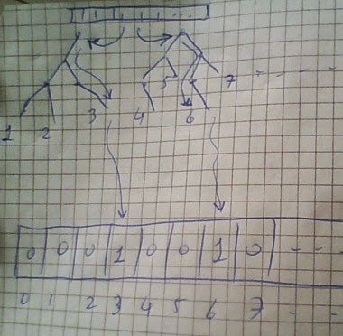

# Agaclar Ile Oge Kodlamasi (Categorical Embedding)

Ilginc bir fikir bir Facebook arastirma grubundan gelen makalede
paylasilmis.

Bu fikri alarak scikit-learn kutuphanesi programcilarindan biri onu
kodlamis

Amac ikisel siniflama (binary classification) yapmaktir. Bu alanda
bilindigi gibi SVM, lojistik regresyon gibi yontemler bulunur. Ustteki
fikir sudur: gradient boosted trees kullanarak egitim verisini normal
oldugu gibi GB agacina teker teker verirsiniz. Bilindigi gibi GB
icinde birden fazla agac vardir, ve her agac icin, her egitim veri
noktasi farkli dip noktalara gidebilir, cunku yukaridan baslayip her
karar noktasinda bir saga bir sola vs. gidersiniz ve o veri noktasi
icin belli (ve tek) bir noktaya varirsiniz. Her veri noktasi icin, GB
icindeki her agac, ayni veri noktasina bakar ve kendi icinde bir nihai
dip noktaya varir (cunku her agac farkli bir agactir).

Ustteki makalede bu ozellikten istifade etmek istemisler, ve GB'nin
tum agaclarinin tum dip noktalarini bir indis (sayi) ile
isaretlemisler, sonra icinde tamamen 0 olan (yani bos sayilabilir) bir
vektoru aliyorlar, ve her egitim noktasinin, her agacta dustugu dip
noktaya bakiyorlar, o noktanin indisini alip bos vektorde oraya 1
degeri yaziyorlar. Bunu tum agaclar icin yapiyorlar, ve nihai olarak
elimize gecen vektor o verinin GB agaclari uzerinden "kodlanmis" ve
hatta kisaltilmis / ozetlenmis halidir!

Hakikaten akillica bir fikir, cunku GB'nin dogal ozelligi olarak
icindeki her agac verinin potansiyel olarak farkli bir tarafina
odaklanir, yani her agac diger agaclara nazaran farkli bir sekilde
ogrenim yapar. Ve farklilik iyidir! Ustteki teknik bu dogal ozelligin
uzerinde bir nevi "sorf yapiyor" ve onu kullanarak bir temsili ikisel
vektor yaratiyor.

Yaziya gore bu temsili vektoru alip artik en basit yontemlerden olan
lojistik regresyon bile kullanabilirsiniz.

Altta scikit learn'cu arkadasin kodu (temizlenmis haliyle) var. FAKAT,
ilginc bir nokta sudur: biz ayni veriyi alip xgboost kutuphanesinin
pur GB koduna verince GB+kategorik kodlama yapan koddan daha iyi bir
sonuc aliyoruz! Bunun sebebi belki de xgboost'un scikit-learn icindeki
GB kodlamasindan daha iyi olmasidir. Ya da GB+kategorik kodlama ornegi
biraz ayarlama (tuning) ile daha iyi hale getirilebilir, belli
degil. Fakat xgboost felaket iyi sonuclar getirdi.

Bu kutuphaneyi ayrica tavsiye ediyoruz, cunku scikit-learn'un tum
birimleri hala seyrekligi (sparsity) desteklemiyorlar. Bu islem
hizinda muthis fark yaratiyor. Bazi acilardan scikit-learn hala
oyuncak seviyesinde denebilir, prototipleme icin iyi fikirleri gormek
icin iyi fakat nihai kod icin bazen baska paketler gerekiyor.

```
# Requiers sklearn 0.15.2 and xgboost
# Install from https://github.com/tqchen/xgboost
# data from from https://archive.ics.uci.edu/ml/machine-learning-databases//adult/adult.data

import pandas as pd, numpy as np
names = ("age, workclass, fnlwgt, education, education-num, "
"marital-status, occupation, relationship, race, sex, "
"capital-gain, capital-loss, hours-per-week, "
"native-country, income").split(', ')
data = pd.read_csv('./data/adult.data', names=names)

data_encoded = data.apply(lambda x: pd.factorize(x)[0])
print data_encoded.head(5)

features = data_encoded.drop('income', axis=1)
X = features.values.astype(np.float32)
y = (data['income'].values == ' >50K').astype(np.int32)
print np.mean(y)
from sklearn.cross_validation import train_test_split
X_train, X_test, y_train, y_test = train_test_split(X, y, test_size=0.2, random_state=0)
from sklearn.tree import DecisionTreeClassifier
from sklearn.cross_validation import cross_val_score
clf = DecisionTreeClassifier(max_depth=8)
scores = cross_val_score(clf, X_train, y_train, cv=5, scoring='roc_auc')
print("ROC AUC Decision Tree: {:.4f} +/-{:.4f}".format(np.mean(scores), np.std(scores)))

# 0.240802162029
# ROC AUC Decision Tree: 0.8821 +/-0.0013

from sklearn.metrics import roc_auc_score
from sklearn.ensemble import GradientBoostingClassifier
from sklearn.base import BaseEstimator, TransformerMixin, clone
from sklearn.preprocessing import LabelBinarizer
from sklearn.linear_model import LogisticRegression
from sklearn.pipeline import make_pipeline
from scipy.sparse import hstack

class TreeTransform(BaseEstimator, TransformerMixin):

    def __init__(self, estimator):
        self.estimator = estimator
        
    def fit(self, X, y):
        self.fit_transform(X, y)
        return self

    def fit_transform(self, X, y):
        self.estimator_ = clone(self.estimator)
        self.estimator_.fit(X, y)
        self.binarizers_ = []
        sparse_applications = []
        estimators = np.asarray(self.estimator_.estimators_).ravel()
        for t in estimators:
            lb = LabelBinarizer(sparse_output=True)
            sparse_applications.append(lb.fit_transform(t.tree_.apply(X)))
            self.binarizers_.append(lb)
        return hstack(sparse_applications)
        
    def transform(self, X, y=None):
        sparse_applications = []
        estimators = np.asarray(self.estimator_.estimators_).ravel()
        for t, lb in zip(estimators, self.binarizers_):
            sparse_applications.append(lb.transform(t.tree_.apply(X)))
        return hstack(sparse_applications)


boosted_trees = GradientBoostingClassifier(
    max_leaf_nodes=5, learning_rate=0.1,
    n_estimators=100, random_state=0,
) 

pipeline = make_pipeline(
    TreeTransform(boosted_trees),
    LogisticRegression(C=1)
)

pipeline.fit(X_train, y_train);
y_pred_proba = pipeline.predict_proba(X_test)[:, 1]
print("ROC AUC: %0.4f" % roc_auc_score(y_test, y_pred_proba))

#ROC AUC: 0.9131

import os, sys
from sklearn.metrics import roc_curve, auc
from sklearn.metrics import roc_auc_score
sys.path.append('%s/Downloads/xgboost/wrapper/' % os.environ['HOME'])
import xgboost as xgb

xg_train = xgb.DMatrix(X_train, label=y_train)
xg_test = xgb.DMatrix(X_test, label=y_test)
watchlist = [ (xg_train,'train'), (xg_test, 'test') ]

param = {}
param['max_depth'] = 6
num_round = 20

bst = xgb.train(param, xg_train, num_round, watchlist )
pred = bst.predict(xg_test)
err = sum(int(pred[i]) != y_test[i] for i in range(len(y_test))) / float(len(y_test))
print ('predicting, classification success=%f' % float(1-err))
fpr, tpr, thresholds = roc_curve(y_test, pred)
roc_auc = auc(fpr, tpr)
print 'Tree AUC', roc_auc

#predicting, classification success=0.773223
#Tree AUC 0.913709849754  
```




