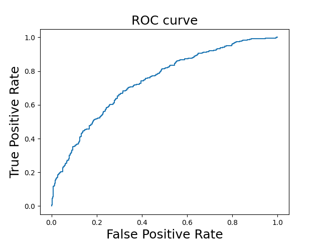
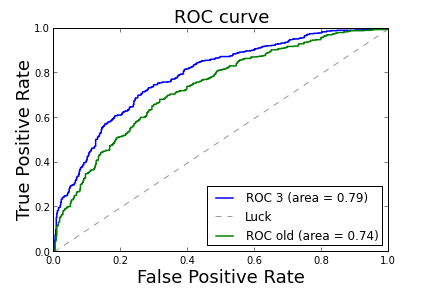

# Dünya Kupası 2014, Veri Analizi

Daha önceki maç verisine bakarak 2014 Dünya Kupası maçlarını tahmin
edebilen istatistik (yapay öğrenim) teknikleri Google mühendisleri
tarafından paylaşıldı, kullanılan teknik lojistik regresyon. Verinin
şekillendirilmesi, veriden özellik (feature) yaratmak işin püf
noktalarından - veri hangi detay seviyesinde (maç seviyesinde mi takım
seviyesinde mi) ve hangi kolonlar üzerinden modele dahil edilecek?
Görülüyor ki nihai regresyon her maç için iki takımı yanyana koyuyor
(A takımı öğeleri belli kolonlar B öğeleri belli kolonlar) ve 1,0
etiketini tahmine uğraşıyor. Öğelerin önemli bir özelliği o ana kadar
her iki takımın oynadığı önceki N maçın özeti olmaları. Yani A takımı
son 3 maçta (N=3) maçta dakikada 5 pas atmışsa passes öğesi 5
olacaktır, B takımı dakikada 10 atmışsa `op_passes` 10
olacaktır. Böylece lojistik regresyona 5'e karşı 10 pas ağırlığı olan
bir veri satırı hakkında irdeleme yapma imkanı veriyoruz; ve bilinen
etikete göre LR gerekli ağırlıkları hesaplayarak sonuca erişiyor.

Projede kullanılan 4 Python dosyası var: 

`match_stats`: Maç istatistiklerini yükleyen kodlar.

`features`: Ham istatistik verileri özelliklere (features) döndürüyor,
ki bu özellikler yapay öğrenim modeline girilebilsin. Bu özellikler önceki
K maçın verilerini özetleme amaçlı yaratıldılar, ki bu özelliklere
dayanarak bir sonraki maçı tahmnin edebilelim.

`world_cup`: Veriyi temizlemek ve modeli kurmak için kullanılan
yardımcı kodlar.

`power`: Birbiriyle belli sayıda maç yapmış takımların bir ``güç
sıralamasını'' hesaplamak.

Özellik inşası

Sonraki maç tahmini için önceki K maçın özet istatistiklerine bakıyoruz, K'nın
ne olduğu `history_size` ile tanımlı.

```python
import world_cup
import features
import match_stats
import pandas as pd

history_size = 3

game_summaries = features.get_game_summaries()
data = features.get_features(history_size)
```

Bu özellikler, dediğimiz gibi, önceki K maçın özeti. Bu özetlerin çoğu bir
ortalamadır, ayrıca bu ortalamaların çoğu dakika bazlı çünkü maç zamanını
aşan maçları da hesaba katmak için.. Eğer maç başına yapılan pas değeri
alınsaydı, o zaman vakti aşan bir maçta o değer normalden çok daha fazla
olacaktı, bu modeli bozardı.

Modelde kullanılacak özellikler:

`is_home`: Takım evinde mi, deplasmanda mı oynuyor. Futbolda bu
değişkenin çok önemli olduğunu biliyoruz.

`avg_points`: Önceki K maçta kazanılan ortalama puan (galibiyet için
3, eşitlik için 1, kayıp için 0). 

`avg_goals`: Önceki K maçta atılan averaj gol.

`op_average_goals`: Rakip tarafından son K maçta atılan averaj gol.

`pass_70/80`: Hücum sahasının 30%-20%'sinde dakika başına verilen
başarılı pas.

`op_pass70/80`: Hücum sahasının 30%-20%'sinde rakip tarafından
verilmiş dakika bazında başarılı paslar.

`expected_goals`: Son K maçtaki gol beklentisi, ki bu beklenti atılan
şut ve ve şutun kaleden uzaklığı baz alınarak hesaplanan bir sayı.

`passes`: Dakika başına atılan paslar.

`bad_passes`: Dakika bazında verilen ama başarılı olmayan paslar.

`pass_ratio`: Başarılı pasların oranı.

`corners`: Dakika bazında atılan kornerler.

`fouls`: Yapılan faul sayısı (dk bazlı)

`cards`: Kırmızı ya da sarı alınan kart ceza sayısı (maç başına).

`shots`: Dakika bazında atılan şut.

`op_*`: Rakipler hakkındaki bazı tarihi istatistikler. Dikkat, bu
``rakip'' `op_team_name` de gösterilen rakip değil, genel olarak bu
takımın rakiplerinin ona karşı nasıl oynadığını göstermeye çalışan bir
istatistik. Mesela `op_corners` bu takımın rakiplerinin dakika başına
kaç korner kazandığını gösteriyor.

`*_op_ratio`: Takimin istatistiklerinin rakiplerine olan orani [?]

Ozellik olmayan kolonlar

`matchid`: Maçın id'si

`teamid`: Takımın id'si

`op_teamid`: Rakip takımın özgün id'si

`team_name`: Takımın ismi

`op_team_name`: Rakip takımın ismi

`timestamp`: Maç ne zaman oynandı

`competitionid`: Genel müsabakayı gösteren kod (dünya kupası, vs).

Hedef kolonlar:

Alttaki kolonlar tahmin edilmeye uğraşılabilecek olan kolonlar. Eğer
bilinen veri üzerinde tahmin yapmak istiyorsak, bu kolonları tahmin öncesi
dışarı atmalıyız, bunu unutmayalım. Birkaç hedef kolon var ama, biz
sadece kazanılan puanı tahmin etmeye uğraşacağız, belki diğer modeller
diğer kolonları tahmin etmeye uğraşırlar, mesela atılan gol sayısı gibi.

`points`: Maçın puan sonucu.

`goals`: `teamid` deki takımın attığı gol sayısı.

`op_goals`: `op_teamid` ile gösterilen takımın attığı gol sayısı.

```python
club_data = data[data['competitionid'] <> 4]
# Show the features latest game in competition id 4, which is the world cup.
print data[data['competitionid'] == 4].iloc[0]
```

```
matchid                                  731828
teamid                                      366
op_teamid                                   632
competitionid                                 4
seasonid                                   2013
is_home                                       0
team_name                           Netherlands
op_team_name                          Argentina
timestamp            2014-07-09 21:00:00.000000
goals                                         0
op_goals                                      0
points                                        1
avg_points                              2.33333
avg_goals                               1.33333
op_avg_goals                           0.333333
pass_70                                0.472036
pass_80                                0.150698
op_pass_70                              0.26478
op_pass_80                             0.078501
expected_goals                          1.44437
op_expected_goals                      0.411425
passes                                  3.83486
bad_passes                              1.01362
pass_ratio                             0.765595
corners                               0.0709912
fouls                                  0.126237
cards                                         1
shots                                  0.155226
op_passes                               3.38986
op_bad_passes                           1.02455
op_corners                            0.0346796
op_fouls                               0.157066
op_cards                                2.66667
op_shots                              0.0924966
goals_op_ratio                          1.33333
shots_op_ratio                          1.70227
pass_op_ratio                           1.02543
Name: 0, dtype: object
```

Maç bazında atılan goller ve maçın sonucunu eksenlere alarak bir tablo
yaratalım (crosstab).

```python
import pandas as pd
print pd.crosstab(
    club_data['goals'], 
    club_data.replace(
        {'points': {
            0: 'lose', 1: 'tie', 3: 'win'}})['points'])
```

```
points  lose  tie  win
goals                 
0        768  279    0
1        508  416  334
2        134  218  531
3         23   42  325
4          2    6  158
5          0    2   67
6          0    0   13
7          0    0    6
8          0    0    1
```

5'den fazla gol atmak tabii ki kazanmayı garantiliyor, hiç atmamak
75\% ihtimalle kaybedilecek demektir (bazen de beraberlik olur
tabii!). Not: Fakat tabloda 4 gol sonrası kazanımlar direk artmıyor,
niye? Çünkü bu maçlar uzatma sonrası atılan penaltılardan geliyor, her
iki takımda bu sırada çok gol atıyor, ve biri mutlaka kaybediyor [1].

Modeli eğitmek

Veri tabanımızdaki klüp verisini kullanarak (yani hiç dünya kupası verisi
kullanmadan) eğiteceğiz. Bu kod  `world_cup.py` içinde. Sonuç bir
lojistik regresyon modeli olacak, ve sonra test verisi üzerinde tahmin
yapacağız. Regresyonun Rsquared değerini göstereceğiz, ki bu eğitim
verisi üzerinden gösterilebilir. Rsquared modelin veriye ne kadar uyduğunu
gösteren bir rakamdır, ne kadar yüksekse o kadar iyidir.

```python
import world_cup
reload(world_cup)
import match_stats
pd.set_option('display.width', 80)

# Don't train on games that ended in a draw, since they have less signal.
train = club_data.loc[club_data['points'] <> 1] 
# train = club_data

(model, test) = world_cup.train_model(
     train, match_stats.get_non_feature_columns())
print "Rsquared: %0.03g" % model.prsquared
```

```
Rsquared: 0.149
```

Önemli özellikleri seçmek

Lojistik regresyon modelimiz regülarizasyon kullanıyor; bu demektir ki daha
çetrefil modeller cezalandırılıyor. Bu cezalandırmanın yan etkisi olarak
biz hangi özelliklerin daha önemli olduğunu görebiliyoruz, çünkü daha
önemsiz olan özellikler modelden atılıyorlar (katsayıları sıfıra iniyor). 

Bu bağlamda özellikleri üçe ayırabiliriz:

Pozitif özellikler: Bu özellikler mevcut ise takımın kazanma şansı yükseliyor.

Negative özellikler: Tam tersi

Atılan değerler: Önemli olmayan özellikler, ki bu özellikler modele dahil
edilirse aşırı uygunluk (overfitting) durumu ortaya çıkar. 

```python
def print_params(model, limit=None):    
    params = model.params.copy()
    params.sort(ascending=False)
    del params['intercept']
    
    if not limit:
        limit = len(params)

    print("Pozitif ozellikler")
    params.sort(ascending=False)
    print np.exp(params[[param > 0.001 for param in params]]).sub(1)[:limit]

    print("\nAtilan ozellikler")
    print params[[param  == 0.0 for param in params]][:limit]

    print("\nNegatif ozellikler")
    params.sort(ascending=True)
    print np.exp(params[[param < -0.001 for param in params]]).sub(1)[:limit]

print_params(model, 10)
```

```
Pozitif ozellikler
is_home           0.848337
pass_70           0.254729
expected_goals    0.169235
opp_op_corners    0.159163
op_passes         0.120319
opp_op_pass_80    0.095970
avg_goals         0.092000
opp_bad_passes    0.075657
opp_cards         0.068903
fouls             0.062809
dtype: float64

Atilan ozellikler
op_pass_70            0
opp_op_cards          0
op_bad_passes         0
opp_op_bad_passes     0
opp_op_fouls          0
corners               0
pass_ratio            0
opp_corners           0
op_fouls              0
opp_goals_op_ratio    0
dtype: float64

Negatif ozellikler
opp_pass_70          -0.203015
opp_expected_goals   -0.144740
op_corners           -0.137309
opp_op_passes        -0.107397
op_pass_80           -0.087566
opp_avg_goals        -0.084249
bad_passes           -0.070335
cards                -0.064461
opp_fouls            -0.059097
opp_passes           -0.049240
dtype: float64
```

Klüp verisi üzerinde tahmin

`predicted`: Takımın kazanma şansı (tahmin).

`points`: Gerçekten ne oldu.

```python
reload(world_cup)
results = world_cup.predict_model(model, test, match_stats.get_non_feature_columns())

predictions = world_cup.extract_predictions(results.copy(), results['predicted'])

print 'Dogru tahminler:'
print predictions[(predictions['predicted'] > 50) & (predictions['points'] == 3)][:5]
```

```
Dogru tahminler:
             team_name         op_team_name  predicted            expected  \
8     Portland Timbers       Real Salt Lake  52.418756    Portland Timbers   
42      Rayo Vallecano           Granada CF  60.862465      Rayo Vallecano   
49  Atltico de Madrid               Getafe  64.383541  Atltico de Madrid   
57     Colorado Rapids  Vancouver Whitecaps  51.836366     Colorado Rapids   
58         Real Madrid        Real Sociedad  64.100904         Real Madrid   

                winner  points  
8     Portland Timbers       3  
42      Rayo Vallecano       3  
49  Atltico de Madrid       3  
57     Colorado Rapids       3  
58         Real Madrid       3  
```

```python
print 'Yanlis tahminler:'
print predictions[(predictions['predicted'] > 50) & (predictions['points'] < 3)][:5]
```

```
Yanlis tahminler:
                 team_name         op_team_name  predicted  \
1      Seattle Sounders FC  Vancouver Whitecaps  51.544963   
2   New England Revolution       Real Salt Lake  63.950714   
3       Philadelphia Union            FC Dallas  54.213693   
14  New England Revolution      Montreal Impact  52.762065   
20      New York Red Bulls           Toronto FC  55.533969   

                  expected               winner  points  
1      Seattle Sounders FC  Vancouver Whitecaps       0  
2   New England Revolution       Real Salt Lake       0  
3       Philadelphia Union            FC Dallas       0  
14  New England Revolution      Montreal Impact       0  
20      New York Red Bulls           Toronto FC       0  
```

Tahminlerimizi kontrol etmek

Kontrol için mesela hesabımızın rasgele tahminden ne kadar iyi olduğunu
hesaplayabiliriz (lift) ya da AUC hesabı yapıp ROC eğrisini hesaplarız. AUC
herhalde en iyisi, bu hesap çok ilginçtir, 0.5 (kafadan atmak) ve 1.0
arasındadır (mükemmel tahmin), ve bu hesap dengesiz veri setlerine karşı
dayanıklıdır. Mesela 0/1 etiketi tahmininde test setinde diyelim ki yüzde 90
oranında olsa ve modelimiz sürekli 1 tahmin etse, basit bir ölçüm bize
modelimizin yüzde 90 başarılı olduğunu söylerdi. AUC böyle durumlara karşı
dayanıklıdır, bize 0.5 sonucunu verir. 

```python
baseline = (sum([yval == 3 for yval in club_data['points']]) 
            * 1.0 / len(club_data))
y = [yval == 3 for yval in test['points']]
world_cup.validate(3, y, results['predicted'], baseline, 
                   compute_auc=True)
plt.savefig('stat_worldcup_01.png')
```

```
(3) Lift: 1.42 Auc: 0.738
```



Modelde eksik olan bir şey var; sonraki maçı önceki birkaç maçın özetinden
tahmin etmeye uğraşıyoruz ama belki bazı takımlar önceki K maçta çok zorlu
rakiplerle uğraşmıştır, bazıları çok kolay rakiplerle uğraşmıştır. Bu
durumda önceki maçların istatistiği bize tüm hikayeyi anlatmayacaktır. 

Bu problemi çözmek için ayrı bir regresyon daha işletebiliriz. Bu regresyon
bir güç sıralaması (power ranking) hesaplayabilir, bu hesap
FIFA/CocaCola'nın enternasyonel takımlar için yaptığı 
güç sıralama hesabına benzer. ABD'de beyzbol ve Amerikan futbolu için de
benzer bir hesap yapılıyor. 

Güç sıralaması hesabını yaptıktan sonra -tek bir sayı, bazı takımlar için daha
yüksek bazı takımlar için daha alçak, ki onun üzerinden sıralama yapılabilsin-
onu bir özellik olarak lojistik regresyon modeline dahil edebiliriz. Güç
sıralaması esas olarak şu tür irdelemelerin modelimize dahilini mümkün kılar; A
takımı B'yi yendiyse, B C'yi yendiyse, A büyük ihtimalle C'yi yener. Bu tür
bilgi niye önemli?  Çünkü elimizde yapılabilecek tüm maçların kombinasyonu yok,
maç verisi seyrek (sparse). Ama eldeki birkaç maçtan bir güç sıralaması
hesaplayabilirsek, bu bize takımlar arasında, daha önce maç oynamamış olsalar
bile, otomatik olarak bir ek irdeleme yapabilmemizi sağlayacaktır.

Sıralama hesabı yapıldıktan sonra bazı kontrolleri hızla, çıplak gözle
yapabiliriz, mesela sonuca bakarız, eğer Wiggan (zayıf bir takım) 1.0
değeri almış, Chelsea (güçlü bir takım) 0.0 değeri almış ise bir şeyler
yanlış demektir.

Tabii buna rağmen bazı takımlara hala uygun sıralama veremeyebiliriz,
mesela A,B'yi, B,C'yi yeniyor, sonra veriye göre, C A'yı yeniyor. Bu
şekilde sıralayamadığımız durumda takıma 0.5 verip tam ortaya koyacağız.

Ayrıca enternasyonel takımların sıralaması çok gürültülü veri olduğu ve
(klüp verisinden bile daha) seyrek olduğu için onu yüzdeliklere (quartiles)
ayırarak göstereceğiz, yani sıralamalar 0, .33, .66, or 1.0 olarak
gözükecekler.

Fakat hesap işi bitince, ve bu sıralamayı nihai lojistik modele dahil
edince başarı oranımızın zıplama yaptığını göreceğiz.

```python
import power
reload(power)
reload(world_cup)
def points_to_sgn(p):
  if p > 0.1: return 1.0
  elif p < -0.1: return -1.0
  else: return 0.0
power_cols = [
  ('points', points_to_sgn, 'points'),
]

power_data = power.add_power(club_data, game_summaries, power_cols)
power_train = power_data.loc[power_data['points'] <> 1] 

# power_train = power_data
(power_model, power_test) = world_cup.train_model(
    power_train, match_stats.get_non_feature_columns())
print "\nRsquared: %0.03g, Power Coef %0.03g" % (
    power_model.prsquared, 
    math.exp(power_model.params['power_points']))

power_results = world_cup.predict_model(power_model, power_test, 
    match_stats.get_non_feature_columns())
power_y = [yval == 3 for yval in power_test['points']]
world_cup.validate(3, power_y, power_results['predicted'], baseline, 
                   compute_auc=True, quiet=False)

print_params(power_model, 8)

plt.plot([0, 1], [0, 1], '--', color=(0.6, 0.6, 0.6), label='Luck')
# Add the old model to the graph
world_cup.validate('old', y, results['predicted'], baseline, 
                   compute_auc=True, quiet=True)
plt.legend(loc="lower right")
plt.savefig('world_cup_02.png')
```

```
New season 2014
New season 2013
New season 2013
New season 2012
New season 2012
New season 2011

['Blackburn Rovers: 0.000', 'Real Betis: 0.000', 'D.C. United: 0.000',
'Celta de Vigo: 0.004', 'Deportivo de La Coru\xc3\xb1a: 0.009',
'Wolverhampton Wanderers: 0.021', 'Reading: 0.022', 'Real Zaragoza: 0.026',
'Real Valladolid: 0.044', 'Granada CF: 0.062', 'Queens Park Rangers:
0.073', 'Mallorca: 0.089', 'Aston Villa: 0.092', 'Bolton Wanderers: 0.102',
'Osasuna: 0.109', 'Espanyol: 0.112', 'Wigan Athletic: 0.124', 'Sunderland:
0.130', 'Rayo Vallecano: 0.138', 'Almer\xc3\xada: 0.145', 'Levante: 0.148',
'Elche: 0.154', 'Getafe: 0.170', 'Swansea City: 0.192', 'Southampton:
0.197', 'Norwich City: 0.206', 'Toronto FC: 0.211', 'Chivas USA: 0.218',
'West Ham United: 0.220', 'West Bromwich Albion: 0.224', 'Villarreal:
0.231', 'Stoke City: 0.255', 'Fulham: 0.274', 'Valencia: 0.296', 'Valencia
CF: 0.296', 'M\xc3\xa1laga: 0.305', 'Newcastle United: 0.342', 'Sevilla:
0.365', 'Columbus Crew: 0.366', 'Athletic Club: 0.386', 'Liverpool: 0.397',
'Everton: 0.417', 'Philadelphia Union: 0.466', 'Montreal Impact: 0.470',
'Chelsea: 0.530', 'Real Sociedad: 0.535', 'Tottenham Hotspur: 0.551',
'Arsenal: 0.592', 'Houston Dynamo: 0.593', 'FC Dallas: 0.612', 'Chicago
Fire: 0.612', 'Vancouver Whitecaps: 0.615', 'San Jose Earthquakes: 0.632',
'New England Revolution: 0.634', 'Atl\xc3\xa9tico de Madrid: 0.672',
'Colorado Rapids: 0.743', 'Barcelona: 0.759', 'Seattle Sounders FC: 0.781',
'New York Red Bulls: 0.814', 'Sporting Kansas City: 0.854', 'LA Galaxy:
0.882', 'Real Salt Lake: 0.922', 'Manchester City: 0.928', 'Real Madrid:
1.000', 'Manchester United: 1.000', 'Portland Timbers: 1.000'] 

Rsquared: 0.22, Power Coef 2.18
(3) Lift: 1.56 Auc: 0.791
    Base: 0.374 Acc: 0.708 P(1|t): 0.778 P(0|f): 0.667
    Fp/Fn/Tp/Tn p/n/c: 99/248/347/496 595/595/1190
Pozitif ozellikler
power_points      1.177169
is_home           0.787110
opp_op_corners    0.170848
expected_goals    0.058597
opp_cards         0.045538
pass_70           0.036267
avg_goals         0.035456
opp_avg_points    0.033857
dtype: float64

Atilan ozellikler
passes                0
op_pass_80            0
op_expected_goals     0
opp_shots_op_ratio    0
bad_passes            0
pass_ratio            0
opp_pass_op_ratio     0
shots                 0
dtype: float64

Negatif ozellikler
opp_power_points     -0.540688
op_corners           -0.145918
opp_expected_goals   -0.055353
cards                -0.043555
opp_pass_70          -0.034997
opp_avg_goals        -0.034242
avg_points           -0.032748
opp_fouls            -0.022867
dtype: float64
(old) Lift: 1.42 Auc: 0.738
```



Şimdi dünya kupasını tahmin edelim!

Aynen klüp verisinde yaptığımız gibi dünya kupası için de benzer
istatistikleri hesaplayabiliriz. Bu durumda elimizde hedefler olmayacak,
yani kimin kazandığını bilemeyeceğiz (aslında bazı dünya kupası maçlarının
sonucunu biliyoruz, ama tahminlerimizi hiçbir maçı bilmiyormuş gibi
yapalım). Ve tekrar vurgulayalım: klüp verisiyle eğittiğimiz modeli
kullanarak dünya kupasını tahmin edeceğiz. Yani model ve tahmin tamamen
farklı takımlar üzerinden yapılacak!

`features.get_wc_features()` bize tüm dünya kupası maçları için
gereken özellikleri yaratıp döndürecektir.

```python
import world_cup
import features
reload(match_stats)
reload(features)
reload(world_cup)
wc_data = world_cup.prepare_data(features.get_wc_features(history_size))
wc_labeled = world_cup.prepare_data(features.get_features(history_size))
wc_labeled = wc_labeled[wc_labeled['competitionid'] == 4]
wc_power_train = game_summaries[game_summaries['competitionid'] == 4].copy()
```

Ev sahası avantajı

Klüp verisi ile dünya kupası verisi arasındaki bazı farklardan biri budur:
dünya kupasında bir maçta ev sahibi olmak ya da deplasmanda olmak ne
demektir?  Resmi olarak tek ev sahibi tüm 2014 kupasına ev sahipliği yapan
Brezilya'dır, o zaman sadece Brezilya mı oynadığı maçlarda ev sahibi
olabilir? Bu pek akla yatkın gelmiyor.

Belki diğer Latin Amerika takımlarını da ev sahibi olarak
görebiliriz.. Adam aynı kıtadan, belki o kıtaya alışık, iklimi vs ona
normal geliyor.. ? Olabilir mi? Diğer bazı modeller `is_home` u sadece
Brezilya'ya vermiş, sonra aynı kitadaki diğer takımlara da 'azıcık' ev
sahipliği vermişler, çünkü istatistiklere göre bu takımlar kendi
kıtalarında daha iyi performans gösteriyorlarmış, vs.

Biz daha değişik bir model kullanacağız, bu model belki biraz
sübjektif.. Biz `is_home` öğesine 0.0 ila 1.0 arasında bir değer
atayacağız, ve bu değerin büyüklüğü o takımın taraftarlarının hem sayı, hem
de destek enerjisi üzerinden ölçülecek. Bunu yapmamızın sebebi ilk turlarda
görüldüğü üzere, taraftarının daha iyi desteklediği takımların diğerlerine
göre daha iyi performans göstermesi. Mesela Şili'nin taraftarı takımını
müthiş destekledi, İspanya taraftarı oralı bile olmadı, Şili-İspanya maçını
Şili 2-0 kazandı. Bunun gibi pek çok maç gözlemledik, çoğunda güney Amerika
takımları vardı, ama çok taraftar gönderen takımlar da vardı, mesela
Meksika. Ya da ABD vardı, çok taraftarı vardı ama sessizdiler, onlar daha
düşük skorlar aldılar.

```
import pandas as pd
wc_home = pd.read_csv('wc_home.csv')

def add_home_override(df, home_map):
  for ii in xrange(len(df)):
    team = df.iloc[ii]['teamid']
    if team in home_map:
        df['is_home'].iloc[ii] = home_map[team]
    else:
        # If we don't know, assume not at home.
        df['is_home'].iloc[ii] = 0.0
        
home_override = {}
for ii in xrange(len(wc_home)):
    row = wc_home.iloc[ii]
    home_override[row['teamid']] = row['is_home']

# Add home team overrides.
add_home_override(wc_data, home_override)    
```

Dünya Kupası Güç Sıralaması

Bu hesabın dünya kupası verisi üzerinde yapılması lazım, çünkü güç
sıralaması o takımların arasındaki maçlara dayanılarak yapılan bir
hesap. Bu maçlar ise, dünya kupası takımları bağlamında, oldukça seyrek
çünkü bazı takımlar bazı takımlarla neredeyse onyıldır oynamamış. Çoğu
Avrupa takımı mesela güney Amerika takımıyla oynamamış, Asyalı takımlarla
daha bile az oynamış. Klüp bazında kullandığımız aynı numarayı burada da
kullanabiliriz, ama başarısızlığa hazır olmak lazım! 

Hesap altta

```python
# Guc verisiyle egitirken, kupa birden fazla maca yayildigi icin 
# is_home'u 0.5'e set et. Yoksa 2010'daki kupa maclarina baktigimizda
# Guney Afrika yerine Brezilya'nin hala ev sahibi olduugnu zannedebilirdik.

wc_power_train['is_home'] = 0.5
wc_power_data = power.add_power(wc_data, wc_power_train, power_cols)

wc_results = world_cup.predict_model(power_model, wc_power_data, 
    match_stats.get_non_feature_columns())
```

```python
New season 2013
New season 2009
New season 6
['Australia: 0.000', 'Serbia: 0.016', 'USA: 0.017', 'Cameroon: 0.035',
'Iran: 0.081', 'Croatia: 0.180', 'Nigeria: 0.204', "C\xc3\xb4te d'Ivoire:
0.244", 'Costa Rica: 0.254', 'Algeria: 0.267', 'Paraguay: 0.277',
'Honduras: 0.279', 'Slovakia: 0.281', 'Greece: 0.284', 'Switzerland:
0.291', 'Ecuador: 0.342', 'Uruguay: 0.367', 'Sweden: 0.386', 'Japan:
0.406', 'Mexico: 0.409', 'Chile: 0.413', 'Colombia: 0.438', 'England:
0.460', 'Belgium: 0.467', 'Ukraine: 0.470', 'Portugal: 0.487', 'Ghana:
0.519', 'South Korea: 0.532', 'France: 0.648', 'Spain: 0.736', 'Argentina:
0.793', 'Italy: 0.798', 'Brazil: 0.898', 'Netherlands: 0.918', 'Germany:
1.000'] 
```

Güç sırası da ayrı bir lojistik regresyon aslında, `power.py` içinde
biz bu regresyona giren matris ve etiketleri hesap yapılmadan önce çekip
çıkarttık, ve bir dosyaya kaydettirdik. Bakarsak,

```python
games = pd.read_csv('/tmp/games.csv')
outcomes = pd.read_csv('/tmp/outcomes.csv')
```

Herhangi bir satıra göz atalım,

```python
print 'mac', games[100:101]
print 'sonuc', outcomes[100:101]
```

```
mac      1041  1042  114  1161  118  119  1215  1216  1219  1221  1223  1224  \
100     0     0    0     0    0    0     0     0     0     0     0     0   

     1264  1266  1794  1801  1804  357  359  360  361  364  365  366  367  \
100     0     0     0     0     0    0    0    0    0    0    0    0    0   

     368     369     494  497  507  510  511  517  522  535  536  537  575  \
100    0 -1.5625  1.5625    0    0    0    0    0    0    0    0    0    0   

     596  614  632  659  830  831  832  835  837  838  847  
100    0    0    0    0    0    0    0    0    0    0    0  
sonuc      0.0
100    0
```

Yani güç sıralaması lojistik regresyonuna girdi olan matrisin her satırı
ayrı bir maç, her kolonu ise ayrı bir takım. Maç yapan iki takımın
değerleri olacak, diğerleri sıfır olacak. Üstteki satır mesela, 369. takım
ve rakipte 494. takım için,

```python
raw_games = pd.read_csv('results-20140714-124014.csv')
tmp = raw_games[(raw_games['teamid'] == 369) & (raw_games['op_teamid'] == 494)]
tmp = tmp[['teamid','team_name','op_team_name','is_home','points']]
print tmp
```

```
      teamid team_name op_team_name  is_home  points
4231     369   Denmark     Cameroon        0       3
```

Danimarka Kamerun maçına aitmiş. Bu maçta Danimarka kazandı, ev sahibi
Kamerun. Şimdi burada birkaç önemli takla atılıyor, Google veri bilimcileri
lojistik regresyonda, girdi olarak, deplasman takımına her maç başında
otomatik olarak eksi bir değer veriyorlar, ev sahibine artı değer
veriyorlar. Etiket ise 'ev sahibi kazandı mı?' sorusunun cevabı.

Ev sahibi olup kazanmak daha kolay, regresyon bağlamında artı değere sahip
olursanız, az bir katsayı modeli uydurmaya yeterli olabilir, pozitife hemen
yaklaşırız. Diğer yandan deplasman takımı ne kadar iyi oynarsa, onun büyüyen
katsayısı eksi değerini o kadar arttırır, ve ev sahibinin artışını (onun
öğesi çarpı katsayısı yani) eksilterek kaybetme durumuna yaklaştırır.

Kötü oynayan deplasman takımının eksi değeri eksi katsayı ile çarpılır, ve daha
büyük bir artı sayıyı oluşturur, ev sahibinin kazanması durumunu güçlendirir.

Katsayıları doğal olarak bir takımın ne kadar iyi olduğunu gösterecektir. 

Tabii regresyona pek çok satır verilecek, Kamerun birden fazla satırda
ortaya çıkabilecek (ama hep aynı kolonda, işin püf noktası burada), bazen
artı değerli olarak (ev sahibi) bazen eksi değerli olarak (deplasman).

İtiraf etmek gerekir ki veri bilimi bağlamında üstteki teknik, model,
düşünce tarzı dahiyane bir yaklaşım, alanın ruhunu göstermesi bakımından
eğitici. Veri temsilinden tutun, regresyonun kodlanmasında çeyrekliklere
ayırmak, az veri olduğu için yaklaşıksallık (convergence) olmayabilir diye
değişik parametrelerle regresyonu birkaç kez işletmek, bunu yaklaşıksallık
olana kadar yapmak, tam anlamıyla bir ders niteliği taşıyor.

Tahmin

Nihayet hazırlandığımız ana geldik. Şimdi dünya kupası maçlarını tahmin
edelim. Birkaç kolon göstereceğiz:

`predicted`: Yüzde kaç ihtimalle (ismi ilk gelen) takımın kazanacağı

`points`: Gerçekten ne olduğu. Oynanmayan maç `NaN`. Dikkat,
penaltı atışlarına giden maçlar eşitlik olarak gösterilecek.

Ama bir dakika! Bu sonuçlar daha önce gösterdiğiniz [Google tahminleri
kastediliyor] tahminlerinden değişik! Bunun sebepleri şunlar: Bazı hataları
tamir ettik, yani kod değişti. İlk model mesela uzayan maçlar yüzünden
kabaran istatistiklerin durumunu hesaba almıyordu.

İkinci sebep, model baştan planlı (deterministik) değil, eğitim verisi için
verinin belli bir kısmını rasgele olarak seçiyoruz, bu sebeple sonuçlar bir
hesaptan diğerine değişik çıkabiliyor (ki bazen sonuçlar çok değişik
olabiliyor). Not: Aslında bu kod değiştirilerek rasgelelik içinden tamamen
çıkartılabilir (ev ödeviniz!).

16'ıncı turu tahmin ederken mesela önceki 3 maçı, çeyrek finaller için
önceki 4, yarıfınaller için 5, ve finaller için önceki 6 maçı
kullandık [biz bu dokümanda önceki 3 maçı kullandık, `history_size`
parametresiyle oynayarak değişik sonuçlar kontrol edilebilir].

```python
pd.set_option('display.max_rows', 5000)
pd.set_option('display.max_columns', 500)
pd.set_option('display.width', 1000)

wc_with_points = wc_power_data.copy()
wc_with_points.index = pd.Index(
    zip(wc_with_points['matchid'], wc_with_points['teamid']))
wc_labeled.index = pd.Index(
    zip(wc_labeled['matchid'], wc_labeled['teamid']))
wc_with_points['points'] = wc_labeled['points']

wc_pred = world_cup.extract_predictions(wc_with_points, 
                                        wc_results['predicted'])

# Reverse our predictions to show the most recent first.
wc_pred.reindex(index=wc_pred.index[::-1])
# Show our predictions for the games that have already happenned.
print wc_pred
```

```
        team_name   op_team_name  predicted       expected         winner  points
0       Argentina        Germany  46.070814        Germany             NA     NaN
1     Netherlands         Brazil  42.833863         Brazil             NA     NaN
2     Netherlands      Argentina  48.641542      Argentina           draw       1
3         Germany         Brazil  44.011593         Brazil        Germany       3
4      Costa Rica    Netherlands  14.442625    Netherlands           draw       1
5         Belgium      Argentina  18.596031      Argentina      Argentina       0
6        Colombia         Brazil  23.890421         Brazil         Brazil       0
7         Germany         France  75.116349        Germany        Germany       3
8             USA        Belgium  32.400646        Belgium        Belgium       0
9     Switzerland      Argentina  19.272768      Argentina      Argentina       0
10        Algeria        Germany   5.926496        Germany        Germany       0
11        Nigeria         France   8.694729         France         France       0
12         Greece     Costa Rica  40.448104     Costa Rica           draw       1
13         Mexico    Netherlands  20.402491    Netherlands    Netherlands       0
14        Uruguay       Colombia  46.480264       Colombia       Colombia       0
15          Chile         Brazil  26.574916         Brazil           draw       1
16        Germany            USA  91.980986        Germany        Germany       3
17          Ghana       Portugal  49.051707       Portugal       Portugal       0
18    Switzerland       Honduras  60.223070    Switzerland    Switzerland       3
19         France        Ecuador  84.538857         France           draw       1
20      Argentina        Nigeria  88.491450      Argentina      Argentina       3
21  Côte d'Ivoire         Greece  61.074502  Côte d'Ivoire         Greece       0
22        Uruguay          Italy  32.685428          Italy        Uruguay       3
23        England     Costa Rica  63.457326        England           draw       1
24         Brazil       Cameroon  94.788074         Brazil         Brazil       3
25         Mexico        Croatia  78.020214         Mexico         Mexico       3
26          Spain      Australia  90.521542          Spain          Spain       3
27          Chile    Netherlands  28.342133    Netherlands    Netherlands       0
28       Portugal            USA  65.457259       Portugal           draw       1
29        Algeria    South Korea  17.376285    South Korea        Algeria       3
30          Ghana        Germany  14.588539        Germany           draw       1
31           Iran      Argentina   5.193843      Argentina      Argentina       0
32        Ecuador       Honduras  53.848926        Ecuador        Ecuador       3
33         France    Switzerland  78.659381         France         France       3
34     Costa Rica          Italy  24.836756          Italy     Costa Rica       3
35         Greece          Japan  44.355013          Japan           draw       1
36        England        Uruguay  61.012694        England        Uruguay       0
37        Croatia       Cameroon  40.212875       Cameroon        Croatia       3
38          Chile          Spain  42.624474          Spain          Chile       3
39    Netherlands      Australia  93.535889    Netherlands    Netherlands       3
40         Mexico         Brazil  20.372064         Brazil           draw       1
41            USA          Ghana  39.500993          Ghana            USA       3
42        Nigeria           Iran  53.813244        Nigeria           draw       1
43       Portugal        Germany  15.337884        Germany        Germany       0
44       Honduras         France  22.953848         France         France       0
45        Ecuador    Switzerland  59.987076        Ecuador    Switzerland       0
46          Japan  Côte d'Ivoire  51.528885          Japan  Côte d'Ivoire       0
47          Italy        England  68.767968          Italy          Italy       3
48     Costa Rica        Uruguay  45.347946        Uruguay     Costa Rica       3
49      Australia          Chile  19.487987          Chile          Chile       0
50    Netherlands          Spain  60.493928    Netherlands    Netherlands       3
51       Cameroon         Mexico  30.018950         Mexico         Mexico       0
52        Croatia         Brazil   6.268704         Brazil         Brazil       0
53          Spain    Netherlands  35.602227    Netherlands          Spain       3
54        Germany        Uruguay  76.467450        Germany        Germany       3
55          Spain        Germany  29.438134        Germany          Spain       3
56    Netherlands        Uruguay  71.342186    Netherlands    Netherlands       3
57          Spain       Paraguay  83.007655          Spain          Spain       3
58        Germany      Argentina  42.635127      Argentina        Germany       3
59          Ghana        Uruguay  41.784682        Uruguay           draw       1
60         Brazil    Netherlands  60.821972         Brazil    Netherlands       0
61       Portugal          Spain  23.464891          Spain          Spain       0
62          Japan       Paraguay  61.278000          Japan           draw       1
63          Chile         Brazil  24.459600         Brazil         Brazil       0
64       Slovakia    Netherlands  12.082967    Netherlands    Netherlands       0
65         Mexico      Argentina  17.626748      Argentina      Argentina       0
66        England        Germany  20.763176        Germany        Germany       0
67          Ghana            USA  71.310871          Ghana          Ghana       3
68    South Korea        Uruguay  45.148588        Uruguay        Uruguay       0
69         Brazil       Portugal  81.610878         Brazil           draw       1
70        Germany          Ghana  81.621494        Germany        Germany       3
71         Serbia      Australia  38.204905      Australia      Australia       0
72  Côte d'Ivoire         Brazil  10.186423         Brazil         Brazil       0
73      Australia          Ghana  23.702414          Ghana           draw       1
74          Japan    Netherlands  10.773998    Netherlands    Netherlands       0
75         Serbia        Germany   4.731113        Germany         Serbia       3
76         Mexico         France  42.801515         France         Mexico       3
77    South Korea      Argentina  15.255040      Argentina      Argentina       0
78    Switzerland          Spain  18.747704          Spain    Switzerland       3
79       Portugal  Côte d'Ivoire  65.031075       Portugal           draw       1
80       Paraguay          Italy  12.288896          Italy           draw       1
81      Australia        Germany   7.395354        Germany        Germany       0
82          Ghana         Serbia  83.682899          Ghana          Ghana       3
83            USA        England  34.763699        England           draw       1
84         France          Italy  28.651132          Italy           draw       1
85       Portugal        Germany  14.833907        Germany        Germany       0
86         France       Portugal  72.141913         France         France       3
87          Italy        Germany  33.364112        Germany          Italy       3
88         France         Brazil  22.742882         Brazil         France       3
89       Portugal        England  49.550454        England           draw       1
90        Ukraine          Italy  28.378865          Italy          Italy       0
91      Argentina        Germany  46.801014        Germany           draw       1
92         France          Spain  47.126654          Spain         France       3
93          Ghana         Brazil   9.144470         Brazil         Brazil       0
94        Ukraine    Switzerland  62.637340        Ukraine           draw       1
95      Australia          Italy   8.365416          Italy          Italy       0
96    Netherlands       Portugal  70.231295    Netherlands       Portugal       0
97        Ecuador        England  34.379086        England        England       0
98         Mexico      Argentina  29.233199      Argentina      Argentina       0
99         Sweden        Germany  10.914079        Germany        Germany       0
```

### Kodlar

### world_cup.py

```python
"""
    Futbol maclarinin sonucunu lojistik regresyon kullanarak tahmin eder.
"""

import random
import math

import numpy as np
random.seed(987654321)
np.random.seed(987654321)
import pandas as pd
import pylab as pl
from sklearn.metrics import roc_auc_score
from sklearn.metrics import roc_curve
import statsmodels.api as sm


def _drop_unbalanced_matches(data):
    """
    Mac sirasinda her iki takim hakkinda elimide veri olmadigi icin,
    tarihi veride bir macta oynayan iki takimin ikisininde hakkinda veri
    yoksa o iki takimi egitim verisinden at. Bu durum eger bir takim hakkinda
    10 mactan daha az veri var ise ortaya cikabilir.
    """
    keep = []
    index = 0
    data = data.dropna()
    while index < len(data) - 1:
        skipped = False
        for col in data:
            if isinstance(col, float) and math.isnan(col):
                keep.append(False)
                index += 1
                skipped = True
             
        if skipped:
            pass
        elif data.iloc[index]['matchid'] == data.iloc[index+1]['matchid']:
            keep.append(True)
            keep.append(True)
            index += 2
        else:
            keep.append(False)
            index += 1
    while len(keep) < len(data):
        keep.append(False)
    results = data[keep]
    if len(results) % 2 != 0:
        raise Exception('Unexpected results')
    return results


def _swap_pairwise(col):
    """ 0 ile 1, 2 ile 2, vs.. seklinda satir degis tokusu yap """
    col = pd.np.array(col)
    for index in xrange(0, len(col), 2):
        val = col[index]
        col[index] = col[index + 1]
        col[index+1] = val
    return col


def _splice(data):
    """ Bir maci temsil eden iki satiri tek bir satir olacak sekilde birlestir """
    data = data.copy()
    opp = data.copy()
    opp_cols = ['opp_%s' % (col,) for col in opp.columns]
    opp.columns = opp_cols
    opp = opp.apply(_swap_pairwise)
    del opp['opp_is_home']
    
    return data.join(opp)


def split(data, test_proportion=0.4):
    """
    Bir dataframe'i egitim set'i ve test set'i olarak ikiyi ayirir.
    Dikkatli olmak lazim cunku dataframe icinde bir macin satirlari ardi
    ardina gelmeli, bu sebeple bir macin tum verileri ya tamamen
    egitim ya da tamamen test set'inde olmali.
    """
    
    train_vec = []
    if len(data) % 2 != 0:
        raise Exception('Unexpected data length')
    while len(train_vec) < len(data):
        rnd = random.random()
        train_vec.append(rnd > test_proportion) 
        train_vec.append(rnd > test_proportion)
            
    test_vec = [not val for val in train_vec]
    train = data[train_vec]
    test = data[test_vec]
    if len(train) % 2 != 0:
        raise Exception('Unexpected train length')
    if len(test) % 2 != 0:
        raise Exception('Unexpected test length')
    return (train, test)


def _extract_target(data, target_col):
    """
    Egitimde hedef olarak kullanilan kolonu dataframe'den cikart.
    Geriye verilen dataframe eksi o kolonu dondur.
    """
    target = data[target_col]
    train_df = data.copy()
    del train_df[target_col]
    return target, train_df


def _check_eq(value): 
    """
    Geriye oyle bir fonksiyon dondur ki gecilen tamsayi degerine (value) uyup
    uymadigini kontrol etsin. Dikkat, geriye gecilen degeri kontrol eden
    _fonksiyon_ donduruyoruz, o degeri burada kontrol etmiyoruz.
    """
    return lambda (x): int(x) == int(value)


L1_ALPHA = 16.0
def build_model_logistic(target, data, acc=0.00000001, alpha=L1_ALPHA):
    """
    Bir lojistik regresyon modelini egitir. target parametresi
    hedef, yani etiket. target vektorunun satir sayisi data icindeki
    egitim verisinin satir sayisi kadar olmali.
    """
    data = data.copy()
    data['intercept'] = 1.0
    target = np.array(target)
    if np.any(target==-1): target[target==-1] = 0
    logit = sm.Logit(target, data, disp=False)
    return logit.fit_regularized(maxiter=1024, alpha=alpha, acc=acc, disp=False)


def validate(label, target, predictions, baseline=0.5, compute_auc=False,
             quiet=True):
    """
    Ikisel tahminleri kontrol et, karisiklik matrisi (confusion matrix) ve
    AUC hesaplar.

    Verili bir tahmin vektoru ve gercek degerlere bakarak tahminde ne kadar
    basarili oldugumuzu hesaplar.

    Argumanlar:

    label: kontrol ettigimiz seyin etiketi
    target: gercek degerlerin vektoru
    predictions: tahmin edilen degerleri - bu bir olasilik vektoru
       olabilir, ki bu durumda onu siralayip (sort) en emin olunan
       degerleri aliriz, emin olmak bir esik degerine gore hesaplanir.
       Tabii tahmin 1 ya da 0 ise direk dogru ya da yanlis sonucuna
       varabiliriz.
    compute_auc: Eger dogru ise tahminler icin bir AUC hesaplar.
       Bu arguman dogru ise tahminlerin de bir olasilik vektoru
       olmasi gerekir. 
    """

    if len(target) != len(predictions):
        raise Exception('Length mismatch %d vs %d' % (len(target), 
                                                      len(predictions)))
    if baseline > 1.0:
        # Baseline number is expected count, not proportion. Get the proportion.
        baseline = baseline * 1.0 / len(target)

    zipped = sorted(zip(target, predictions), key=lambda tup: -tup[1])
    expect = len(target) * baseline
    
    (true_pos, true_neg, false_pos, false_neg) = (0, 0, 0, 0)
    for index in xrange(len(target)):
        (yval, prob) = zipped[index]
        if float(prob) == 0.0:
            predicted = False
        elif float(prob) == 1.0:
            predicted = True
        else:
            predicted = index < expect
        if predicted:
            if yval:
                true_pos += 1
            else:
                false_pos += 1 
        else:
            if yval:
                false_neg += 1
            else:
                true_neg += 1
    pos = true_pos + false_neg
    neg = true_neg + false_pos
    # P(1 | predicted(1)) and P(0 | predicted(f))
    pred_t = true_pos + false_pos
    pred_f = true_neg + false_neg
    prob1_t = true_pos * 1.0 / pred_t if pred_t > 0.0 else -1.0
    prob0_f = true_neg * 1.0 / pred_f if pred_f > 0.0 else -1.0
              
    # Lift = P(1 | t) / P(1)
    prob_1 = pos * 1.0 / (pos + neg)
    lift = prob1_t / prob_1 if prob_1 > 0 else 0.0
              
    accuracy = (true_pos + true_neg) * 1.0 / len(target)
              
    if compute_auc:
        y_bool =  [True if yval else False for (yval, _) in zipped]
        x_vec = [xval for (_, xval) in zipped]
        auc_value = roc_auc_score(y_bool, x_vec)
        fpr, tpr, _ = roc_curve(y_bool, x_vec)
        pl.plot(fpr, tpr, lw=1.5,
            label='ROC %s (area = %0.2f)' % (label, auc_value))
        pl.xlabel('False Positive Rate', fontsize=18)
        pl.ylabel('True Positive Rate', fontsize=18)
        pl.title('ROC curve', fontsize=18)
        auc_value = '%0.03g' % auc_value
    else:
        auc_value = 'NA'

    print '(%s) Lift: %0.03g Auc: %s' % (label, lift, auc_value)
    if not quiet:
        print '    Base: %0.03g Acc: %0.03g P(1|t): %0.03g P(0|f): %0.03g' % (
            baseline, accuracy, prob1_t, prob0_f)
        print '    Fp/Fn/Tp/Tn p/n/c: %d/%d/%d/%d %d/%d/%d' % (
            false_pos, false_neg, true_pos, true_neg, pos, neg, len(target))
    

def _coerce_types(vals):
    """ Bir liste icindeki tum degerlerin float (reel sayi) oldugunu kontrol et """
    return [1.0 * val for val in vals]


def _coerce(data):
    """
    Dataframe icindeki tum degerleri float'a cevir ve degerleri
    standardize et
    """
    return _standardize(data.apply(_coerce_types))


def _standardize_col(col):
    """ Tek bir kolonu standardize et (ortalamayi cikar, standart sapma
        ile bol
    """
    std = np.std(col)
    mean = np.mean(col)
    if abs(std) > 0.001:
        return col.apply(lambda val: (val - mean)/std)
    else:
        return col


def _standardize(data):
    """ Tum dataframe'i standardize et. Tum kolonlar sayisal olmali """
    return data.apply(_standardize_col)


def _clone_and_drop(data, drop_cols):
    """ Icinde belli bazi kolonlarin atildigi bir Dataframe'in kopyasini dondur """
    clone = data.copy()
    for col in drop_cols:
        if col in clone.columns:
            del clone[col]
    return clone


def _normalize(vec):
    """ Listeyi normalize et ki toplami 1 olsun """
    total = float(sum(vec))
    return [val / total for val in vec]


def _games(data):
    """ Tek sayili satirlari at. Bu fonksiyon faydali cunku bazen
        ardi ardina ayni mac hakkinda iki satira ihtiyacimiz olmuyor
        bir tanesi yeterli.
    """
    return data[[idx % 2 == 0 for idx in xrange(len(data))]] 
  

def _team_test_prob(target):
    """ A takiminin B takimini, ve B takiminin A takimini yenme olasiliklarini
        hesapliyoruz. Her iki yondeki olasiliklari kullanarak genel
        bir olasilik hesabi yap.
    """
    results = []
    for idx in range(len(target)/2):
        game0 = float(target.iloc[idx*2])
        game1 = float(target.iloc[idx*2+1])
        results.append(game0/(game0+game1))
    return results


def extract_predictions(data, predictions):
    """
         Uyum verileri ve tahminleri iceren Dataframe'leri birlestir.
         Geriye dondurulen DF icinde takim isimleri, tahminler, ve
         (eger mevcut ise) puan olarak sonuc. 
    """
    probs = _team_test_prob(predictions)
    teams0 = []
    teams1 = []
    points = []
    for game in xrange(len(data)/2):
        if data['matchid'].iloc[game*2] != data['matchid'].iloc[game*2+1]:
            raise Exception('Unexpeted match id %d vs %d', (
                               data['matchid'].iloc[game * 2],
                               data['matchid'].iloc[game * 2 + 1]))
        team0 = data['team_name'].iloc[game * 2]
        team1 = data['op_team_name'].iloc[game * 2]
        if 'points' in data.columns: 
            points.append(data['points'].iloc[game * 2])
        teams0.append(team0)
        teams1.append(team1)
    results =  pd.DataFrame(
        {'team_name': pd.Series(teams0), 
         'op_team_name': pd.Series(teams1),
         'predicted': pd.Series(probs).mul(100)},
         columns = ['team_name', 'op_team_name', 'predicted'])

    expected_winner = []
    for game in xrange(len(results)):
        row = results.iloc[game]
        col = 'team_name' if row['predicted'] >= 50 else 'op_team_name' 
        expected_winner.append(row[col])

    results['expected'] = pd.Series(expected_winner)

    if len(points) > 0:
        winners = []
        for game in xrange(len(results)):
            row = results.iloc[game]
            point = points[game]
            if point > 1.1:
                winners.append(row['team_name'])
            elif point < 0.9:
                winners.append(row['op_team_name'])
            elif point > -0.1:
                winners.append('draw')
            else:
                winners.append('NA')
        results['winner'] = pd.Series(winners)
        results['points'] = pd.Series(points)
    return results


def _check_data(data):
    """ Dataframe'i gez ve her seyin iyi durumda olup olmadigini kontrol et """
    i = 0
    if len(data) % 2 != 0:
        raise Exception('Unexpeted length')
    matches = data['matchid']
    teams = data['teamid']
    op_teams = data['op_teamid']
    while i < len(data) - 1:
        if matches.iloc[i] != matches.iloc[i + 1]:
            raise Exception('Match mismatch: %s vs %s ' % (
                            matches.iloc[i], matches.iloc[i + 1]))
        if teams.iloc[i] != op_teams.iloc[i + 1]:
            raise Exception('Team mismatch: match %s team %s vs %s' % (
                            matches.iloc[i], teams.iloc[i], 
                            op_teams.iloc[i + 1]))
        if teams.iloc[i + 1] != op_teams.iloc[i]:
            raise Exception('Team mismatch: match %s team %s vs %s' % (
                            matches.iloc[i], teams.iloc[i + 1], 
                            op_teams.iloc[i]))
        i += 2


def prepare_data(data):
    """ birbiri ile uyan ama iki takim hakkinda veri olmadigi durumda o satirlari at"""
    data = data.copy()
    data = _drop_unbalanced_matches(data)
    _check_data(data)
    return data


def train_model(data, ignore_cols):
    """
    Veri uzerinde bir lojistik regresyon modeli egitir. ignore_cols icinde
    gecilen kolonlar dikkate alinmaz. 
    """
    # Validate the data
    data = prepare_data(data)
    target_col = 'points'
    (train, test) = split(data)
    train.to_csv('/tmp/out3.csv')
    (y_train, x_train) = _extract_target(train, target_col)
    x_train2 = _splice(_coerce(_clone_and_drop(x_train, ignore_cols)))

    y_train2 = [int(yval) == 3 for yval in y_train]
    model = build_model_logistic(y_train2, x_train2, alpha=8.0)
    return (model, test)


def predict_model(model, test, ignore_cols):
    """
    Bir takimin kazanip kazanmayacaginin tahmin eden basit bir algoritma
    """
      
    x_test = _splice(_coerce(_clone_and_drop(test, ignore_cols)))
    x_test['intercept'] = 1.0
    predicted =  model.predict(x_test)
    result = test.copy()
    result['predicted'] = predicted
    return result
```

### power.py

```python
"""
Futbol takimlarin gecmiste oynadiklari maclara gore bir guc indisi atayarak
derecelendirir.
"""

import numpy as np
from numpy.linalg import LinAlgError
import pandas as pd

import world_cup

def _build_team_matrix(data, target_col):
    """
    Verili bir mac dataframe'ine gore bir seyrek guc matrisi yaratir.
    Girdi verisinde her mac icin arka arkaya iki tane satir kaydi olmasini
    bekliyoruz. Ilk satir deplasman takimi hakkinda bilgi tasiyacak,
    ikinci satir konuk takim hakkinda. Hesap yapilan matriste takimlar kolonlarda
    maclar ise satirlarda olacak. Her mac icin deplasman takiminin
    kolonunda pozitif bir deger olacak. Konuk takim icin negatif bir deger
    olacak. Futbolde deplasman avantaji cok onemli oldugu icin
    bu deplasmanda oynayan takimdan biraz avantaj cikartiyoruz. Tabii
    burada dikatli olmak ta lazim, cunku dunya kupasi icin is_home (deplasman mi?)
    kolonu evet/hayir formatinda degil (0.0 ile 1.0 arasinda reel degerler).
    Guc matrisindeki en son kolon bir puan matrisi, bu kolona
    deplasman takimi ile konuk takimin hedef kolonlari arasindaki fark
    yazilmis.
    """
    teams = {}
    nrows = len(data) / 2
    for teamid in data['teamid']:
        teams[str(teamid)] = pd.Series(np.zeros(nrows))

    result = pd.Series(np.empty(nrows))
    teams[target_col] = result

    current_season = None
    current_discount = 2.0

    for game in xrange(nrows):
        home = data.iloc[game * 2]
        away = data.iloc[game * 2 + 1]
        if home['seasonid'] != current_season:
            # Discount older seasons.
            current_season = home['seasonid']
            current_discount *= 0.6
            print "New season %s" % (current_season,)

        home_id = str(home['teamid'])
        away_id = str(away['teamid'])
        points = home[target_col] - away[target_col]

        # Discount home team's performance.
        teams[home_id][game] = (1.0 + home['is_home'] * .25) / current_discount
        teams[away_id][game] = (-1.0 - away['is_home'] * .25) / current_discount
        result[game] = points

    return pd.DataFrame(teams)


def _build_power(games, outcomes, coerce_fn, acc=0.0001, alpha=1.0, snap=True):
    """ Birbiri ile alakali bir kume mac uzerinden bir guc modeli
        hazirlar (tum bu maclar ayni turnuvadan, musabakadan olmalidir mesela).
        Bu maclar ve onlarin sonucunu alarak bu fonksiyon bir lojistik
        regresyon modeli kurar, ve bu model tum takimlarin birbirine
        olan izafi bir siralamasini hesaplar. Geriye takim id'si ve
        o takimin 0 ve 1 arasindaki bir guc indisini dondurur. Eger
        snap degiskeni True ise, indisler ceyreklere bolunur. Bu faydali
        cunku siralama tahmini oldukca kabaca yapilan bir tahmin ve
        tek bir numaradan elde edilecek bir tur "asiri spesifiklik" 
        bizi yaniltabilirdi. 
    """
    outcomes = pd.Series([coerce_fn(val) for val in outcomes])
    games.to_csv('/tmp/games.csv',index=None)
    outcomes.to_csv('/tmp/outcomes.csv',index=None)
    model = world_cup.build_model_logistic(outcomes, games, 
        acc=acc, alpha=alpha)

    #print model.summary()
    params = np.exp(model.params)
    del params['intercept']
    params = params[params != 1.0]
    max_param = params.max()
    min_param = params.min()
    param_range = max_param - min_param
    if len(params) == 0 or param_range < 0.0001:
        return None
    
    params = params.sub(min_param)
    params = params.div(param_range)
    qqs = np.percentile(params, [20, 40, 60, 80])
    def _snap(val): 
        """ Snaps a value to a quartile. """
        for idx in xrange(len(qqs)):
            if (qqs[idx] > val):
                return idx * 0.25
        return 1.0
      
    if snap:
        # Snap power data to rough quartiles.
        return params.apply(_snap).to_dict()
    else:
        return params.to_dict()


def _get_power_map(competition, competition_data, col, coerce_fn):
    """
       Verili bir musabakadaki maclar ve sonuclarini iceren hedef kolonlarini
       kullanarak tum bu takimlarin guc siralamasini hesapla. Uyum biraz
       gevsek olacaktir, evet, bu sebeple uydurma islemini farkli
       regularizasyon ve alpha parametreleri ile birkac kez denememiz
       gerekebilir, ki boylece uydurmanin yakinsamasini (converge)
       elde edebilmis oluruz. Geriye takim id ve guc siralamsini dondurur.
    """
    acc = 0.000001
    alpha = 0.5
    while True:
        if alpha < 0.1:
            print "Skipping power ranking for competition %s column %s" % (
                competition, col)
            return {}
        try:
            games = _build_team_matrix(competition_data, col)
            outcomes = games[col]
            del games[col]
            competition_power = _build_power(games, outcomes, coerce_fn, acc,
                                             alpha, snap=False)
            if not competition_power:
                alpha /= 2
                print 'Reducing alpha for %s to %f due lack of range' % (
                    competition, alpha)
            else:
                return competition_power
        except LinAlgError, err:
            alpha /= 2  
            print 'Reducing alpha for %s to %f due to error %s' % (
                competition, alpha, err)


def add_power(data, power_train_data, cols):
    """
        Dataframe'e bazi guc kolonlari ekliyor. Egitim power_train_data
        verisini musabakalara boler (cunku bu parcalar birbirinden farkli
        guc istatistigine sahip olacaktir; mesela EPL takimlari MLS takimlari
        ile normal lig maclarinda oynamazlar), hangi takimin daha fazla ya da
        az guclu olup olmadigini bu maclar bazinda anlamak faydali olmazdi.

        cols icinde bir kolon ismi olacak, ki bu kolon tahmin etmek
        icin kullanilacak, bir fonksiyon ki onceden bahsedilen kolondaki
        farki irdelemekle gorevli, ve sonucun yazilacagi hedef kolon.

        Geriye bir dataframe dondurur, bu dataframe 'data' parametresiyle
        ayni boyutlardadir, sadece ekl olarak guc istatistigi eklemis olacaktir.
    """   
    data = data.copy()
    competitions = data['competitionid'].unique()
    for (col, coerce_fn, final_name) in cols:
        power = {}
        for competition in competitions:
            competition_data = power_train_data[
                power_train_data['competitionid'] == competition]
            power.update(
                _get_power_map(competition, competition_data, col, coerce_fn))

        names = {}
        power_col = pd.Series(np.zeros(len(data)), data.index)
        for index in xrange(len(data)):
            teamid = str(data.iloc[index]['teamid'])
            names[data.iloc[index]['team_name']] = power.get(teamid, 0.5)
            power_col.iloc[index] = power.get(teamid, 0.5)
        print ['%s: %0.03f' % (x[0], x[1])
               for x in sorted(names.items(), key=(lambda x: x[1]))]
        data['power_%s' % (final_name)] = power_col
    return data
```

### features.py

```python
"""
    Mac hakkindaki ham veriyi tahmin icin kullanabilecegimiz
    ozelliklere donusturur. Tarihi verideki birkac maci birlestirip
    birlesik / ozetsel bazi hesaplar uret ki boylece sonraki maci
    tahmin edebilelim.
"""

import pandas as pd

import match_stats

def get_wc_features(history_size):
    return pd.read_csv('results-20140714-123022.csv',sep=',')

def get_features(history_size):
    return pd.read_csv('results-20140714-123519.csv',sep=',')

def get_game_summaries():
    return pd.read_csv('results-20140714-124014.csv',sep=',')
```

### match_stats.py

```python
def get_non_feature_columns():
    """ 
    Ozellikler dataframe'inin kolon isimlerini dondur. Bu dataframe
    tahmin icin kullanilmayan bir dataframe; kolonlari metaveri
    aslinda (yani veri hakkinda veri), mesela takim ismi gibi, ya da
    regresyon icin kaynak degil hedef veri iceren kolonlar. Hedef kolonunu
    kullanmak istemiyoruz cunku bir macin verisini kullanarak ayni maci tahmin
    ettigimiz bir durumda olmak istemeyiz.
    """
    return ['teamid', 'op_teamid', 'matchid', 'competitionid', 'seasonid',
            'goals', 'op_goals', 'points', 'timestamp', 'team_name', 
            'op_team_name']

def get_feature_columns(all_cols):
    """
    Tahminde kullanilmasi gereken tum kolonlari geri dondurur, mesela
    mesela dataframe'de olan ama features.get_non_feature_column() icinde
    olmayan tum ogeler (kolonlar)
    """
    return [col for col in all_cols if col not in get_non_feature_columns()]
```

Kaynaklar

[1] Google Cloud Platform Blog,
    Google Cloud Platform goes 8 for 8 in World Cup predictions,
    http://googlecloudplatform.blogspot.de/2014/07/google-cloud-platform-goes-8-for-8-in-soccer-predictions.html

[2] Google Cloud Platform,
    Sample iPython notebook with soccer predictions,
    https://github.com/GoogleCloudPlatform/ipython-soccer-predictions

[3] Google, Predicting the World Cup with the Google Cloud Platform,
    http://nbviewer.ipython.org/github/GoogleCloudPlatform/ipython-soccer-predictions/blob/master/predict/wc-final.ipynb


