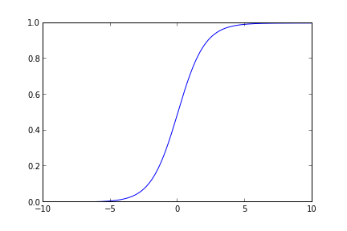

# Paralel Lojistik Regresyon, Eşle/İndirge

Lojistik regresyon kodunu eşle-indirge (map-reduce) üzerinden
paralelize etmek için literatüre [1-7] bakınca, genel yaklaşımın
makinalara bölünen veri parçaları üzerinde ayrı ayrı gradyan çıkışının
(gradient aşçent) işletilmesi ve sonuç theta'ların son bir makinada
ortalamasının alınması olduğunu görürüz.

Daha önceki lojistik regresyon yazımızda iki farklı gradyan çıkış
algoritmasi görmüştük. Bu algoritmalardan kullanacağımız daha basit olanı,
her döngüde alpha'yı değiştiren versiyon değil tek alpha kullanan, ve kod
içinde zar atan değil, veriyi sırayla işleyen. Bunun birkaç sebebi var,
öncelikle altta göreceğimiz üzere veriyi Hadoop'a vermeden önce kendimiz
karıştıracağız, yani kod içinde zar atmaya gerek kalmayacak. İkincisi pek
çok makinada işlem yapıldığı için tek bir sabit üzerinden azaltma yapmak
mümkün değil (fakat her işleyicinin -değişmeyen- kendine has / ayrı bir
sabiti olabilir, bu konuyu ileride işleyebiliriz), bu sebeple ve basitlik
amacıyla tek sabitli kod kullanıldı. Ayrıca artık döngü (iterasyon) yok,
yani veri baştan sona bir kez tarandı mı, o makinanın işlemi bitecek. Fakat
büyük veri ortamında (ki zaten onun için Hadoop kullanıyoruz herhalde)
elimizde o kadar çok veri olacak ki bu verinin tamamını işleyince zaten
100,200 kere döngüyü işletmek ile aynı etkiyi almış oluyoruz.

Örnek veri olarak alttakini ürettik,

```python
from pandas import *
mean1 = [10,10]
mean2 = [20,20]
cov = [[5,0],[0,5]]             
d1 = DataFrame(np.random.multivariate_normal(mean1,cov,10000))
d2 = DataFrame(np.random.multivariate_normal(mean2,cov,10000))
d1['labels'] = 1
d2['labels'] = 0
data = DataFrame(np.vstack((d1,d2)))
data.to_csv("testSet.txt",sep='\t',index=None,header=None)
print data[:4]
```

```
           0          1  2
0  10.287025  11.158653  1
1   7.390719  12.214295  1
2  11.720941   8.711403  1
3  11.543380  11.627805  1
```

```python
plt.plot(d1.ix[:,0],d1.ix[:,1],'b.')
plt.hold(True)
plt.plot(d2.ix[:,0],d2.ix[:,1],'r.') %
plt.hold(True)
plt.savefig('logreg1.png')
```



Altta veriyi işletmeden önce kendimiz karıştırıyoruz,

```
!sort --random-sort testSet.txt > /tmp/testSet1.txt
```

```python
'''
Logistic regression for map/reduce written for MRJob,
uses stochastic gradient descent.
'''
from mrjob.job import MRJob
from mrjob.protocol import PickleProtocol
import numpy as np
import os, thread

class MRLogisticRegression(MRJob):
    INTERNAL_PROTOCOL = PickleProtocol
    
    def __init__(self, *args, **kwargs):
        super(MRLogisticRegression, self).__init__(*args, **kwargs)
        self.n  = 1
        self.m = 3
        self.count = 0
        self.theta = np.ones((self.m,1))
        self.final_theta = np.zeros((self.m,self.n))

    def sigmoid(self, arr):
        return 1.0/(1+np.exp(-arr))

    def stoc_grad_ascent0(self, data_mat, label, theta):
        alpha = 0.01
        h = self.sigmoid(np.dot(data_mat,theta))
        theta = theta.T + (alpha * data_mat * (label - h))
        theta = theta.reshape((self.m,self.n))
        return theta
        
    def mapper(self, key, line):        
        tokens = map(np.float,line.split('\t'))
        data = np.append(1.0,np.array(tokens[:-1]))
        label = np.array(tokens[-1])
        self.theta = self.stoc_grad_ascent0(data, label, self.theta)
        
    def mapper_final(self):        
        yield ("key1", self.theta)
                
    def reducer(self, key, tokens):
        for val in tokens:
            self.final_theta += val
            self.count += 1
        yield('result',str(self.final_theta / self.count))
        
if __name__ == '__main__':
    MRLogisticRegression.run()    
```

Üstte eşleyici içinde tek bir tane anahtar üretiyoruz, tüm makinalarda
tüm eşleyiciler aynı anahtarı, bir kez üretiyor olacaklar. Bunun
sebebi nedir?  Ne yapmaya çalıştığımızı hatırlayalım, tüm makinalarda
lojistik regresyon işletiyoruz, gradyan çıkışı yapıyoruz, ve sonuçta o
makinanın işi bitince elimizde tek bir tane ağırlık vektörü yani theta
olacak. İlgilendiğimiz sonuç bu, o yüzden çıktı stdout'a tek bir satır
yazılıyor. Peki niye aynı anahtar? Çünkü her makinadaki tüm ağırlık
vektörlerinin "hep beraber" bir noktada ortalamasının alınmasını
istiyoruz, bunu Hadoop'a yaptırmanın bir yolu herkese aynı anahtarı
kullandırtmak, böylece bu anahtarlar tek bir indirgeyiciye (ve
makinaya) gidecek, ve orada ortalamaları alınacak. Tüm eşleyicilerin
sonucunun tek bir indirgeçiye gitmesi performans problemi çıkartmaz
mı? Çıkmaz, çünkü 1000 tane, 10000 tane eşleyici paralel iş yapmış
olabilir, ama işleri bitince elimizde 1000,10000 tane ağırlık vektörü
olacak, ve bu zaten tek makinanın rahatlıkla başa çıkabileceği bir
yüktür.

Bu yaklaşım, eşleyicinin her veri satırı başına bir ya da daha fazla
anahtar-değer satırı ürettiği yaklaşımdan (mesela klasik kelime sayma
problemi) biraz farklı, o sebeple bu farklılığı belirtmek istedik.

Bir püf nokta, her veri satırı için işletilen map'e de aslında anahtar
ürettirmiyoruz, tüm map çağrıları bittikten sonra son bir kez
çağırılacak `map_final`'a bu işi yaptırıyoruz. Oraya gelinceye kadar
(map içinde) değişen theta'yı sürekli hafızada tutmuşuz, son noktaya
gelince o sonucu aynı anahtar ile eşleyerek üretiyoruz ve iş bitiyor.

Komut satırından işletelim:

```python
!python logreg.py /tmp/testSet1.txt 
```

```
using configs in /home/burak/.mrjob.conf
creating tmp directory /tmp/logreg.burak.20131201.234703.391390
writing to /tmp/logreg.burak.20131201.234703.391390/step-0-mapper_part-00000
Counters from step 1:
  (no counters found)
writing to /tmp/logreg.burak.20131201.234703.391390/step-0-mapper-sorted
> sort /tmp/logreg.burak.20131201.234703.391390/step-0-mapper_part-00000
writing to /tmp/logreg.burak.20131201.234703.391390/step-0-reducer_part-00000
Counters from step 1:
  (no counters found)
Moving /tmp/logreg.burak.20131201.234703.391390/step-0-reducer_part-00000 -> /tmp/logreg.burak.20131201.234703.391390/output/part-00000
Streaming final output from /tmp/logreg.burak.20131201.234703.391390/output
"result"	"[[ 9.50705297]\n [-0.32580375]\n [-0.31237616]]"
removing tmp directory /tmp/logreg.burak.20131201.234703.391390
```

```python
def plot_theta(theta):
    x = np.array(arange(-10.0, 40.0, 0.1))
    y = np.array((-theta[0]-theta[1]*x)/theta[2])
    plot(x, y)
    hold(True)
    plot(d1.ix[:,0],d1.ix[:,1],'b.')
    hold(True)
    plot(d2.ix[:,0],d2.ix[:,1],'r.')
    hold(True)
    ylim(0,30)
    xlim(0,30)

theta = [9.50829527,-0.36317422,-0.34354905]
plot_theta(theta)
plt.savefig('logreg2.png')
```


Kaynaklar

[1] Smola, Scalable Machine Learning, Optimization,
    http://alex.smola.org/teaching/berkeley2012/slides/4_Optimization.pdf

[2] Bhandarkar, Modeling with Hadoop,
    http://www.slideshare.net/hadoop/modeling-with-hadoop-kdd2011

[3] Simianer, Joint Feature Selection in Distributed Stochastic Learning for Large-Scale Discriminative SMT,
    http://simianer.de/P12-1002-slides.pdf

[4] Allen, A Python implementation of binary regularized logistic
    regression with stochastic gradient descent, packaged as scripts for use with Hadoop streaming},
    https://github.com/elsevierlabs/logistic-regression-sgd-mapreduce

