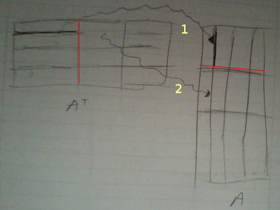
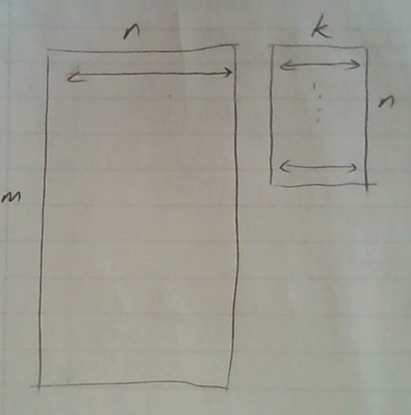
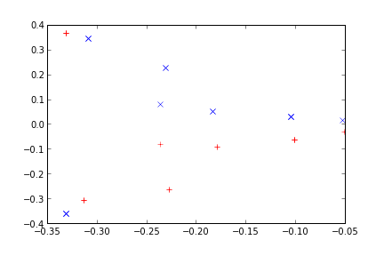

# Lineer Cebir ve Hadoop

### Paralel A'A

Öncelikle elimizdeki becerilere (capabilities) bakalım. Hadoop ortamı
bize aşırı büyük bir dosyayı otomatik olarak makinalara bölerek bir
hesap yapılması gerektiğinde o hesabın her makinadaki veri parçası
üzerinde yaptırılabilmesini sağlıyor.

A'A örneğinde eldeki veri A, ve "çok olan" A'nin satırları, yani m x n
boyutlarında matris var ve m devasa boyutlarda (olabilir). Bir A
dosyası tipik olarak şöyle gözükecek:

```
!head -5 A_matrix
```

```
3 4 5 6
3 4 5 2
3 6 7 8
2 2 2 2
9 9 3 3
```

Eşle/indirgeye gelelim: Eğer çarpıma satır bakışını hatırlarsak,



Bu bakışa göre soldaki matriste satır boyunca giderken, sağdakinde ona
tekabül eden kolon boyunca gidiyoruz, ve birbirine eşlene her ögeyi
çarpıyoruz, ve çarpımları topluyoruz.

Şimdi bu matrisin Hadoop'ta parça parça bize geldiğini düşünürsek (ki üstte
hayali bir ilk parçayı kırmızı çizgi ile belirttik), bu parça içinde mesela ilk
satırı kendisi ile çarparken (1'inci ok) aynı blok içindeyiz. Bu önemli bir
nokta, çarparken bloklar arası geçiş yok.

Tabii ki nihai çarpımdaki (1,1) hesabı için A' icindeki birinci
satırın *tamamen* A'daki birinci kolonla nokta çarpımının bitirilmiş
olması gerekir, ama şimdi düşünelim, başka bir makinaya ikinci parça
verilmiş ise, makinada o birinci satırın geri kalanı çarpılıp
toplanacaktır (2. ok), ve eğer tüm parçalar, tüm makinalarda bu
şekilde işlenirse, (1,1) hesabı için o makinalardaki o tüm çarpımları
alıp nihai bir noktada toplamak bize (1,1) için nihai sonucu
verecektir. Bu tipik bir eşle/indirge hesabı olabilir, eşle safhasında
eldeki parça P üzerinde P'P yapılır, indirge safhasında bu parçalar
toplanır.

Eşleme safhasından yayınlanacak (emit) anahtar ve değerler, bizce, P'P
içindeki her satırın satır no'su ve satır değeri olmalı. Niye? (Aynı
sabit bir anahtar değeriyle beraber P'P nin tamamını da
yayınlayabilirdik).

Hatırlayalım, nihai çarpım n x n boyutunda, her parça p olsa bile, n x
p * p x n yine bize n x n veriyor. Yani her makina n x n boyutunda bir
çarpım sonucunu üretiyor. Evet n nispeten küçük bir sayı, fakat yine
de onbinlerde olsa bile 10,000 x 10,000 mesela, büyük bir sayı. Eğer
tüm toplamı tek bir indirgeyici makinaya yaptırırsak, pek çok n x n
boyutunda matrisin toplamı bu makinayı kaşar. O sebeple indirgeme
sonrası matrisleri değil, o matrislerin her $n$ satırını satır no'su
ile yayınlıyoruz, böylece aynı satırlar aynı indirgeyiciye gidip orada
toplanıyorlar, ama birçok indirgeyici var yani toplama işlemi paralel
hale gelmiş oluyor. Tabii indirgeme sonrası o sonuçlar yayınlanıyor,
ve satır no'ya göre doğal olarak sıralanmış halde nihai sonuç çıkıyor.
Ama toplama işlemi paralel. Kod alttaki gibi

```python
from mrjob.job import MRJob
from mrjob.protocol import PickleProtocol
import numpy as np, sys

class MRAtA(MRJob):
    INTERNAL_PROTOCOL = PickleProtocol
    
    def __init__(self, *args, **kwargs):
        super(MRAtA, self).__init__(*args, **kwargs)
        self.buffer_size = 4
        self.n = 4
        self.data = []
        self.A_sum = np.zeros((self.n,self.n))
        
    def mapper(self, key, line):
        line_vals = map(np.float,line.split())
        self.data.append(line_vals)
        if len(self.data) == self.buffer_size:
            mult = np.dot(np.array(self.data).T,np.array(self.data))
            self.data = []
            for i, val in enumerate(mult):
                yield i, val        
    
    def reducer(self, i, tokens):
        for val in tokens:
            self.A_sum[i,:] += np.array(val)
        yield i, str(self.A_sum[i,:])

    '''
    At the end of processing a file, we might have some left over
    rows in self.data that were not multiplied because we did not
    reach buffer size. That condition is handled here. Whatever is
    left over, is simply multiplied and emitted.
    '''
    def mapper_final(self):        
        if len(self.data) > 0:
            mult = np.dot(np.array(self.data).T,np.array(self.data))
            for i, val in enumerate(mult):
                yield i, val        

    
if __name__ == '__main__':
    MRAtA.run()
```

Fonksiyon `mapper_final` MRJob kurallarına göre bir makinadaki tüm
eşleme bittikten sonra çağırılır, biz bu çengeli (hook), "artık
parçaları çarpıp yayınlamak için" kullandık, her parça $p$
büyüklüğünde, ama m / p tam sayı olmayabilir, yani işlem sonunda bazı
artık veriler kalmış olabilir, onları `mapper_final` içinde
çarpıyoruz.

Bu arada kodun kendi içinde de bir "parçalama", "biriktirme ve işleme" yaptığına
dikkat, yani 20,000 satır olabilir, iki tane eşleyici var ise her eşleyici bu
verinin 10,000 satırını işler, ama ayrıca işleyiciler daha ufak ufak (üstte 4)
parçalarla çarpım yapıyor.

```
!python AtA.py A_matrix
```

```
using configs in /home/burak/.mrjob.conf
creating tmp directory /tmp/AtA.burak.20131202.225802.256844
writing to /tmp/AtA.burak.20131202.225802.256844/step-0-mapper_part-00000
Counters from step 1:
  (no counters found)
writing to /tmp/AtA.burak.20131202.225802.256844/step-0-mapper-sorted
> sort /tmp/AtA.burak.20131202.225802.256844/step-0-mapper_part-00000
writing to /tmp/AtA.burak.20131202.225802.256844/step-0-reducer_part-00000
Counters from step 1:
  (no counters found)
Moving /tmp/AtA.burak.20131202.225802.256844/step-0-reducer_part-00000 -> /tmp/AtA.burak.20131202.225802.256844/output/part-00000
Streaming final output from /tmp/AtA.burak.20131202.225802.256844/output
0	"[ 420.  463.  264.  265.]"
1	"[ 463.  538.  351.  358.]"
2	"[ 264.  351.  316.  321.]"
3	"[ 265.  358.  321.  350.]"
removing tmp directory /tmp/AtA.burak.20131202.225802.256844
```

Karşılaştırmak için aynı işlemi tek bir script içinde yapalım, 

```python
A = np.loadtxt('A_matrix')
print np.dot(A.T,A)
```

```
[[ 420.  463.  264.  265.]
 [ 463.  538.  351.  358.]
 [ 264.  351.  316.  321.]
 [ 265.  358.  321.  350.]]
```

Tıpatıp aynı. 

### Cholesky ve QR

Şimdi bu sonuç üzerinde Cholesky yapalım

```python
import numpy.linalg as lin
print lin.cholesky(np.dot(A.T,A))
```

```
[[ 20.49390153   0.           0.           0.        ]
 [ 22.59208669   5.25334361   0.           0.        ]
 [ 12.88188096  11.41585875   4.44244436   0.        ]
 [ 12.93067597  12.53849977   2.54158031   4.37310096]]
```

Bu bize L'yi verdi. Karşılaştırmak için A üzerinde direk `qr` yapalım

```python
q,r = lin.qr(A)
print r.T
```

```
[[-20.49390153   0.           0.           0.        ]
 [-22.59208669  -5.25334361   0.           0.        ]
 [-12.88188096 -11.41585875   4.44244436   0.        ]
 [-12.93067597 -12.53849977   2.54158031  -4.37310096]]
```

Bu matris Cholesky sonucunun eksi ile çarpılmış hali, fakat bu nihai
sonuç açısından farketmiyor.

Q


Q hesabı için biraz daha takla atmak lazım,

A = QR

AR^-1 = QRR^-1

Q = AR^-1

Demek ki R'i elde ettikten sonra onu tersine çevirip (inverse) A ile
çarparsak, bu bize Q'yu verecek. Dert değil, R ufak bir matris, n x n,
ve tersini alma operasyonu pahalı bir işlem olsa da bu boyutlarda
yavaş olmaz. Daha sonra bu R^-1'i alıp bu sefer başka bir eşle/indirge
ile çarpım işlemine tabi tutarız. R'yi direk alttaki script içine
yazdık (B olarak) bir sonuç ortamında bu verinin başka bir şekilde
MRJob işlemine verilmiş olması lazım. Bir işleme zinciri var, zincirde
önce A'A, Cholesky, oradan R alınıp başka bir işleme (job)
aktarılıyor.

```python
from mrjob.job import MRJob
from mrjob.protocol import PickleProtocol
import numpy as np, sys

class MRAB(MRJob):
    INTERNAL_PROTOCOL = PickleProtocol
    
    def __init__(self, *args, **kwargs):
        super(MRAB, self).__init__(*args, **kwargs)
        self.buffer_size = 4
        self.n = 4
        self.data = []
        # an example B
        self.B = np.array([[-20.49390153,   0.        ,   0.        ,   0.        ],
                           [-22.59208669,  -5.25334361,   0.        ,   0.        ],
                           [-12.88188096, -11.41585875,   4.44244436,   0.        ],
                           [-12.93067597, -12.53849977,   2.54158031,  -4.37310096]])

        
    def mapper(self, key, line):
        line_vals = map(np.float,line.split())
        self.data.append(line_vals)
        if len(self.data) == self.buffer_size:
            mult = np.dot(self.data,self.B.T)
            self.data = []
            yield (key, mult)
    
    def reducer(self, key, tokens):
        for x in tokens:
            yield (key, str(x))
    
if __name__ == '__main__':
    MRAB.run()

```

```
!python AB.py A_matrix
```

```
using configs in /home/burak/.mrjob.conf
creating tmp directory /tmp/AB.burak.20131202.230008.985111
writing to /tmp/AB.burak.20131202.230008.985111/step-0-mapper_part-00000
Counters from step 1:
  (no counters found)
writing to /tmp/AB.burak.20131202.230008.985111/step-0-mapper-sorted
> sort /tmp/AB.burak.20131202.230008.985111/step-0-mapper_part-00000
writing to /tmp/AB.burak.20131202.230008.985111/step-0-reducer_part-00000
Counters from step 1:
  (no counters found)
Moving /tmp/AB.burak.20131202.230008.985111/step-0-reducer_part-00000 -> /tmp/AB.burak.20131202.230008.985111/output/part-00000
Streaming final output from /tmp/AB.burak.20131202.230008.985111/output
null	"[[ -61.48170459  -88.78963451  -62.09685608  -84.98432736]\n [ -20.49390153  -27.8454303   -19.85529535  -27.30069639]\n [ -40.98780306  -55.6908606   -39.7105907   -54.60139278]\n [-184.44511377 -250.6088727  -205.35232431 -234.71714361]]"
null	"[[ -61.48170459  -99.29632173  -76.04368486 -131.21677204]\n [ -40.98780306  -55.6908606   -39.7105907   -54.60139278]\n [-184.44511377 -250.6088727  -205.35232431 -234.71714361]\n [ -61.48170459  -88.78963451  -62.09685608 -102.4767312 ]]"

null	"[[ -61.48170459  -88.78963451  -62.09685608 -102.4767312 ]\n [ -61.48170459  -88.78963451  -62.09685608  -84.98432736]\n [ -61.48170459  -99.29632173  -76.04368486 -131.21677204]\n [ -40.98780306  -55.6908606   -39.7105907   -54.60139278]]"
removing tmp directory /tmp/AB.burak.20131202.230008.985111
```

Kontrol edelim,

```python
B = np.array([[-20.49390153,   0.        ,   0.        ,   0.        ],
              [-22.59208669,  -5.25334361,   0.        ,   0.        ],
              [-12.88188096, -11.41585875,   4.44244436,   0.        ],
              [-12.93067597, -12.53849977,   2.54158031,  -4.37310096]])
print np.dot(A,B.T)
```

```
[[ -61.48170459  -88.78963451  -62.09685608 -102.4767312 ]
 [ -61.48170459  -88.78963451  -62.09685608  -84.98432736]
 [ -61.48170459  -99.29632173  -76.04368486 -131.21677204]
 [ -40.98780306  -55.6908606   -39.7105907   -54.60139278]
 [-184.44511377 -250.6088727  -205.35232431 -234.71714361]
 [ -61.48170459  -99.29632173  -76.04368486 -131.21677204]
 [ -40.98780306  -55.6908606   -39.7105907   -54.60139278]
 [-184.44511377 -250.6088727  -205.35232431 -234.71714361]
 [ -61.48170459  -99.29632173  -76.04368486 -131.21677204]
 [ -40.98780306  -55.6908606   -39.7105907   -54.60139278]
 [-184.44511377 -250.6088727  -205.35232431 -234.71714361]
 [ -61.48170459  -88.78963451  -62.09685608 -102.4767312 ]
 [ -61.48170459  -88.78963451  -62.09685608  -84.98432736]
 [ -20.49390153  -27.8454303   -19.85529535  -27.30069639]
 [ -40.98780306  -55.6908606   -39.7105907   -54.60139278]
 [-184.44511377 -250.6088727  -205.35232431 -234.71714361]
 [ -81.97560612 -116.63506481  -90.83704015 -126.11438629]]
```

Çarpımlar aynı. Yanlız dikkat, satırların sırası değişik olabilir,
burada problem eşle/indirge işleminin A'yi parçalama sonucu her çarpım
parçasının değişik bir sırada ele geçiyor olması. Eğer sıralamayı aynı
A gibi istiyorsak, bu sıra no'sunu A verisi içinde ilk satıra koymak
lazım ve eşleyiciler oradan alıp bu no'yu anahtar olarak
yayınlamalılar. Bu eklemeyi okuyucuya bırakıyorum!

Şimdi QR hesabını bu şekilde yapıp yapamayacağımızı kontrol
edelim. Eğer `qr` ile Q hesaplarsak,

```python
q,r = lin.qr(A)
print q
```

```
[[-0.14638501 -0.13188879  0.36211188 -0.35057934]
 [-0.14638501 -0.13188879  0.36211188  0.56410341]
 [-0.14638501 -0.51259871 -0.16600517 -0.02328772]
 [-0.09759001  0.03897744  0.26737941 -0.1251395 ]
 [-0.43915503  0.1753985  -0.14740047  0.02394349]
 [-0.14638501 -0.51259871 -0.16600517 -0.02328772]
 [-0.09759001  0.03897744  0.26737941 -0.1251395 ]
 [-0.43915503  0.1753985  -0.14740047  0.02394349]
 [-0.14638501 -0.51259871 -0.16600517 -0.02328772]
 [-0.09759001  0.03897744  0.26737941 -0.1251395 ]
 [-0.43915503  0.1753985  -0.14740047  0.02394349]
 [-0.14638501 -0.13188879  0.36211188 -0.35057934]
 [-0.14638501 -0.13188879  0.36211188  0.56410341]
 [-0.048795    0.01948872  0.1336897  -0.06256975]
 [-0.09759001  0.03897744  0.26737941 -0.1251395 ]
 [-0.43915503  0.1753985  -0.14740047  0.02394349]
 [-0.19518001 -0.11240007  0.04559899 -0.21745867]]
```

R'in tersi ile A carpilinca hakikaten Q elde ediliyor mu?  Kontrol
edelim.

```python
print np.dot(A,lin.inv(B.T))
```

```
[[-0.14638501 -0.13188879  0.36211188 -0.35057934]
 [-0.14638501 -0.13188879  0.36211188  0.56410341]
 [-0.14638501 -0.51259871 -0.16600517 -0.02328772]
 [-0.09759001  0.03897744  0.26737941 -0.1251395 ]
 [-0.43915503  0.1753985  -0.14740047  0.02394349]
 [-0.14638501 -0.51259871 -0.16600517 -0.02328772]
 [-0.09759001  0.03897744  0.26737941 -0.1251395 ]
 [-0.43915503  0.1753985  -0.14740047  0.02394349]
 [-0.14638501 -0.51259871 -0.16600517 -0.02328772]
 [-0.09759001  0.03897744  0.26737941 -0.1251395 ]
 [-0.43915503  0.1753985  -0.14740047  0.02394349]
 [-0.14638501 -0.13188879  0.36211188 -0.35057934]
 [-0.14638501 -0.13188879  0.36211188  0.56410341]
 [-0.048795    0.01948872  0.1336897  -0.06256975]
 [-0.09759001  0.03897744  0.26737941 -0.1251395 ]
 [-0.43915503  0.1753985  -0.14740047  0.02394349]
 [-0.19518001 -0.11240007  0.04559899 -0.21745867]]
```

Sonuçlar birebir aynı.

Üstteki teknikleri kullanarak artık devasa boyutlarda satırı olan bir
A matrisi üzerinde artık QR hesabı yapılabilir.

### Paralel Rasgele İzdüşümü

Rasgele yansıtma tekniği m x b boyutunda bir matrisi n x k boyutunda
ve her hücresinde N(0,1) dağılımından gelen bir sayı içeren matris ile
çarpmak sonunda elde edilir. Böylece ana veri matrisi "yansıtılmış"
olur, boyut azaltmak için çok kullanışlı bir tekniktir, çünkü elde
edilen matrisin ana matris $A$'nin "menzilini" iyi temsil ettiği
ispatlanmıştır. Daha fazla detay için bkz [1] yazısı.

Eşle/indirge ortamında rasgele yansıtma için önce [2] adlı yazıya da bakmak
gerekebilir. Bu yazıda iki matris arasındaki çarpıma "satır bakışı" bizim
için gerekli. Çünkü çarpımın solunda $m \times n$ boyutundaki matrisin
verileri bize satır satır geliyor, yani her $m$ satırdan sadece bir
tanesine bakarak işlem yapıyoruz. Faraziyemiz $n$'in de büyük olabilmesine
rağmen en azından $n$ tane veri noktasını tek bir makinada
işleyebileceğimiz.

Satır bakışına dönersek, bu çarpım görüşüne göre soldaki her satır
için, o satırdaki bir öğeyi sağda ona tekabül eden $n \times k$
boyutundaki matrisin satırıyla (yani her gelen satırın 5. öğesi
sağdaki matrisin 5 satırın tamamı ile) çarpıp, sonuç olan "çarpılmış"
satırları birbiriyle topluyoruz. Bu Hadoop veri işleme mentalitesine
uygun çünkü her seferinde $A$'nin tek bir satırına bakıyoruz.

Sağdaki rasgele sayılar içeren matris kritik. Biz bu matrisi bellekte
tut\textbf{ma}maya karar verdik, çünkü n sayısı da büyük olabilir, her
ne kadar k küçük olsa da (çoğunlukla 100 civarı) yine de bu kadar
belleği eğer mümkün ise israf etmemek en iyisi.



Eğer bellekte tutmuyorsak rasgele matrisin değerlerini (sadece
ilgilendiğimiz öğe için, tüm matrisi değil) her seferinde tekrar
üretmek gerekir. Hız açısından performans çok kötü olmayacaktır, çünkü
rasgele sayı üretimi toplama, çarpma, mod gibi direk matematiksel
hesaplar ile yapılır.

Fakat burada önemli bir diğer konu şudur: her $A$ satırı için {\em
aynı} rasgele matris (öğelerini) aynı şekilde üretebilmeliyiz.

Bu problemin en basit çözümü rasgele sayı üretimi için tohum (seed)
kullanımıdır. Eğer tohum kullanılmazsa, Python \verb!random!
paketindeki üretici çağrılar günün zamanına göre bir tohum
kullanırlar, ve böylece her çağrı değişik bir sayı üretmiş olur (çünkü
komut işletildiği her seferinde günün zamanı değişiktir). Fakat
rasgele sayı üretimini, "her seferinde aynı şekilde" yaptırmanın yolku
vardır, bunun için tohum dışarıdan set edilir ve böylece aynı tohumdan
başlayan rasgele sayı üretim zinciri hep aynı olur. Rasgele sayı
üretimi deterministik bir algoritmadır, zaten literatürde bu işlem
"yarı rasgele sayı üretimi (pseudorandom number generation)" olarak
geçer.

```python
import random

# tohumsuz, bu kod her seferinde degisik sayi uretir
print random.gauss(0,1), random.gauss(0,1)
print random.gauss(0,1), random.gauss(0,1)
```

```
-0.49078710907 1.97156772689
-0.612135407803 -0.0159405924623
```

```python
import random
# tohumlu
random.seed(100000)
print random.gauss(0,1), random.gauss(0,1)
random.seed(100000)
print random.gauss(0,1), random.gauss(0,1)
```

```
1.46560757321 0.974749135866
1.46560757321 0.974749135866
```

Üstteki kodda aynı tohumu verince arka arkaya üretilen iki (daha fazla
da olabilirdi) "rasgele" sayının hep aynı olduğunu görüyoruz.

Rasgele "matrise" dönersek, eğer bu matrisin her A veri satırı için
hücre değerlerinin aynı şekilde üretilmesini istiyorsak, tohum
kullanmalıyız. Tohum değeri ne olacak? Bu değer mesela n x k
boyutundaki rasgele matris için indis değerleri yanyana koyularak
üretilebilir, mesela 111. satır ve 2. kolon için 1112 tohum değeri
kullanılır, ve bu tohumla tek bir rasgele sayı üretilir, (111,2)
hücresine konulur ve sonraki indis için yeni bir tohum
kullanılır. Evet üst üste çakışmalar olabilir tabii ki, mesela
11. satır 12. kolon da üstteki tohumla aynı sonucu getirir, ama bu tür
nadir çakışmalar o kadar önemli değil, sonuçta rasgele sayılarla
uğraşıyoruz, "yeterince raslantısal olmaları" kafi.

Altta bu veri matrisini satır satır çarpıp yansıtılmış yeni bir
matrisi üreten mrjob programını bulabilirsiniz.

```python
from mrjob.job import MRJob
from mrjob.protocol import PickleProtocol, RawValueProtocol
import numpy as np, sys
import random

class MRProj(MRJob):
    INTERNAL_PROTOCOL = PickleProtocol
    OUTPUT_PROTOCOL = RawValueProtocol
    
    def __init__(self, *args, **kwargs):
        super(MRProj, self).__init__(*args, **kwargs)
        self.k = 3
        
    def mapper(self, key, line):
        line_vals = map(np.float,line.split())
        result = np.zeros(self.k)
        for j,val in enumerate(line_vals):
            for i in range(self.k):
                random.seed(int(j + i))
                result[i] += val*random.gauss(0,1)
        yield (None,",".join(map(str,result)))
            
if __name__ == '__main__':
    MRProj.run()
```

Tek bir eşle çağrısı var, çünkü çarpım işlemi oldukça basit, indirgeme
işlemine gerek yok.

Çıktı için yield ile yayınladığımız (emit) satırlarda anahtar
kullanmıyoruz, yani verinin paralel işlenirken nasıl yük dağıtımı
yapıldığına göre sonuç matrisinin sırası ana matrisin satır sırasına
uymayabilir. Fakat satır sırası bizim için çoğunlukla önemli olmuyor
(kolon sırası önemli), çünkü genelde, her satır, diğerinden ayrı /
bağımsız bir veri ölçümünü temsil eder çoğunlukla. Eğer zamansal bir
boyut var ise, bazı şeyler arka arkaya işlenmeliyse, o bilgi ayrı bir
kolon (mesela tarih, zaman damgası -timestamp-) olarak veride
bulunurdu.

```
!python mrproj.py A_matrix2 > /tmp/out
```

```
using configs in /home/burak/.mrjob.conf
creating tmp directory /tmp/mrproj.burak.20131203.094548.254606
writing to /tmp/mrproj.burak.20131203.094548.254606/step-0-mapper_part-00000
Counters from step 1:
  (no counters found)
Moving /tmp/mrproj.burak.20131203.094548.254606/step-0-mapper_part-00000 -> /tmp/mrproj.burak.20131203.094548.254606/output/part-00000
Streaming final output from /tmp/mrproj.burak.20131203.094548.254606/output
removing tmp directory /tmp/mrproj.burak.20131203.094548.254606
```

```
!head -10 /tmp/out
```

```
20.2369671373,13.9358970644,0.524561578258
19.8581349841,13.7724732852,5.23992858318
27.6790861925,18.8833585029,-1.56199395804
9.3255498646,7.52383094482,2.58977793605
27.3677257439,33.0438553532,18.4819155509
27.6790861925,18.8833585029,-1.56199395804
9.3255498646,7.52383094482,2.58977793605
27.3677257439,33.0438553532,18.4819155509
27.6790861925,18.8833585029,-1.56199395804
9.3255498646,7.52383094482,2.58977793605
```

Performans İyileştirmeleri

Üstteki kod daha hızlı olabilir. Diyelim ki $n$'in milyonlarda olduğu
şartları da hızlı bir şekilde işleyebilmek istiyoruz. Fakat bu noktada
kendimize şu soruyu sormamız gerekir: hangi şartlarda n milyonları
bulacaktır?

Büyük bir ihtimalle bu durum eğer bolca kategorik veri boyutu var ise
ortaya çıkar. Kategorik verileri bildiğimiz gibi 1-in-n, ya da 1-hot
kodlama (encoding) ile temsil ediyoruz, bu demektir ki 1000 tane
farklı değer içerebilen tek bir kolon, 1000 tane yeni kolon haline
geliyor. Bazı boyutların (mesela web sayfa ismi, URL değeri) taşıyan
veri setlerinde özgün (unique) değerlerin milyonlar hatta milyara
varabileceğini düşünürsek aşırı yüksek $n$ rakamlarının nereden
geldiğini anlarız.

Ama bunun bize ek bir faydası var: 1-in-n kodlaması var ise, bu her
satırda çok fazla sıfır olacak demektir, ve içinde çok sıfırı olan
vektörleri / matrisleri seyrek matrisler ile çok rahat şekilde temsil
edebiliriz.

```python
from mrjob.job import MRJob
from mrjob.protocol import PickleProtocol, RawValueProtocol
import numpy as np, sys, itertools
from scipy import sparse
import random

class MRProj(MRJob):
    INTERNAL_PROTOCOL = PickleProtocol
    OUTPUT_PROTOCOL = RawValueProtocol
    
    def __init__(self, *args, **kwargs):
        super(MRProj, self).__init__(*args, **kwargs)
        self.k = 3
        
    def mapper(self, key, line):
        line_vals = map(np.float,line.split())
        line_sps = sparse.coo_matrix(line_vals,shape=(1,len(line_vals)))
        result = np.zeros(self.k)
        for xx,j,v in itertools.izip(line_sps.row, line_sps.col, line_sps.data):
            np.random.seed(j)
            result += v*np.random.randn(self.k)
        yield (None,",".join(map(str,result)))
            
if __name__ == '__main__':
    MRProj.run()
```

Üstteki kodda her satırı okur okumaz hemen onu bir seyrek matrise
çeviriyoruz. Şimdi en kritik numara: `itertools.izip` çağrısı ile bu
seyrek matrisin {\em sadece sıfır olmayan değerlerini ziyaret
ediyoruz}. Eğer 1000 tane kolon var ise, ama bu 1000 kolonun 20 tanesi
dolu ise, bu 50 kat bir performans iyileştirmesi sağlayacak demektir
(bu arada seyrek verilerde yüzde 2 doluluk gayet normal bir
rakamdır). Sadece dolu hücreleri ziyaret ediyoruz, ayrıca `izip` bu
dolu hücrelerin indis değerlerini de bize geri getiriyor, biz de bu
değerleri `seed` için önceden olduğu gibi kullanıyoruz. Bir diğer
ilerleme K tane rasgele sayıyı bir kerede üretiyoruz, ve tohum
ayarlamasını bir kere, dış döngü başında gerçekleştiriyoruz.

Sonuçlara bakalım:

```
!python mrprojs.py A_matrix2 > /tmp/out
!head -10 /tmp/out
```

```
using configs in /home/burak/.mrjob.conf
creating tmp directory /tmp/mrprojs.burak.20131203.094635.908870
writing to /tmp/mrprojs.burak.20131203.094635.908870/step-0-mapper_part-00000
Counters from step 1:
  (no counters found)
Moving /tmp/mrprojs.burak.20131203.094635.908870/step-0-mapper_part-00000 -> /tmp/mrprojs.burak.20131203.094635.908870/output/part-00000
Streaming final output from /tmp/mrprojs.burak.20131203.094635.908870/output
removing tmp directory /tmp/mrprojs.burak.20131203.094635.908870
20.4375200961,1.09117093744,-9.27846872665
13.2830062024,-0.654868464606,-9.66445859893
26.4299520755,0.628144156713,-14.4142094864
9.52053667131,0.337287636006,-3.17826479151
34.6111912648,-0.763663777689,-2.06399979621
26.4299520755,0.628144156713,-14.4142094864
9.52053667131,0.337287636006,-3.17826479151
34.6111912648,-0.763663777689,-2.06399979621
26.4299520755,0.628144156713,-14.4142094864
9.52053667131,0.337287636006,-3.17826479151
```

Daha önceki sonuçlar ile aynı (rasgelelik var ama \verb!seed!
değerleri değişmedi, o sebeple aynı sonucu aldık, bu iyi).

Bir kontrol daha var, eğer rasgelelik bazlı yansıtma iyi yapıldıysa,
$A$ matrisini izdüşümünü aldıktan daha önce anlattığımız teknik ile
SVD hesabını çok rahat bir şekilde yapabilmeliyiz. Bunun için
izdüşümünü `/tmp/Y` içine yazacağız, ve ardından daha önceki QR bazlı
teknikle SVD hesabını yapacağız. Ardından pür SVD ile A'yi işleyeceğiz
ve sonuç U matrisindeki en büyük iki eşsiz (singular) değeri her iki
teknikten alıp ekranda grafikleyeceğiz.

```
!python mrprojs.py A_matrix2 > /tmp/Y
```

```
using configs in /home/burak/.mrjob.conf
creating tmp directory /tmp/mrprojs.burak.20140104.064956.493025
writing to /tmp/mrprojs.burak.20140104.064956.493025/step-0-mapper_part-00000
Counters from step 1:
  (no counters found)
Moving /tmp/mrprojs.burak.20140104.064956.493025/step-0-mapper_part-00000 -> /tmp/mrprojs.burak.20140104.064956.493025/output/part-00000
Streaming final output from /tmp/mrprojs.burak.20140104.064956.493025/output
removing tmp directory /tmp/mrprojs.burak.20140104.064956.493025
```

```python
import numpy.linalg as lin

n = 4; k = 3
A = np.loadtxt('A_matrix2')
Y = np.loadtxt("/tmp/Y",delimiter=',')

Q, xx = lin.qr(Y)
B = np.dot(Q.T,A)
Uhat, Sigma, V = lin.svd(B)
U = np.dot(Q, Uhat)

plt.plot(U[:,0],U[:,1],'r+')
plt.hold(True)

U, Sigma, V = lin.svd(A);
plt.plot(U[:,0],U[:,1],'bx')
plt.savefig('rnd_1.png')
```



Sonuçlar fena değil.

Kaynaklar

[1] Bayramlı, Lineer Cebir, {\em Rasgele İzdüşümü ile SVD}

[2] Bayramlı, Lineer Cebir, {\em Matris Çarpımı, Ders 1}


